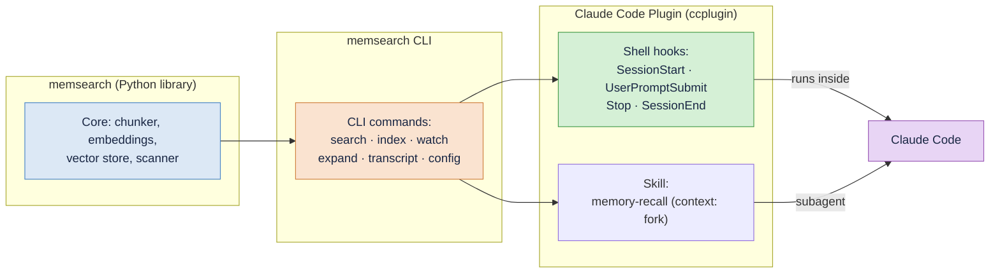
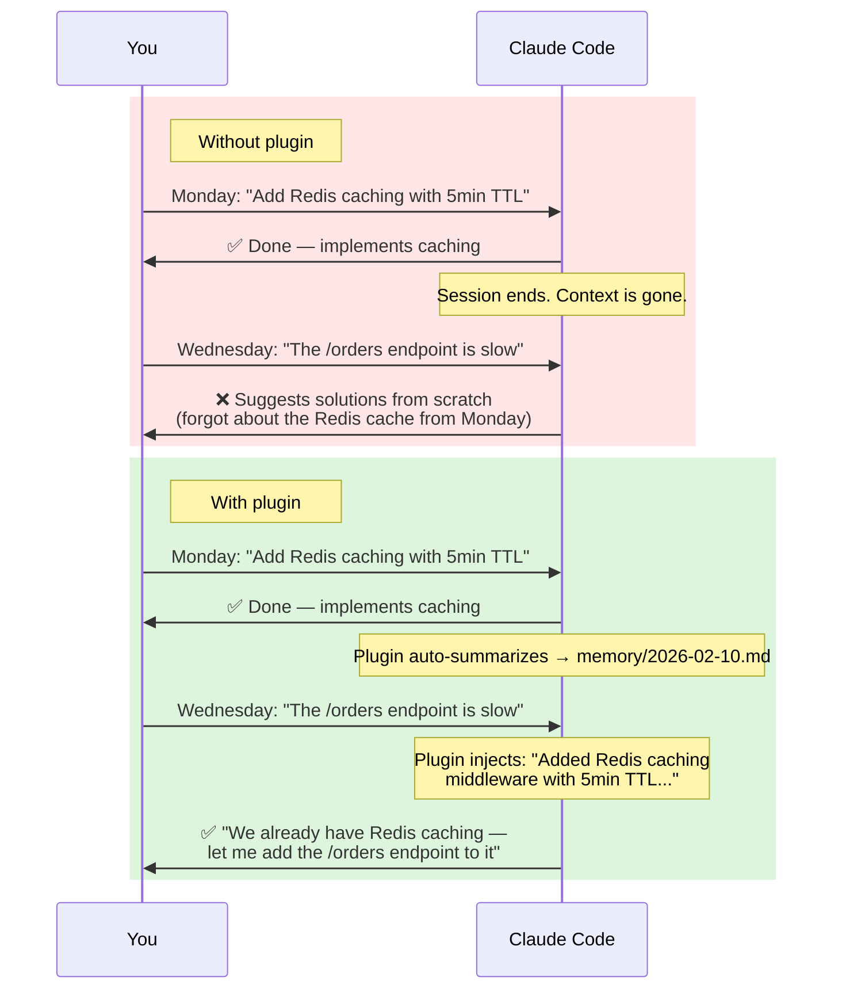
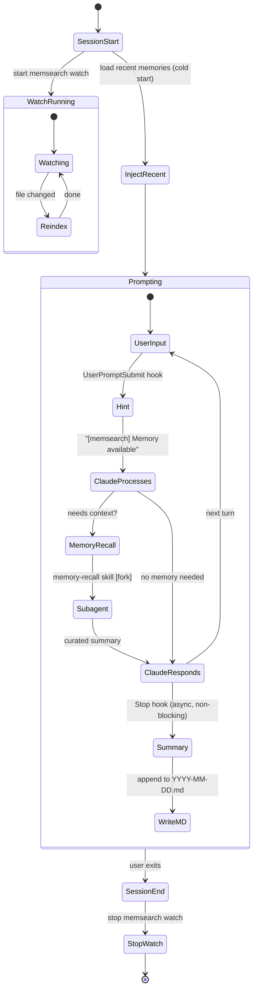
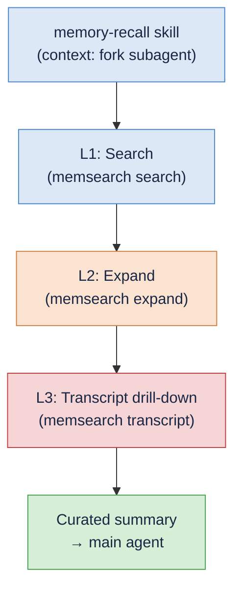

# memsearch — Claude Code Plugin

https://github.com/user-attachments/assets/190a9973-8e23-4ca1-b2a4-a5cf09dad10a

**Automatic persistent memory for [Claude Code](https://docs.anthropic.com/en/docs/claude-code).** No commands to learn, no manual saving — just install the plugin and Claude remembers what you worked on across sessions.

Built on Claude Code's native [Hooks](https://docs.anthropic.com/en/docs/claude-code/hooks), [Skills](https://docs.anthropic.com/en/docs/claude-code/skills), and [CLI](https://zilliztech.github.io/memsearch/cli/) — no MCP servers, no sidecar services. Everything runs locally as shell scripts, a skill definition, and a Python CLI.

### How the Pieces Fit Together



The **memsearch Python library** provides the core engine (chunking, embedding, vector storage, search). The **memsearch CLI** wraps the library into shell-friendly commands. The **Claude Code Plugin** ties those CLI commands to Claude Code's hook lifecycle and skill system — hooks handle session management and memory capture, while the **memory-recall skill** handles intelligent retrieval in a forked subagent context.

---

## Without vs. With the Plugin



---

## Quick Start

### Install from Marketplace (recommended)

```bash
# 1. Set your embedding API key (OpenAI is the default provider)
export OPENAI_API_KEY="sk-..."

# 2. In Claude Code, add the marketplace and install the plugin
/plugin marketplace add zilliztech/memsearch
/plugin install memsearch

# 3. Have a conversation, then exit. Check your memories:
cat .memsearch/memory/$(date +%Y-%m-%d).md

# 4. Start a new session — Claude automatically remembers!
```

> **Note:** If memsearch is not already installed, the plugin will attempt to install it automatically on first run.

---

## How It Works

The plugin hooks into **4 Claude Code lifecycle events** and provides a **memory-recall skill**. A singleton `memsearch watch` process runs in the background, keeping the vector index in sync with markdown files as they change.

### Lifecycle Diagram



### Hook Summary

| Hook | Type | Async | Timeout | What It Does |
|------|------|-------|---------|-------------|
| **SessionStart** | command | no | 10s | Start `memsearch watch` singleton, write session heading to today's `.md`, inject recent daily logs as cold-start context via `additionalContext`, display config status (provider/model/milvus) in `systemMessage` |
| **UserPromptSubmit** | command | no | 15s | Lightweight hint: returns `systemMessage` "[memsearch] Memory available" (skip if < 10 chars). No search — recall is handled by the memory-recall skill |
| **Stop** | command | **yes** | 120s | Parse transcript with `parse-transcript.sh`, call `claude -p --model haiku` to summarize, append summary with session/turn anchors to daily `.md` |
| **SessionEnd** | command | no | 10s | Stop the `memsearch watch` background process (cleanup) |

### What Each Hook Does

#### SessionStart

Fires once when a Claude Code session begins. This hook:

1. **Reads config and checks API key.** Runs `memsearch config get` to read the configured embedding provider, model, and Milvus URI. Checks whether the required API key is set for the provider (`OPENAI_API_KEY`, `GOOGLE_API_KEY`, `VOYAGE_API_KEY`; `ollama` and `local` need no key). If missing, shows an error in `systemMessage` and exits early.
2. **Starts the watcher.** Launches `memsearch watch .memsearch/memory/` as a singleton background process (PID file lock prevents duplicates). The watcher monitors markdown files and auto-re-indexes on changes with a 1500ms debounce.
3. **Writes a session heading.** Appends `## Session HH:MM` to today's memory file (`.memsearch/memory/YYYY-MM-DD.md`), creating the file if it does not exist.
4. **Injects cold-start context.** Reads the last 30 lines from the 2 most recent daily logs and returns them as `additionalContext`. This gives Claude awareness of recent sessions, which helps it decide when to invoke the memory-recall skill.
5. **Checks for updates.** Queries PyPI (2s timeout) and compares with the installed version. If a newer version is available, appends an `UPDATE` hint to the status line.
6. **Displays config status.** Every exit path returns a `systemMessage` showing the active configuration, e.g. `[memsearch v0.1.10] embedding: openai/text-embedding-3-small | milvus: ~/.memsearch/milvus.db` (with `| UPDATE: v0.1.12 available` when outdated).

#### UserPromptSubmit

Fires on every user prompt before Claude processes it. This hook:

1. **Extracts the prompt** from the hook input JSON.
2. **Skips short prompts** (under 10 characters) — greetings and single words don't need memory hints.
3. **Returns a lightweight hint.** Outputs `systemMessage: "[memsearch] Memory available"` — a visible one-liner that keeps Claude aware of the memory system without performing any search.

The actual memory retrieval is handled by the **[memory-recall skill](#how-the-skill-works)**, which Claude invokes automatically when it judges the user's question needs historical context.

#### Stop

Fires after Claude finishes each response. Runs **asynchronously** so it does not block the user. This hook:

1. **Guards against recursion.** Checks `stop_hook_active` to prevent infinite loops (since the hook itself calls `claude -p`).
2. **Validates the transcript.** Skips if the transcript file is missing or has fewer than 3 lines.
3. **Parses the transcript.** Calls `parse-transcript.sh`, which takes the last 200 lines of the JSONL transcript, truncates content to 500 characters, extracts tool call summaries, and skips `file-history-snapshot` entries.
4. **Summarizes with Haiku.** Pipes the parsed transcript to `claude -p --model haiku --no-session-persistence` with a system prompt requesting 3-8 bullet points.
5. **Appends to daily log.** Writes a `### HH:MM` sub-heading with an HTML comment anchor containing session ID, turn UUID, and transcript path. Then runs `memsearch index` to ensure immediate indexing.

#### SessionEnd

Fires when the user exits Claude Code. Calls `stop_watch` to kill the `memsearch watch` process and clean up the PID file, including a sweep for any orphaned processes.

---

## Progressive Disclosure

Memory retrieval uses a **three-layer progressive disclosure model**, all handled autonomously by the **memory-recall skill** running in a forked subagent context. Claude invokes the skill when it judges the user's question needs historical context — no manual intervention required.



### How the Skill Works

When Claude detects that a user's question could benefit from past context, it automatically invokes the `memory-recall` skill. The skill runs in a **forked subagent context** (`context: fork`), meaning it has its own context window and does not pollute the main conversation. The subagent:

1. **Searches** for relevant memories using `memsearch search`
2. **Evaluates** which results are truly relevant (skips noise)
3. **Expands** promising results with `memsearch expand` to get full markdown sections
4. **Drills into transcripts** when needed with `memsearch transcript`
5. **Returns a curated summary** to the main agent

The main agent only sees the final summary — all intermediate search results, raw expand output, and transcript parsing happen inside the subagent.

Users can also manually invoke the skill with `/memory-recall <query>` if Claude doesn't trigger it automatically.

### L1: Search

The subagent runs `memsearch search` to find relevant chunks from the indexed memory files.

### L2: Expand

For promising search results, the subagent runs `memsearch expand` to retrieve the **full markdown section** surrounding a chunk:

```bash
$ memsearch expand 7a3f9b21e4c08d56
```

**Example output:**

```
Source: .memsearch/memory/2026-02-10.md (lines 12-32)
Heading: 09:15
Session: abc123de-f456-7890-abcd-ef1234567890
Turn: def456ab-cdef-1234-5678-90abcdef1234
Transcript: /home/user/.claude/projects/.../abc123de...7890.jsonl

### 08:50
<!-- session:abc123de... turn:aaa11122... transcript:/.../abc123de...7890.jsonl -->
- Set up project scaffolding for the new API service
- Configured FastAPI with uvicorn, added health check endpoint
- Connected to PostgreSQL via SQLAlchemy async engine

### 09:15
<!-- session:abc123de... turn:def456ab... transcript:/.../abc123de...7890.jsonl -->
- Added Redis caching middleware to API with 5-minute TTL
- Used redis-py async client with connection pooling (max 10 connections)
- Cache key format: `api:v1:{endpoint}:{hash(params)}`
- Added cache hit/miss Prometheus counters for monitoring
- Wrote integration tests with fakeredis
```

### L3: Transcript Drill-Down

When Claude needs the original conversation verbatim — exact code snippets, error messages, or tool outputs — it drills into the JSONL transcript.

**List all turns** in a session:

```bash
$ memsearch transcript /path/to/session.jsonl
```

```
All turns (73):

  6d6210b7-b84  08:50:14  Set up the project scaffolding for...          [12 tools]
  3075ee94-0f6  09:05:22  Can you add a health check endpoint?
  8e45ce0d-9a0  09:15:03  Add a Redis caching layer to the API...        [8 tools]
  53f5cac3-6d9  09:32:41  The cache TTL should be configurable...         [3 tools]
  c708b40c-8f8  09:45:18  Let's add Prometheus metrics for cache...      [10 tools]
```

**Drill into a specific turn** with surrounding context:

```bash
$ memsearch transcript /path/to/session.jsonl --turn 8e45ce0d --context 1
```

```
Showing 2 turns around 8e45ce0d:

>>> [09:05:22] 3075ee94
Can you add a health check endpoint?

**Assistant**: Sure, I'll add a `/health` endpoint that checks the database
connection and returns the service version.

>>> [09:15:03] 8e45ce0d
Add a Redis caching layer to the API with a 5-minute TTL.

**Assistant**: I'll add Redis caching middleware. Let me first check
your current dependencies and middleware setup.
  [Read] requirements.txt
  [Read] src/middleware/__init__.py
  [Write] src/middleware/cache.py
  [Edit] src/main.py — added cache middleware to app
```

### Session Anchors

Each memory summary includes an HTML comment anchor that links the chunk back to its source session, enabling the L2-to-L3 drill-down:

```markdown
### 14:30
<!-- session:abc123def turn:ghi789jkl transcript:/home/user/.claude/projects/.../abc123def.jsonl -->
- Implemented caching system with Redis L1 and in-process LRU L2
- Fixed N+1 query issue in order-service using selectinload
- Decided to use Prometheus counters for cache hit/miss metrics
```

The anchor contains three fields:

| Field | Description |
|-------|-------------|
| `session` | Claude Code session ID (also the JSONL filename without extension) |
| `turn` | UUID of the last user turn in the session |
| `transcript` | Absolute path to the JSONL transcript file |

Claude extracts these fields from `memsearch expand --json-output` and uses them to call `memsearch transcript` for L3 access.

---

## Memory Storage

All memories live in **`.memsearch/memory/`** inside your project directory:

```
your-project/
├── .memsearch/
│   ├── .watch.pid            <-- singleton watcher PID file
│   └── memory/
│       ├── 2026-02-07.md     <-- daily memory log
│       ├── 2026-02-08.md
│       └── 2026-02-09.md     <-- today's session summaries
└── ... (your project files)
```

Each file contains session summaries in plain markdown:

```markdown
## Session 14:30

### 14:30
<!-- session:abc123def turn:ghi789jkl transcript:/home/user/.claude/projects/.../abc123def.jsonl -->
- Implemented caching system with Redis L1 and in-process LRU L2
- Fixed N+1 query issue in order-service using selectinload
- Decided to use Prometheus counters for cache hit/miss metrics

## Session 17:45

### 17:45
<!-- session:mno456pqr turn:stu012vwx transcript:/home/user/.claude/projects/.../mno456pqr.jsonl -->
- Debugged React hydration mismatch caused by Date.now() during SSR
- Added comprehensive test suite for the caching middleware
```

**Markdown is the source of truth.** The [Milvus](https://milvus.io/) vector index is a derived cache that can be rebuilt at any time with `memsearch index .memsearch/memory/`.

---

## Comparison with claude-mem

[claude-mem](https://github.com/thedotmack/claude-mem) is another memory solution for Claude Code. Here is a detailed comparison:

| Aspect | memsearch | claude-mem |
|--------|-----------|------------|
| **Architecture** | 4 shell hooks + 1 skill + 1 watch process | 5 JS hooks + 1 skill + MCP tools + Express worker service (port 37777) + React viewer |
| **Integration** | Native hooks + skill + CLI — no MCP, no sidecar service | Hooks + skill + MCP tools + HTTP worker service |
| **Memory recall** | **Skill in forked subagent** — `memory-recall` runs in `context: fork`, intermediate results stay isolated from main context | **Skill + MCP hybrid** — `mem-search` skill for auto-recall, plus 5 MCP tools (`search`, `timeline`, `get_observations`, `save_memory`, ...) for explicit access |
| **Progressive disclosure** | **3-layer in subagent**: search → expand → transcript, all in forked context — only curated summary reaches main conversation | **3-layer**: `mem-search` skill for auto-recall; MCP tools for explicit drill-down |
| **Session capture** | 1 async `claude -p --model haiku` call at session end | AI observation compression on every tool use (`PostToolUse` hook) + session summary |
| **Vector backend** | [Milvus](https://milvus.io/) — hybrid search (dense + [BM25](https://en.wikipedia.org/wiki/Okapi_BM25) + RRF), scales from embedded to distributed cluster | [ChromaDB](https://www.trychroma.com/) — dense only; SQLite FTS5 for keyword search (separate, not fused) |
| **Embedding model** | Pluggable: OpenAI, Google, Voyage, Ollama, local | Fixed: all-MiniLM-L6-v2 (384-dim, WASM backend) |
| **Storage format** | Transparent `.md` files — human-readable, git-friendly | SQLite database + ChromaDB binary |
| **Data portability** | Copy `.memsearch/memory/*.md` and rebuild index | Export from SQLite + ChromaDB |
| **Runtime dependency** | Python (`memsearch` CLI) + `claude` CLI | Node.js / Bun + Express worker service |
| **Context window cost** | No MCP tool definitions; skill runs in forked context — only curated summary enters main context | MCP tool definitions permanently loaded + each MCP tool call/result consumes main context |

### The Key Difference: Forked Subagent vs. MCP Tools

Both projects use hooks for session lifecycle and skills for memory recall. The architectural divergence is in **how retrieval interacts with the main context window**.

**memsearch** runs memory recall in a **forked subagent** (`context: fork`). The `memory-recall` skill gets its own isolated context window — all search, expand, and transcript operations happen there. Only the curated summary is returned to the main conversation. This means: (1) intermediate search results never pollute the main context, (2) multi-step retrieval is autonomous, and (3) no MCP tool definitions consume context tokens.

**claude-mem** combines a `mem-search` skill with **MCP tools** (`search`, `timeline`, `get_observations`, `save_memory`). The MCP tools give Claude explicit control over memory access in the main conversation, at the cost of tool definitions permanently consuming context tokens. The `PostToolUse` hook also records every tool call as an observation, providing richer per-action granularity but incurring more API calls.

The other key difference is **storage philosophy**: memsearch treats markdown files as the source of truth (human-readable, git-friendly, rebuildable), while claude-mem uses SQLite + ChromaDB (opaque but structured, with richer queryable metadata).

---

## Comparison with Claude's Native Memory

Claude Code has built-in memory features: `CLAUDE.md` files and auto-memory (the `/memory` command). Here is why memsearch provides a stronger solution:

| Aspect | Claude Native Memory | memsearch |
|--------|---------------------|-----------|
| **Storage** | Single `CLAUDE.md` file (or per-project) | Unlimited daily `.md` files with full history |
| **Recall mechanism** | File is loaded at session start (no search) | Skill-based semantic search — Claude auto-invokes when context is needed |
| **Granularity** | One monolithic file, manually edited | Per-session bullet points, automatically generated |
| **Search** | None — Claude reads the whole file or nothing | Hybrid semantic search (dense + BM25) returning top-k relevant chunks |
| **History depth** | Limited to what fits in one file | Unlimited — every session is logged, every entry is searchable |
| **Automatic capture** | `/memory` command requires manual intervention | Fully automatic — hooks capture every session |
| **Progressive disclosure** | None — entire file is loaded into context | 3-layer model (L1 auto-inject, L2 expand, L3 transcript) minimizes context usage |
| **Deduplication** | Manual — user must avoid adding duplicates | [SHA-256](https://en.wikipedia.org/wiki/SHA-2) content hashing prevents duplicate embeddings |
| **Portability** | Tied to Claude Code's internal format | Standard markdown files, usable with any tool |

### Why This Matters

`CLAUDE.md` is a blunt instrument: it loads the entire file into context at session start, regardless of relevance. As the file grows, it wastes context window on irrelevant information and eventually hits size limits. There is no search — Claude cannot selectively recall a specific decision from three weeks ago.

memsearch solves this with **skill-based semantic search and progressive disclosure**. When Claude judges that historical context would help, it auto-invokes the memory-recall skill, which runs in a forked subagent and autonomously searches, expands, and curates relevant memories. History can grow indefinitely without degrading performance, because the vector index handles the filtering. And the three-layer model (search → expand → transcript) runs entirely in the subagent, keeping the main context window clean.

---

## Plugin Files

```
ccplugin/
├── .claude-plugin/
│   └── plugin.json              # Plugin manifest (name, version, description)
├── hooks/
│   ├── hooks.json               # Hook definitions (4 lifecycle hooks)
│   ├── common.sh                # Shared setup: env, PATH, memsearch detection, watch management
│   ├── session-start.sh         # Start watch + write session heading + inject cold-start context
│   ├── user-prompt-submit.sh    # Lightweight systemMessage hint ("[memsearch] Memory available")
│   ├── stop.sh                  # Parse transcript -> haiku summary -> append to daily .md
│   ├── parse-transcript.sh      # Deterministic JSONL-to-text parser with truncation
│   └── session-end.sh           # Stop watch process (cleanup)
└── skills/
    └── memory-recall/
        └── SKILL.md             # Memory retrieval skill (context: fork subagent)
```

---

## The `memsearch` CLI

The plugin is built entirely on the [`memsearch`](../README.md) CLI — every hook is a shell script calling `memsearch` subcommands:

| Command | Used By | What It Does |
|---------|---------|-------------|
| `search <query>` | memory-recall skill | Semantic search over indexed memories (`--top-k` for result count, `--json-output` for JSON) |
| `watch <paths>` | SessionStart hook | Background watcher that auto-indexes on file changes (1500ms debounce) |
| `index <paths>` | Manual / rebuild | One-shot index of markdown files (`--force` to re-index all) |
| `expand <chunk_hash>` | memory-recall skill (L2) | Show full markdown section around a chunk, with anchor metadata |
| `transcript <jsonl>` | memory-recall skill (L3) | Parse Claude Code JSONL transcript into readable conversation turns |
| `config init` | Quick Start | Interactive config wizard for first-time setup |
| `stats` | Manual | Show index statistics (collection size, chunk count) |
| `reset` | Manual | Drop all indexed data (requires `--yes` to confirm) |

For the full CLI reference, see the [CLI Reference docs](https://zilliztech.github.io/memsearch/cli/).

---

## Development Mode

For contributors or if you want to modify the plugin locally:

```bash
git clone https://github.com/zilliztech/memsearch.git
cd memsearch && uv sync
claude --plugin-dir ./ccplugin
```

---

## Troubleshooting

The plugin provides several observability mechanisms, from always-on status lines to opt-in debug logging. Work from the top down — most issues are resolved by the first two sections.

| Mechanism | Always On? | What You See | Best For |
|-----------|-----------|--------------|----------|
| [SessionStart status line](#1-sessionstart-status-line) | Yes | `[memsearch v0.1.11] embedding: openai/... \| milvus: ...` | Config errors, version checks |
| [Debug mode](#2-debug-mode---debug) | No | Full hook JSON in `~/.claude/logs/` | Hook execution, additionalContext |
| [CLI diagnostic commands](#3-cli-diagnostic-commands) | Manual | Config, index stats, search results | Config verification, search testing |
| [Watch process](#4-watch-process) | Yes (background) | PID file at `.memsearch/.watch.pid` | Index sync issues |
| [Skill execution](#5-skill-execution--progressive-disclosure) | Yes (in UI) | Skill invocation + Bash tool calls | Memory recall debugging |
| [Memory files](#6-memory-files) | Yes | `.memsearch/memory/YYYY-MM-DD.md` | Stop hook, summary quality |

---

### 1. SessionStart Status Line

Every session starts with a status line in `systemMessage`. This is the first thing to check when something seems wrong.

Hooks communicate with Claude Code by returning JSON. Two key fields:

- **`systemMessage`** — A **visible** info line shown in the terminal, like a status bar.
- **`additionalContext`** — **Invisible** to the user; injected into Claude's context silently. Only appears in debug logs (`claude --debug`).

Here is what a session looks like with the plugin installed:

```
   ✻
   |
  ▟█▙     Claude Code v2.x.x
▐▛███▜▌   Model · Plan
▝▜█████▛▘  ~/my-project
 ▘▘ ▝▝
 ⎿  SessionStart:startup says: [memsearch v0.1.11]        ← systemMessage
    embedding: openai/text-embedding-3-small | milvus:       (SessionStart hook)
    ~/.memsearch/milvus.db

❯ How does the caching layer work?

 ⎿  UserPromptSubmit says: [memsearch] Memory available    ← systemMessage
                                                             (UserPromptSubmit hook)
✶ Thinking…
```

The SessionStart hook also loads the 2 most recent daily logs as `additionalContext` — Claude reads this silently to decide when to invoke the memory-recall skill, but you won't see it in the terminal.

**Normal:**

```
[memsearch v0.1.11] embedding: openai/text-embedding-3-small | milvus: ~/.memsearch/milvus.db
```

**API key missing:**

```
[memsearch v0.1.11] embedding: openai/text-embedding-3-small | milvus: ~/.memsearch/milvus.db | ERROR: OPENAI_API_KEY not set — memory search disabled
```

**Update available:**

```
[memsearch v0.1.11] embedding: openai/text-embedding-3-small | milvus: ~/.memsearch/milvus.db | UPDATE: v0.1.12 available
```

#### "ERROR: \<KEY\> not set — memory search disabled"

The plugin checks for the required API key at session start. If missing, memory recording still writes `.md` files, but semantic search and indexing are disabled.

| Provider | Required environment variable |
|----------|------------------------------|
| `openai` (default) | `OPENAI_API_KEY` |
| `google` | `GOOGLE_API_KEY` |
| `voyage` | `VOYAGE_API_KEY` |
| `ollama` | None (local) |
| `local` | None (local) |

**Fix:** export the key for your configured provider:

```bash
# For OpenAI (default)
export OPENAI_API_KEY="sk-..."

# Or switch to a provider that needs no key
memsearch config set embedding.provider ollama
```

To make it permanent, add the export to your `~/.bashrc`, `~/.zshrc`, or equivalent.

#### "UPDATE: v0.x.x available"

The plugin checks PyPI at session start (2s timeout) and shows this hint when a newer version exists. How to upgrade depends on your installation method:

```bash
# If installed via uv tool
uv tool upgrade memsearch

# If installed via pip
pip install --upgrade memsearch

# If using uvx (auto-upgraded on each session — you shouldn't see this)
uvx --upgrade memsearch --version
```

> **Note:** `uvx` users get automatic upgrades — the plugin runs `uvx --upgrade` on every bootstrap. The `UPDATE` hint primarily helps `pip`/`uv tool` users who have no automatic update mechanism.

---

### 2. Debug Mode (`--debug`)

Claude Code's `--debug` flag enables verbose logging for all hooks.

**Start Claude Code with debug logging:**

```bash
claude --debug
```

**Log location:** `~/.claude/logs/` (timestamped files)

**What to look for in the logs:**

```bash
# See all hook outputs (additionalContext, systemMessage, etc.)
grep -A 5 'hook' ~/.claude/logs/*.log

# Check SessionStart output specifically
grep -A 10 'SessionStart' ~/.claude/logs/*.log

# See what additionalContext was injected
grep 'additionalContext' ~/.claude/logs/*.log
```

Each hook outputs JSON to stdout. In debug mode, you can see the raw JSON — useful for verifying that `additionalContext` (cold-start memories) and `systemMessage` (status line) are being returned correctly.

---

### 3. CLI Diagnostic Commands

These commands work outside of Claude Code — run them directly in your terminal.

**Verify resolved configuration:**

```bash
memsearch config list --resolved
```

Shows the effective config after merging all layers (defaults → `~/.memsearch/config.toml` → `.memsearch.toml` → env vars). Check that `embedding.provider`, `embedding.model`, and `milvus.uri` are what you expect.

**Check index health:**

```bash
memsearch stats
```

Shows collection name, chunk count, and embedding dimensions. If the count is 0 or unexpectedly low, re-index:

```bash
memsearch index .memsearch/memory/ --force
```

**Test search manually:**

```bash
memsearch search "your query here" --top-k 5
```

If this returns no results but `stats` shows chunks exist, the issue is likely with embeddings (wrong API key, different model than what was used for indexing).

**Expand a specific chunk:**

```bash
memsearch expand <chunk_hash>
```

Retrieves the full markdown section surrounding a chunk, including session anchors. Useful for verifying that the L2 expand layer works.

**Trace back to original conversation:**

```bash
memsearch transcript /path/to/session.jsonl
memsearch transcript /path/to/session.jsonl --turn <uuid> --context 3
```

Lists all turns or drills into a specific turn. The transcript path is embedded in session anchors (the `<!-- session:... transcript:... -->` HTML comments in memory files).

---

### 4. Watch Process

The `memsearch watch` singleton runs in the background, auto-re-indexing when memory files change.

**PID file location:** `.memsearch/.watch.pid`

**Check if it's running:**

```bash
cat .memsearch/.watch.pid && kill -0 $(cat .memsearch/.watch.pid) 2>/dev/null && echo "running" || echo "not running"
```

**Restart manually:**

```bash
# Kill existing watch (if any) and start fresh
kill $(cat .memsearch/.watch.pid) 2>/dev/null; rm -f .memsearch/.watch.pid
memsearch watch .memsearch/memory/ &
echo $! > .memsearch/.watch.pid
```

**Sweep for orphaned processes:**

```bash
pgrep -f "memsearch watch" && echo "found orphans" || echo "clean"
```

The watch process is started by `SessionStart` and stopped by `SessionEnd`. If Claude Code crashes or is killed with SIGKILL, the `SessionEnd` hook won't fire and the process may become orphaned. The next `SessionStart` always stops any existing watch before starting a new one.

---

### 5. Skill Execution & Progressive Disclosure

When Claude decides past context is needed, it invokes the `memory-recall` skill. You can observe the three progressive disclosure layers in the Claude Code UI:

```
╭─ memory-recall                                          ─╮
│                                                          │
│  ● Searching for relevant memories...                    │
│                                                          │
│  $ memsearch search "redis caching" --top-k 5           │
│    → 3 results found                                     │
│                                                          │
│  $ memsearch expand 7a3f9b21e4c08d56                     │
│    → Full section from 2026-02-10.md                     │
│                                                          │
│  Summary: Found relevant context about Redis caching...  │
│                                                          │
╰──────────────────────────────────────────────────────────╯
```

The skill runs in a forked subagent (`context: fork`), so its intermediate work does not pollute your main conversation context.

**Force a skill invocation for debugging:**

```
/memory-recall <your query>
```

This manually triggers the skill, bypassing Claude's judgment about whether memory is needed.

**Skill not triggering automatically?** Possible reasons:

- Claude judged that the question doesn't need historical context — this is by design
- The `UserPromptSubmit` hint (`[memsearch] Memory available`) didn't fire — check that the prompt is ≥ 10 characters
- `memsearch` is not installed or not in PATH — the `UserPromptSubmit` hook returns `{}` when `MEMSEARCH_CMD` is empty

---

### 6. Memory Files

All memories are stored as plain markdown in `.memsearch/memory/`.

**Directory location:** `.memsearch/memory/` (project-scoped)

**File format:** One file per day, named `YYYY-MM-DD.md`:

```markdown
## Session 14:30

### 14:30
<!-- session:abc123def turn:ghi789jkl transcript:/home/user/.claude/projects/.../abc123def.jsonl -->
- Implemented caching system with Redis L1 and in-process LRU L2
- Fixed N+1 query issue in order-service using selectinload
```

**Verify the Stop hook is working:**

```bash
# Check if today's file exists and has content
cat .memsearch/memory/$(date +%Y-%m-%d).md

# Check if recent sessions have summaries (not just headings)
tail -20 .memsearch/memory/$(date +%Y-%m-%d).md
```

If you see `## Session HH:MM` headings but no `### HH:MM` sub-headings with bullet points underneath, the Stop hook is not completing successfully. Common causes:

- `claude` CLI not found — the Stop hook calls `claude -p --model haiku` to summarize
- API key missing — the Stop hook skips summarization when the embedding provider key is not set
- Transcript too short — sessions with fewer than 3 JSONL lines are skipped

---

### Common Issues

| Symptom | Check | Section |
|---------|-------|---------|
| "ERROR: \<KEY\> not set" in status line | Export the required API key for your provider | [§1](#1-sessionstart-status-line) |
| "UPDATE: v0.x.x available" in status line | Upgrade memsearch | [§1](#1-sessionstart-status-line) |
| Search returns no results | Run `memsearch stats` and `memsearch search` manually | [§3](#3-cli-diagnostic-commands) |
| New memories not being indexed | Check watch process is running | [§4](#4-watch-process) |
| Claude never invokes memory recall | Try `/memory-recall <query>` manually | [§5](#5-skill-execution--progressive-disclosure) |
| Session summaries missing from memory files | Check `claude` CLI is available and API key is set | [§6](#6-memory-files) |
