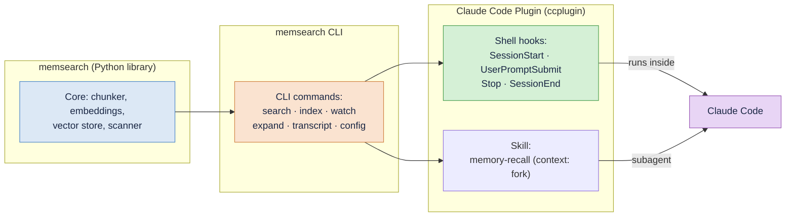
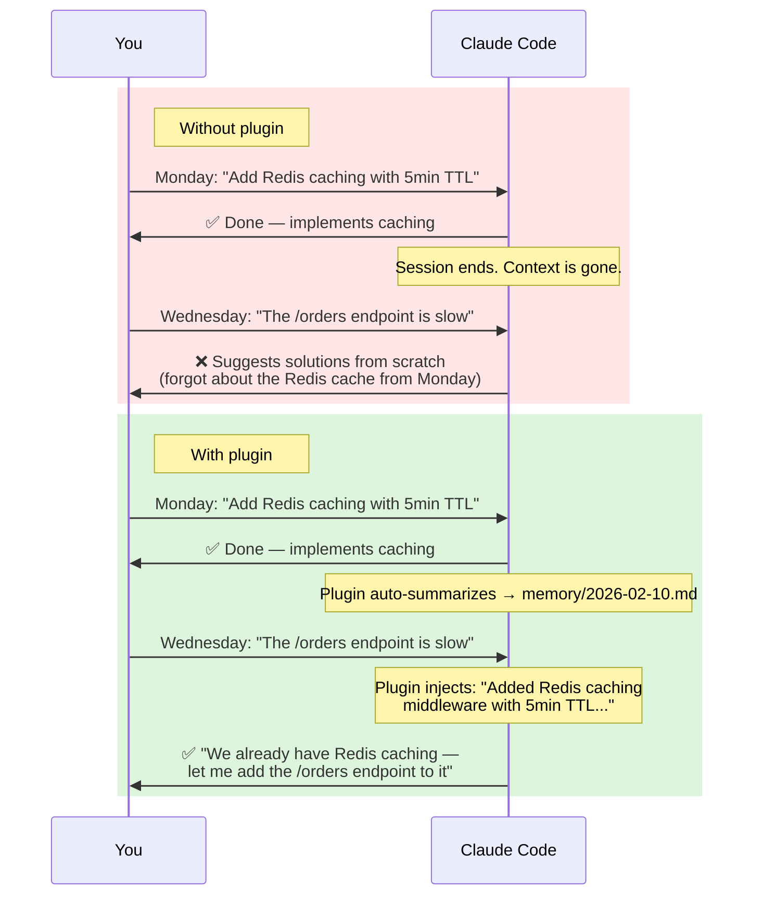
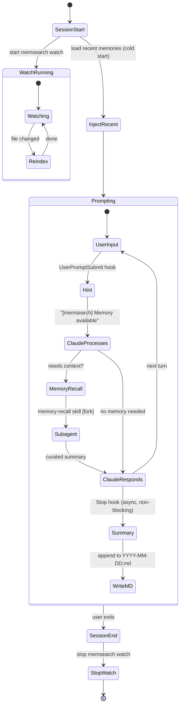
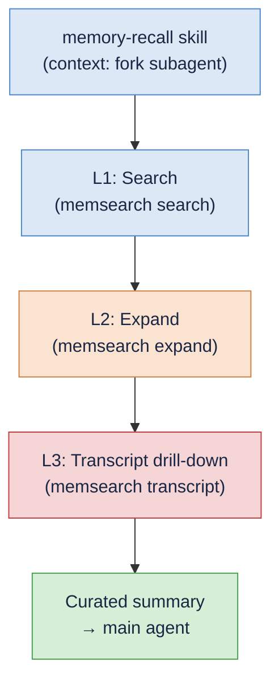

# memsearch — Claude Code Plugin

https://github.com/user-attachments/assets/190a9973-8e23-4ca1-b2a4-a5cf09dad10a

**Automatic persistent memory for [Claude Code](https://docs.anthropic.com/en/docs/claude-code).** No commands to learn, no manual saving — just install the plugin and Claude remembers what you worked on across sessions.

Built on Claude Code's native [Hooks](https://docs.anthropic.com/en/docs/claude-code/hooks), [Skills](https://docs.anthropic.com/en/docs/claude-code/skills), and [CLI](https://zilliztech.github.io/memsearch/cli/) — no MCP servers, no sidecar services. Everything runs locally as shell scripts, a skill definition, and a Python CLI.

### How the Pieces Fit Together



The **memsearch Python library** provides the core engine (chunking, embedding, vector storage, search). The **memsearch CLI** wraps the library into shell-friendly commands. The **Claude Code Plugin** ties those CLI commands to Claude Code's hook lifecycle and skill system — hooks handle session management and memory capture, while the **memory-recall skill** handles intelligent retrieval in a forked subagent context.

---

## Without vs. With the Plugin



---

## Quick Start

### Install from Marketplace (recommended)

```bash
# 1. Set your embedding API key (OpenAI is the default provider)
export OPENAI_API_KEY="sk-..."

# 2. In Claude Code, add the marketplace and install the plugin
/plugin marketplace add zilliztech/memsearch
/plugin install memsearch

# 3. Have a conversation, then exit. Check your memories:
cat .memsearch/memory/$(date +%Y-%m-%d).md

# 4. Start a new session — Claude automatically remembers!
```

> **Note:** You don't need to install memsearch manually — the plugin auto-installs it via [`uvx`](https://docs.astral.sh/uv/) on first run.

---

## How It Works

The plugin hooks into **4 Claude Code lifecycle events** and provides a **memory-recall skill**. A singleton `memsearch watch` process runs in the background, keeping the vector index in sync with markdown files as they change.

### Lifecycle Diagram



### Hook Summary

| Hook | Type | Async | Timeout | What It Does |
|------|------|-------|---------|-------------|
| **SessionStart** | command | no | 10s | Start `memsearch watch` singleton, write session heading to today's `.md`, inject recent daily logs as cold-start context via `additionalContext`, display config status (provider/model/milvus) in `systemMessage` |
| **UserPromptSubmit** | command | no | 15s | Lightweight hint: returns `systemMessage` "[memsearch] Memory available" (skip if < 10 chars). No search — recall is handled by the memory-recall skill |
| **Stop** | command | **yes** | 120s | Parse transcript with `parse-transcript.sh`, call `claude -p --model haiku` to summarize, append summary with session/turn anchors to daily `.md` |
| **SessionEnd** | command | no | 10s | Stop the `memsearch watch` background process (cleanup) |

### What Each Hook Does

#### SessionStart

Fires once when a Claude Code session begins. This hook:

1. **Reads config and checks API key.** Runs `memsearch config get` to read the configured embedding provider, model, and Milvus URI. Checks whether the required API key is set for the provider (`OPENAI_API_KEY`, `GOOGLE_API_KEY`, `VOYAGE_API_KEY`; `ollama` and `local` need no key). If missing, shows an error in `systemMessage` and exits early.
2. **Starts the watcher.** Launches `memsearch watch .memsearch/memory/` as a singleton background process (PID file lock prevents duplicates). The watcher monitors markdown files and auto-re-indexes on changes with a 1500ms debounce.
3. **Writes a session heading.** Appends `## Session HH:MM` to today's memory file (`.memsearch/memory/YYYY-MM-DD.md`), creating the file if it does not exist.
4. **Injects cold-start context.** Reads the last 30 lines from the 2 most recent daily logs and returns them as `additionalContext`. This gives Claude awareness of recent sessions, which helps it decide when to invoke the memory-recall skill.
5. **Displays config status.** Every exit path returns a `systemMessage` showing the active configuration, e.g. `[memsearch] embedding: openai/text-embedding-3-small | milvus: ~/.memsearch/milvus.db`.

#### UserPromptSubmit

Fires on every user prompt before Claude processes it. This hook:

1. **Extracts the prompt** from the hook input JSON.
2. **Skips short prompts** (under 10 characters) — greetings and single words don't need memory hints.
3. **Returns a lightweight hint.** Outputs `systemMessage: "[memsearch] Memory available"` — a visible one-liner that keeps Claude aware of the memory system without performing any search.

The actual memory retrieval is handled by the **memory-recall skill** (see below), which Claude invokes automatically when it judges the user's question needs historical context.

#### Stop

Fires after Claude finishes each response. Runs **asynchronously** so it does not block the user. This hook:

1. **Guards against recursion.** Checks `stop_hook_active` to prevent infinite loops (since the hook itself calls `claude -p`).
2. **Validates the transcript.** Skips if the transcript file is missing or has fewer than 3 lines.
3. **Parses the transcript.** Calls `parse-transcript.sh`, which takes the last 200 lines of the JSONL transcript, truncates content to 500 characters, extracts tool call summaries, and skips `file-history-snapshot` entries.
4. **Summarizes with Haiku.** Pipes the parsed transcript to `claude -p --model haiku --no-session-persistence` with a system prompt requesting 3-8 bullet points.
5. **Appends to daily log.** Writes a `### HH:MM` sub-heading with an HTML comment anchor containing session ID, turn UUID, and transcript path. Then runs `memsearch index` to ensure immediate indexing.

#### SessionEnd

Fires when the user exits Claude Code. Calls `stop_watch` to kill the `memsearch watch` process and clean up the PID file, including a sweep for any orphaned processes.

---

## Progressive Disclosure

Memory retrieval uses a **three-layer progressive disclosure model**, all handled autonomously by the **memory-recall skill** running in a forked subagent context. Claude invokes the skill when it judges the user's question needs historical context — no manual intervention required.



### How the Skill Works

When Claude detects that a user's question could benefit from past context, it automatically invokes the `memory-recall` skill. The skill runs in a **forked subagent context** (`context: fork`), meaning it has its own context window and does not pollute the main conversation. The subagent:

1. **Searches** for relevant memories using `memsearch search`
2. **Evaluates** which results are truly relevant (skips noise)
3. **Expands** promising results with `memsearch expand` to get full markdown sections
4. **Drills into transcripts** when needed with `memsearch transcript`
5. **Returns a curated summary** to the main agent

The main agent only sees the final summary — all intermediate search results, raw expand output, and transcript parsing happen inside the subagent.

Users can also manually invoke the skill with `/memory-recall <query>` if Claude doesn't trigger it automatically.

### L1: Search

The subagent runs `memsearch search` to find relevant chunks from the indexed memory files.

### L2: Expand

For promising search results, the subagent runs `memsearch expand` to retrieve the **full markdown section** surrounding a chunk:

```bash
$ memsearch expand 7a3f9b21e4c08d56
```

**Example output:**

```
Source: .memsearch/memory/2026-02-10.md (lines 12-32)
Heading: 09:15
Session: abc123de-f456-7890-abcd-ef1234567890
Turn: def456ab-cdef-1234-5678-90abcdef1234
Transcript: /home/user/.claude/projects/.../abc123de...7890.jsonl

### 08:50
<!-- session:abc123de... turn:aaa11122... transcript:/.../abc123de...7890.jsonl -->
- Set up project scaffolding for the new API service
- Configured FastAPI with uvicorn, added health check endpoint
- Connected to PostgreSQL via SQLAlchemy async engine

### 09:15
<!-- session:abc123de... turn:def456ab... transcript:/.../abc123de...7890.jsonl -->
- Added Redis caching middleware to API with 5-minute TTL
- Used redis-py async client with connection pooling (max 10 connections)
- Cache key format: `api:v1:{endpoint}:{hash(params)}`
- Added cache hit/miss Prometheus counters for monitoring
- Wrote integration tests with fakeredis
```

### L3: Transcript Drill-Down

When Claude needs the original conversation verbatim — exact code snippets, error messages, or tool outputs — it drills into the JSONL transcript.

**List all turns** in a session:

```bash
$ memsearch transcript /path/to/session.jsonl
```

```
All turns (73):

  6d6210b7-b84  08:50:14  Set up the project scaffolding for...          [12 tools]
  3075ee94-0f6  09:05:22  Can you add a health check endpoint?
  8e45ce0d-9a0  09:15:03  Add a Redis caching layer to the API...        [8 tools]
  53f5cac3-6d9  09:32:41  The cache TTL should be configurable...         [3 tools]
  c708b40c-8f8  09:45:18  Let's add Prometheus metrics for cache...      [10 tools]
```

**Drill into a specific turn** with surrounding context:

```bash
$ memsearch transcript /path/to/session.jsonl --turn 8e45ce0d --context 1
```

```
Showing 2 turns around 8e45ce0d:

>>> [09:05:22] 3075ee94
Can you add a health check endpoint?

**Assistant**: Sure, I'll add a `/health` endpoint that checks the database
connection and returns the service version.

>>> [09:15:03] 8e45ce0d
Add a Redis caching layer to the API with a 5-minute TTL.

**Assistant**: I'll add Redis caching middleware. Let me first check
your current dependencies and middleware setup.
  [Read] requirements.txt
  [Read] src/middleware/__init__.py
  [Write] src/middleware/cache.py
  [Edit] src/main.py — added cache middleware to app
```

### Session Anchors

Each memory summary includes an HTML comment anchor that links the chunk back to its source session, enabling the L2-to-L3 drill-down:

```markdown
### 14:30
<!-- session:abc123def turn:ghi789jkl transcript:/home/user/.claude/projects/.../abc123def.jsonl -->
- Implemented caching system with Redis L1 and in-process LRU L2
- Fixed N+1 query issue in order-service using selectinload
- Decided to use Prometheus counters for cache hit/miss metrics
```

The anchor contains three fields:

| Field | Description |
|-------|-------------|
| `session` | Claude Code session ID (also the JSONL filename without extension) |
| `turn` | UUID of the last user turn in the session |
| `transcript` | Absolute path to the JSONL transcript file |

Claude extracts these fields from `memsearch expand --json-output` and uses them to call `memsearch transcript` for L3 access.

---

## Memory Storage

All memories live in **`.memsearch/memory/`** inside your project directory:

```
your-project/
├── .memsearch/
│   ├── .watch.pid            <-- singleton watcher PID file
│   └── memory/
│       ├── 2026-02-07.md     <-- daily memory log
│       ├── 2026-02-08.md
│       └── 2026-02-09.md     <-- today's session summaries
└── ... (your project files)
```

Each file contains session summaries in plain markdown:

```markdown
## Session 14:30

### 14:30
<!-- session:abc123def turn:ghi789jkl transcript:/home/user/.claude/projects/.../abc123def.jsonl -->
- Implemented caching system with Redis L1 and in-process LRU L2
- Fixed N+1 query issue in order-service using selectinload
- Decided to use Prometheus counters for cache hit/miss metrics

## Session 17:45

### 17:45
<!-- session:mno456pqr turn:stu012vwx transcript:/home/user/.claude/projects/.../mno456pqr.jsonl -->
- Debugged React hydration mismatch caused by Date.now() during SSR
- Added comprehensive test suite for the caching middleware
```

**Markdown is the source of truth.** The [Milvus](https://milvus.io/) vector index is a derived cache that can be rebuilt at any time with `memsearch index .memsearch/memory/`.

---

## Comparison with claude-mem

[claude-mem](https://github.com/thedotmack/claude-mem) is another memory solution for Claude Code. Here is a detailed comparison:

| Aspect | memsearch | claude-mem |
|--------|-----------|------------|
| **Architecture** | 4 shell hooks + 1 watch process | Node.js/Bun worker service + Express server + React UI |
| **Integration** | Native hooks + CLI (zero IPC overhead) | MCP server (stdio); tool definitions permanently consume context window |
| **Memory recall** | **Skill-based auto-recall** — Claude auto-invokes memory-recall skill in a forked subagent when context is needed | **Agent-driven** — Claude must explicitly call MCP `search` tool |
| **Progressive disclosure** | **3-layer, skill-driven**: subagent autonomously handles search (L1), expand (L2), transcript (L3) and returns curated summary | **3-layer, all manual**: `search`, `timeline`, `get_observations` all require explicit tool calls |
| **Session summary cost** | 1 `claude -p --model haiku` call, runs async | Observation on every tool use + session summary (more API calls at scale) |
| **Vector backend** | [Milvus](https://milvus.io/) — hybrid search (dense + [BM25](https://en.wikipedia.org/wiki/Okapi_BM25)), scales from embedded to distributed cluster | [Chroma](https://www.trychroma.com/) — dense only, limited scaling path |
| **Storage format** | Transparent `.md` files — human-readable, git-friendly | Opaque SQLite + Chroma binary |
| **Index sync** | `memsearch watch` singleton — auto-debounced background sync | Automatic observation writes, but no unified background sync |
| **Data portability** | Copy `.memsearch/memory/*.md` and rebuild | Export from SQLite + Chroma |
| **Runtime dependency** | Python (`memsearch` CLI) + `claude` CLI | Node.js + Bun + MCP runtime |
| **Context window cost** | Minimal — skill runs in forked context, only curated summary enters main context | MCP tool definitions always loaded + each tool call/result consumes context |
| **Cost per session** | ~1 Haiku call for summary | Multiple Claude API calls for observation compression |

### The Key Insight: Skill-Based vs. MCP-Based Recall

The fundamental architectural difference is **how** memory recall is orchestrated.

**memsearch uses a skill-based approach.** The `memory-recall` skill runs in a forked subagent context (`context: fork`), meaning all search, expand, and transcript operations happen in an isolated context window. Claude auto-invokes the skill when it judges historical context would be useful. The subagent autonomously handles all three progressive disclosure layers and returns only a curated summary to the main conversation. Combined with cold-start context from the `SessionStart` hook and a lightweight `systemMessage` hint on every prompt, Claude reliably triggers the skill when past context is relevant.

**claude-mem gives Claude MCP tools to search, explore timelines, and fetch observations.** All three layers require Claude to **proactively decide** to invoke them in the main conversation context. While this is more flexible (Claude controls when and what to recall), it means memories are only retrieved when Claude thinks to ask, and every search/expand operation consumes the main context window.

The key advantages of the skill-based approach: (1) the subagent handles multi-step retrieval autonomously without distracting the main agent, (2) intermediate search results don't pollute the main context window, and (3) Claude only recalls memories when they're actually needed — no unnecessary context injection on every prompt.

---

## Comparison with Claude's Native Memory

Claude Code has built-in memory features: `CLAUDE.md` files and auto-memory (the `/memory` command). Here is why memsearch provides a stronger solution:

| Aspect | Claude Native Memory | memsearch |
|--------|---------------------|-----------|
| **Storage** | Single `CLAUDE.md` file (or per-project) | Unlimited daily `.md` files with full history |
| **Recall mechanism** | File is loaded at session start (no search) | Skill-based semantic search — Claude auto-invokes when context is needed |
| **Granularity** | One monolithic file, manually edited | Per-session bullet points, automatically generated |
| **Search** | None — Claude reads the whole file or nothing | Hybrid semantic search (dense + BM25) returning top-k relevant chunks |
| **History depth** | Limited to what fits in one file | Unlimited — every session is logged, every entry is searchable |
| **Automatic capture** | `/memory` command requires manual intervention | Fully automatic — hooks capture every session |
| **Progressive disclosure** | None — entire file is loaded into context | 3-layer model (L1 auto-inject, L2 expand, L3 transcript) minimizes context usage |
| **Deduplication** | Manual — user must avoid adding duplicates | [SHA-256](https://en.wikipedia.org/wiki/SHA-2) content hashing prevents duplicate embeddings |
| **Portability** | Tied to Claude Code's internal format | Standard markdown files, usable with any tool |

### Why This Matters

`CLAUDE.md` is a blunt instrument: it loads the entire file into context at session start, regardless of relevance. As the file grows, it wastes context window on irrelevant information and eventually hits size limits. There is no search — Claude cannot selectively recall a specific decision from three weeks ago.

memsearch solves this with **skill-based semantic search and progressive disclosure**. When Claude judges that historical context would help, it auto-invokes the memory-recall skill, which runs in a forked subagent and autonomously searches, expands, and curates relevant memories. History can grow indefinitely without degrading performance, because the vector index handles the filtering. And the three-layer model (search → expand → transcript) runs entirely in the subagent, keeping the main context window clean.

---

## Plugin Files

```
ccplugin/
├── .claude-plugin/
│   └── plugin.json              # Plugin manifest (name, version, description)
├── hooks/
│   ├── hooks.json               # Hook definitions (4 lifecycle hooks)
│   ├── common.sh                # Shared setup: env, PATH, memsearch detection, watch management
│   ├── session-start.sh         # Start watch + write session heading + inject cold-start context
│   ├── user-prompt-submit.sh    # Lightweight systemMessage hint ("[memsearch] Memory available")
│   ├── stop.sh                  # Parse transcript -> haiku summary -> append to daily .md
│   ├── parse-transcript.sh      # Deterministic JSONL-to-text parser with truncation
│   └── session-end.sh           # Stop watch process (cleanup)
└── skills/
    └── memory-recall/
        └── SKILL.md             # Memory retrieval skill (context: fork subagent)
```

---

## The `memsearch` CLI

The plugin is built entirely on the [`memsearch`](../README.md) CLI — every hook is a shell script calling `memsearch` subcommands:

| Command | Used By | What It Does |
|---------|---------|-------------|
| `search <query>` | memory-recall skill | Semantic search over indexed memories (`--top-k` for result count, `--json-output` for JSON) |
| `watch <paths>` | SessionStart hook | Background watcher that auto-indexes on file changes (1500ms debounce) |
| `index <paths>` | Manual / rebuild | One-shot index of markdown files (`--force` to re-index all) |
| `expand <chunk_hash>` | memory-recall skill (L2) | Show full markdown section around a chunk, with anchor metadata |
| `transcript <jsonl>` | memory-recall skill (L3) | Parse Claude Code JSONL transcript into readable conversation turns |
| `config init` | Quick Start | Interactive config wizard for first-time setup |
| `stats` | Manual | Show index statistics (collection size, chunk count) |
| `reset` | Manual | Drop all indexed data (requires `--yes` to confirm) |

For the full CLI reference, see the [CLI Reference docs](https://zilliztech.github.io/memsearch/cli/).

---

## Development Mode

For contributors or if you want to modify the plugin locally:

```bash
git clone https://github.com/zilliztech/memsearch.git
cd memsearch && uv sync
claude --plugin-dir ./ccplugin
```

---

## Troubleshooting

### "ERROR: \<KEY\> not set — memory search disabled"

The plugin detects the configured embedding provider and checks for the required API key at session start. If missing, memory recording still writes `.md` files, but semantic search and indexing are disabled.

| Provider | Required environment variable |
|----------|------------------------------|
| `openai` (default) | `OPENAI_API_KEY` |
| `google` | `GOOGLE_API_KEY` |
| `voyage` | `VOYAGE_API_KEY` |
| `ollama` | None (local) |
| `local` | None (local) |

**Fix:** export the key for your configured provider:

```bash
# For OpenAI (default)
export OPENAI_API_KEY="sk-..."

# Or switch to a provider that needs no key
memsearch config set embedding.provider ollama
```

To make it permanent, add the export to your `~/.bashrc`, `~/.zshrc`, or equivalent.
