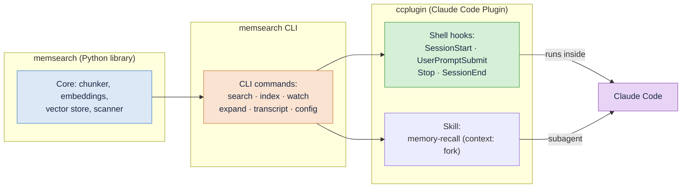

# memsearch -- Claude Code Plugin

https://github.com/user-attachments/assets/190a9973-8e23-4ca1-b2a4-a5cf09dad10a

**Automatic persistent memory for [Claude Code](https://docs.anthropic.com/en/docs/claude-code).** No commands to learn, no manual saving -- just install the plugin and Claude remembers what you worked on across sessions.

Built on Claude Code's native [Hooks](https://docs.anthropic.com/en/docs/claude-code/hooks), [Skills](https://docs.anthropic.com/en/docs/claude-code/skills), and [CLI](https://zilliztech.github.io/memsearch/cli/) -- no MCP servers, no sidecar services. Everything runs locally as shell scripts, a skill definition, and a Python CLI.

---

## Quick Start

```bash
# 1. Set your embedding API key (OpenAI is the default provider)
export OPENAI_API_KEY="sk-..."

# 2. In Claude Code, add the marketplace and install the plugin
/plugin marketplace add zilliztech/memsearch
/plugin install memsearch

# 3. Have a conversation, then exit. Check your memories:
cat .memsearch/memory/$(date +%Y-%m-%d).md

# 4. Start a new session -- Claude automatically remembers!
```

> **Note:** If memsearch is not already installed, the plugin will attempt to install it automatically on first run.

---

## How It Works

The plugin hooks into 4 Claude Code lifecycle events and provides a memory-recall skill. A singleton `memsearch watch` process runs in the background, keeping the vector index in sync with markdown files as they change.


```mermaid
graph LR
    subgraph "memsearch (Python library)"
        LIB[Core: chunker, embeddings,<br/>vector store, scanner]
    end

    subgraph "memsearch CLI"
        CLI["CLI commands:<br/>search · index · watch<br/>expand · transcript · config"]
    end

    subgraph "ccplugin (Claude Code Plugin)"
        HOOKS["Shell hooks:<br/>SessionStart · UserPromptSubmit<br/>Stop · SessionEnd"]
        SKILL["Skill:<br/>memory-recall (context: fork)"]
    end

    LIB --> CLI
    CLI --> HOOKS
    CLI --> SKILL
    HOOKS -->|"runs inside"| CC[Claude Code]
    SKILL -->|"subagent"| CC

    style LIB fill:#dce8f5,stroke:#4a86c8,color:#1a2744
    style CLI fill:#fae3d0,stroke:#d08040,color:#1a2744
    style HOOKS fill:#d5f0d6,stroke:#4a9e4e,color:#1a2744
    style CC fill:#e8d5f5,stroke:#9b59b6,color:#1a2744
```

| Hook | What It Does |
|------|-------------|
| **SessionStart** | Start watcher, inject cold-start context, display config status |
| **UserPromptSubmit** | Return lightweight hint "[memsearch] Memory available" |
| **Stop** | Summarize last turn with haiku, append to daily `.md` |
| **SessionEnd** | Stop watcher, cleanup |

Memory retrieval uses a **three-layer progressive disclosure model** (search -> expand -> transcript), all handled by the memory-recall skill in a forked subagent.

---

## Plugin Files

```
ccplugin/
├── .claude-plugin/
│   └── plugin.json              # Plugin manifest (name, version, description)
├── hooks/
│   ├── hooks.json               # Hook definitions (4 lifecycle hooks)
│   ├── common.sh                # Shared setup: env, PATH, memsearch detection, watch management
│   ├── session-start.sh         # Start watch + write session heading + inject cold-start context
│   ├── user-prompt-submit.sh    # Lightweight systemMessage hint
│   ├── stop.sh                  # Parse transcript -> haiku summary -> append to daily .md
│   ├── parse-transcript.sh      # Deterministic JSONL-to-text parser with truncation
│   └── session-end.sh           # Stop watch process (cleanup)
├── scripts/
│   └── derive-collection.sh     # Derive per-project collection name from project path
└── skills/
    └── memory-recall/
        └── SKILL.md             # Memory retrieval skill (context: fork subagent)
```

---

## Development Mode

For contributors or if you want to modify the plugin locally:

```bash
git clone https://github.com/zilliztech/memsearch.git
cd memsearch && uv sync
claude --plugin-dir ./ccplugin
```

---

## Full Documentation

For detailed documentation, see the [memsearch docs site](https://zilliztech.github.io/memsearch/):

- **[Plugin Overview](https://zilliztech.github.io/memsearch/claude-plugin/)** -- architecture, comparisons, memory storage
- **[Hooks](https://zilliztech.github.io/memsearch/claude-plugin/hooks/)** -- deep dive into all 4 lifecycle hooks
- **[Progressive Disclosure](https://zilliztech.github.io/memsearch/claude-plugin/progressive-disclosure/)** -- 3-layer retrieval system (search -> expand -> transcript)
- **[Troubleshooting](https://zilliztech.github.io/memsearch/claude-plugin/troubleshooting/)** -- debugging, observability, common issues
