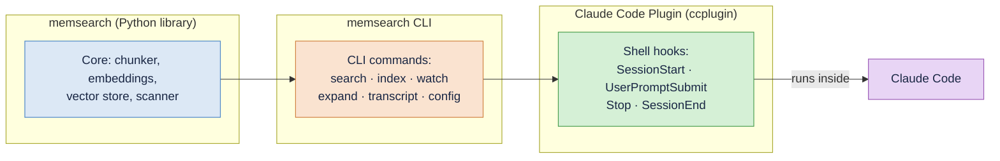
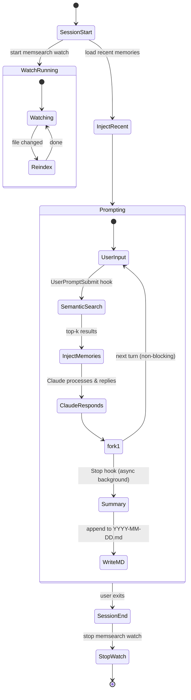
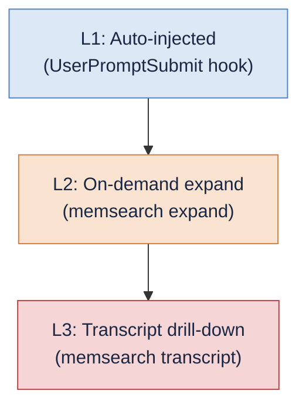

# memsearch — Claude Code Plugin

https://github.com/user-attachments/assets/190a9973-8e23-4ca1-b2a4-a5cf09dad10a

**Automatic persistent memory for [Claude Code](https://docs.anthropic.com/en/docs/claude-code).** No commands to learn, no manual saving — just install the plugin and Claude remembers what you worked on across sessions.

Built on Claude Code's native [Hooks](https://docs.anthropic.com/en/docs/claude-code/hooks) and [CLI](https://zilliztech.github.io/memsearch/cli/) — no MCP servers, no sidecar services. Everything runs locally as shell scripts and a Python CLI.

### How the Pieces Fit Together



The **memsearch Python library** provides the core engine (chunking, embedding, vector storage, search). The **memsearch CLI** wraps the library into shell-friendly commands. The **Claude Code Plugin** ties those CLI commands to Claude Code's hook lifecycle — so everything happens automatically without user intervention.

---

## Without vs. With the Plugin

```mermaid
sequenceDiagram
    participant You
    participant Claude as Claude Code

    rect rgb(60, 30, 30)
    note right of You: Without plugin
    You->>Claude: Monday: "Add Redis caching with 5min TTL"
    Claude->>You: ✅ Done — implements caching
    note over Claude: Session ends. Context is gone.
    You->>Claude: Wednesday: "The /orders endpoint is slow"
    Claude->>You: ❌ Suggests solutions from scratch<br/>(forgot about the Redis cache from Monday)
    end

    rect rgb(20, 50, 30)
    note right of You: With plugin
    You->>Claude: Monday: "Add Redis caching with 5min TTL"
    Claude->>You: ✅ Done — implements caching
    note over Claude: Plugin auto-summarizes → memory/2026-02-10.md
    You->>Claude: Wednesday: "The /orders endpoint is slow"
    note over Claude: Plugin injects: "Added Redis caching<br/>middleware with 5min TTL..."
    Claude->>You: ✅ "We already have Redis caching —<br/>let me add the /orders endpoint to it"
    end
```



---

## Quick Start

### Install from Marketplace (recommended)

```bash
# 1. Install the memsearch CLI
pip install memsearch

# 2. Set your embedding API key (OpenAI is the default provider)
export OPENAI_API_KEY="sk-..."

# 3. (Optional) Initialize config
memsearch config init

# 4. In Claude Code, add the marketplace and install the plugin
/plugin marketplace add zilliztech/memsearch
/plugin install memsearch

# 5. Have a conversation, then exit. Check your memories:
cat .memsearch/memory/$(date +%Y-%m-%d).md

# 6. Start a new session — Claude automatically remembers!
```

---

## How It Works

The plugin hooks into **4 Claude Code lifecycle events**. A singleton `memsearch watch` process runs in the background, keeping the vector index in sync with markdown files as they change.

### Lifecycle Diagram



### Hook Summary

| Hook | Type | Async | Timeout | What It Does |
|------|------|-------|---------|-------------|
| **SessionStart** | command | no | 10s | Start `memsearch watch` singleton, write session heading to today's `.md`, inject recent memories and Memory Tools instructions via `additionalContext` |
| **UserPromptSubmit** | command | no | 15s | Semantic search on user prompt (skip if < 10 chars), inject top-3 relevant memories with `chunk_hash` IDs via `additionalContext` |
| **Stop** | command | **yes** | 120s | Parse transcript with `parse-transcript.sh`, call `claude -p --model haiku` to summarize, append summary with session/turn anchors to daily `.md` |
| **SessionEnd** | command | no | 10s | Stop the `memsearch watch` background process (cleanup) |

### What Each Hook Does

#### SessionStart

Fires once when a Claude Code session begins. This hook:

1. **Starts the watcher.** Launches `memsearch watch .memsearch/memory/` as a singleton background process (PID file lock prevents duplicates). The watcher monitors markdown files and auto-re-indexes on changes with a 1500ms debounce.
2. **Writes a session heading.** Appends `## Session HH:MM` to today's memory file (`.memsearch/memory/YYYY-MM-DD.md`), creating the file if it does not exist.
3. **Injects recent memories.** Reads the last 30 lines from the 2 most recent daily logs. If memsearch is available, also runs `memsearch search "recent session summary" --top-k 3` for semantic results.
4. **Injects Memory Tools instructions.** Tells Claude about `memsearch expand` and `memsearch transcript` commands for progressive disclosure (L2 and L3).

All of this is returned as `additionalContext` in the hook output JSON.

#### UserPromptSubmit

Fires on every user prompt before Claude processes it. This hook:

1. **Extracts the prompt** from the hook input JSON.
2. **Skips short prompts** (under 10 characters) — greetings and single words are not worth searching.
3. **Runs semantic search.** Calls `memsearch search "$PROMPT" --top-k 3 --json-output`.
4. **Formats results** as a compact index with source file, heading, a 200-character preview, and the `chunk_hash` for each result.
5. **Injects as context.** Returns formatted results under a `## Relevant Memories` heading via `additionalContext`.

This is the key mechanism that makes memory recall automatic — Claude does not need to decide to search, it simply receives relevant context on every prompt.

#### Stop

Fires after Claude finishes each response. Runs **asynchronously** so it does not block the user. This hook:

1. **Guards against recursion.** Checks `stop_hook_active` to prevent infinite loops (since the hook itself calls `claude -p`).
2. **Validates the transcript.** Skips if the transcript file is missing or has fewer than 3 lines.
3. **Parses the transcript.** Calls `parse-transcript.sh`, which takes the last 200 lines of the JSONL transcript, truncates content to 500 characters, extracts tool call summaries, and skips `file-history-snapshot` entries.
4. **Summarizes with Haiku.** Pipes the parsed transcript to `claude -p --model haiku --no-session-persistence` with a system prompt requesting 3-8 bullet points.
5. **Appends to daily log.** Writes a `### HH:MM` sub-heading with an HTML comment anchor containing session ID, turn UUID, and transcript path. Then runs `memsearch index` to ensure immediate indexing.

#### SessionEnd

Fires when the user exits Claude Code. Calls `stop_watch` to kill the `memsearch watch` process and clean up the PID file, including a sweep for any orphaned processes.

---

## Progressive Disclosure

Memory retrieval uses a **three-layer progressive disclosure model**. Layer 1 is fully automatic; layers 2 and 3 are available on demand when Claude needs more context.



### L1: Auto-Injected (Automatic)

On every user prompt, the `UserPromptSubmit` hook injects the top-3 semantic search results. Each result includes the source file, heading, a 200-character content preview, and the `chunk_hash` identifier.

**Example injection** (this is what Claude sees before processing each message):

```
## Relevant Memories
- [.memsearch/memory/2026-02-10.md:09:15]  Added Redis caching middleware
  to API with 5-minute TTL. Used redis-py async client with connection
  pooling (max 10 connections). Cache key format: api:v1:{endpoint}:...
  `chunk_hash: 7a3f9b21e4c08d56`
- [.memsearch/memory/2026-02-09.md:14:30]  Fixed N+1 query in order-service
  by switching from lazy loading to selectinload. Reduced /orders response
  time from 1.2s to 180ms...
  `chunk_hash: 31cbaf74856ad1ed`
```

### L2: On-Demand Expand

When an L1 preview is not enough, Claude runs `memsearch expand` to retrieve the **full markdown section** surrounding a chunk:

```bash
$ memsearch expand 7a3f9b21e4c08d56
```

**Example output:**

```
Source: .memsearch/memory/2026-02-10.md (lines 12-32)
Heading: 09:15
Session: abc123de-f456-7890-abcd-ef1234567890
Turn: def456ab-cdef-1234-5678-90abcdef1234
Transcript: /home/user/.claude/projects/.../abc123de...7890.jsonl

### 08:50
<!-- session:abc123de... turn:aaa11122... transcript:/.../abc123de...7890.jsonl -->
- Set up project scaffolding for the new API service
- Configured FastAPI with uvicorn, added health check endpoint
- Connected to PostgreSQL via SQLAlchemy async engine

### 09:15
<!-- session:abc123de... turn:def456ab... transcript:/.../abc123de...7890.jsonl -->
- Added Redis caching middleware to API with 5-minute TTL
- Used redis-py async client with connection pooling (max 10 connections)
- Cache key format: `api:v1:{endpoint}:{hash(params)}`
- Added cache hit/miss Prometheus counters for monitoring
- Wrote integration tests with fakeredis
```

### L3: Transcript Drill-Down

When Claude needs the original conversation verbatim — exact code snippets, error messages, or tool outputs — it drills into the JSONL transcript.

**List all turns** in a session:

```bash
$ memsearch transcript /path/to/session.jsonl
```

```
All turns (73):

  6d6210b7-b84  08:50:14  Set up the project scaffolding for...          [12 tools]
  3075ee94-0f6  09:05:22  Can you add a health check endpoint?
  8e45ce0d-9a0  09:15:03  Add a Redis caching layer to the API...        [8 tools]
  53f5cac3-6d9  09:32:41  The cache TTL should be configurable...         [3 tools]
  c708b40c-8f8  09:45:18  Let's add Prometheus metrics for cache...      [10 tools]
```

**Drill into a specific turn** with surrounding context:

```bash
$ memsearch transcript /path/to/session.jsonl --turn 8e45ce0d --context 1
```

```
Showing 2 turns around 8e45ce0d:

>>> [09:05:22] 3075ee94
Can you add a health check endpoint?

**Assistant**: Sure, I'll add a `/health` endpoint that checks the database
connection and returns the service version.

>>> [09:15:03] 8e45ce0d
Add a Redis caching layer to the API with a 5-minute TTL.

**Assistant**: I'll add Redis caching middleware. Let me first check
your current dependencies and middleware setup.
  [Read] requirements.txt
  [Read] src/middleware/__init__.py
  [Write] src/middleware/cache.py
  [Edit] src/main.py — added cache middleware to app
```

### Session Anchors

Each memory summary includes an HTML comment anchor that links the chunk back to its source session, enabling the L2-to-L3 drill-down:

```markdown
### 14:30
<!-- session:abc123def turn:ghi789jkl transcript:/home/user/.claude/projects/.../abc123def.jsonl -->
- Implemented caching system with Redis L1 and in-process LRU L2
- Fixed N+1 query issue in order-service using selectinload
- Decided to use Prometheus counters for cache hit/miss metrics
```

The anchor contains three fields:

| Field | Description |
|-------|-------------|
| `session` | Claude Code session ID (also the JSONL filename without extension) |
| `turn` | UUID of the last user turn in the session |
| `transcript` | Absolute path to the JSONL transcript file |

Claude extracts these fields from `memsearch expand --json-output` and uses them to call `memsearch transcript` for L3 access.

---

## Memory Storage

All memories live in **`.memsearch/memory/`** inside your project directory:

```
your-project/
├── .memsearch/
│   ├── .watch.pid            <-- singleton watcher PID file
│   └── memory/
│       ├── 2026-02-07.md     <-- daily memory log
│       ├── 2026-02-08.md
│       └── 2026-02-09.md     <-- today's session summaries
└── ... (your project files)
```

Each file contains session summaries in plain markdown:

```markdown
## Session 14:30

### 14:30
<!-- session:abc123def turn:ghi789jkl transcript:/home/user/.claude/projects/.../abc123def.jsonl -->
- Implemented caching system with Redis L1 and in-process LRU L2
- Fixed N+1 query issue in order-service using selectinload
- Decided to use Prometheus counters for cache hit/miss metrics

## Session 17:45

### 17:45
<!-- session:mno456pqr turn:stu012vwx transcript:/home/user/.claude/projects/.../mno456pqr.jsonl -->
- Debugged React hydration mismatch caused by Date.now() during SSR
- Added comprehensive test suite for the caching middleware
```

**Markdown is the source of truth.** The [Milvus](https://milvus.io/) vector index is a derived cache that can be rebuilt at any time with `memsearch index .memsearch/memory/`.

---

## Comparison with claude-mem

[claude-mem](https://github.com/thedotmack/claude-mem) is another memory solution for Claude Code. Here is a detailed comparison:

| Aspect | memsearch | claude-mem |
|--------|-----------|------------|
| **Architecture** | 4 shell hooks + 1 watch process | Node.js/Bun worker service + Express server + React UI |
| **Integration** | Native hooks + CLI (zero IPC overhead) | MCP server (stdio); tool definitions permanently consume context window |
| **Memory recall** | **Automatic** — semantic search on every prompt via hook | **Agent-driven** — Claude must explicitly call MCP `search` tool |
| **Progressive disclosure** | **3-layer, auto-triggered**: hook injects top-k (L1), then `expand` (L2), then `transcript` (L3) | **3-layer, all manual**: `search`, `timeline`, `get_observations` all require explicit tool calls |
| **Session summary cost** | 1 `claude -p --model haiku` call, runs async | Observation on every tool use + session summary (more API calls at scale) |
| **Vector backend** | [Milvus](https://milvus.io/) — hybrid search (dense + [BM25](https://en.wikipedia.org/wiki/Okapi_BM25)), scales from embedded to distributed cluster | [Chroma](https://www.trychroma.com/) — dense only, limited scaling path |
| **Storage format** | Transparent `.md` files — human-readable, git-friendly | Opaque SQLite + Chroma binary |
| **Index sync** | `memsearch watch` singleton — auto-debounced background sync | Automatic observation writes, but no unified background sync |
| **Data portability** | Copy `.memsearch/memory/*.md` and rebuild | Export from SQLite + Chroma |
| **Runtime dependency** | Python (`memsearch` CLI) + `claude` CLI | Node.js + Bun + MCP runtime |
| **Context window cost** | Minimal — hook injects only top-k results as plain text | MCP tool definitions always loaded + each tool call/result consumes context |
| **Cost per session** | ~1 Haiku call for summary | Multiple Claude API calls for observation compression |

### The Key Insight: Automatic vs. Agent-Driven Recall

The fundamental architectural difference is **when** memory recall happens.

**memsearch injects relevant memories into every prompt via hooks.** Claude does not need to decide whether to search — it simply receives relevant context before processing each message. This means memories are **never missed due to Claude forgetting to look them up**. Progressive disclosure starts automatically at L1 (the hook injects top-k results), and only deeper layers (L2 expand, L3 transcript) require explicit CLI calls from the agent.

**claude-mem gives Claude MCP tools to search, explore timelines, and fetch observations.** All three layers require Claude to **proactively decide** to invoke them. While this is more flexible (Claude controls when and what to recall), it means memories are only retrieved when Claude thinks to ask. In practice, Claude often does not call the search tool unless the conversation explicitly references past work — which means relevant context can be silently lost.

The difference is analogous to push vs. pull: memsearch **pushes** memories to Claude on every turn, while claude-mem requires Claude to **pull** them on demand.

---

## Comparison with Claude's Native Memory

Claude Code has built-in memory features: `CLAUDE.md` files and auto-memory (the `/memory` command). Here is why memsearch provides a stronger solution:

| Aspect | Claude Native Memory | memsearch |
|--------|---------------------|-----------|
| **Storage** | Single `CLAUDE.md` file (or per-project) | Unlimited daily `.md` files with full history |
| **Recall mechanism** | File is loaded at session start (no search) | Semantic search on every prompt (embedding-based) |
| **Granularity** | One monolithic file, manually edited | Per-session bullet points, automatically generated |
| **Search** | None — Claude reads the whole file or nothing | Hybrid semantic search (dense + BM25) returning top-k relevant chunks |
| **History depth** | Limited to what fits in one file | Unlimited — every session is logged, every entry is searchable |
| **Automatic capture** | `/memory` command requires manual intervention | Fully automatic — hooks capture every session |
| **Progressive disclosure** | None — entire file is loaded into context | 3-layer model (L1 auto-inject, L2 expand, L3 transcript) minimizes context usage |
| **Deduplication** | Manual — user must avoid adding duplicates | [SHA-256](https://en.wikipedia.org/wiki/SHA-2) content hashing prevents duplicate embeddings |
| **Portability** | Tied to Claude Code's internal format | Standard markdown files, usable with any tool |

### Why This Matters

`CLAUDE.md` is a blunt instrument: it loads the entire file into context at session start, regardless of relevance. As the file grows, it wastes context window on irrelevant information and eventually hits size limits. There is no search — Claude cannot selectively recall a specific decision from three weeks ago.

memsearch solves this with **semantic search and progressive disclosure**. Instead of loading everything, it injects only the top-k most relevant memories for each specific prompt. History can grow indefinitely without degrading performance, because the vector index handles the filtering. And the three-layer model means Claude starts with lightweight previews and only drills deeper when needed, keeping context window usage minimal.

---

## Plugin Files

```
ccplugin/
├── .claude-plugin/
│   └── plugin.json              # Plugin manifest (name, version, description)
└── hooks/
    ├── hooks.json               # Hook definitions (4 lifecycle hooks)
    ├── common.sh                # Shared setup: env, PATH, memsearch detection, watch management
    ├── session-start.sh         # Start watch + write session heading + inject memories & tools
    ├── user-prompt-submit.sh    # Semantic search on prompt -> inject memories with chunk_hash
    ├── stop.sh                  # Parse transcript -> haiku summary -> append to daily .md
    ├── parse-transcript.sh      # Deterministic JSONL-to-text parser with truncation
    └── session-end.sh           # Stop watch process (cleanup)
```

---

## The `memsearch` CLI

The plugin is built entirely on the [`memsearch`](../README.md) CLI — every hook is a shell script calling `memsearch` subcommands:

| Command | Used By | What It Does |
|---------|---------|-------------|
| `search <query>` | UserPromptSubmit hook | Semantic search over indexed memories (`--top-k` for result count, `--json-output` for JSON) |
| `watch <paths>` | SessionStart hook | Background watcher that auto-indexes on file changes (1500ms debounce) |
| `index <paths>` | Manual / rebuild | One-shot index of markdown files (`--force` to re-index all) |
| `expand <chunk_hash>` | Agent (L2 disclosure) | Show full markdown section around a chunk, with anchor metadata |
| `transcript <jsonl>` | Agent (L3 disclosure) | Parse Claude Code JSONL transcript into readable conversation turns |
| `config init` | Quick Start | Interactive config wizard for first-time setup |
| `stats` | Manual | Show index statistics (collection size, chunk count) |
| `reset` | Manual | Drop all indexed data (requires `--yes` to confirm) |

For the full CLI reference, see the [CLI Reference docs](https://zilliztech.github.io/memsearch/cli/).

---

## Development Mode

For contributors or if you want to modify the plugin locally:

```bash
git clone https://github.com/zilliztech/memsearch.git
pip install memsearch
claude --plugin-dir ./memsearch/ccplugin
```
