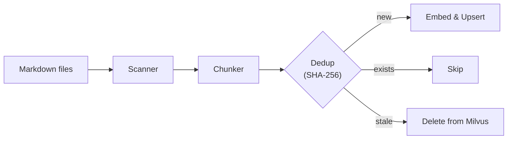
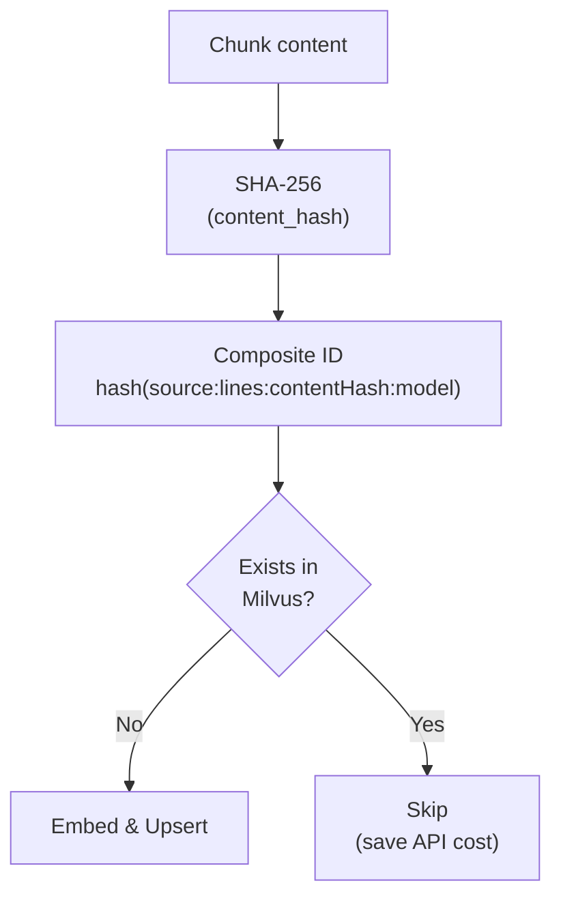
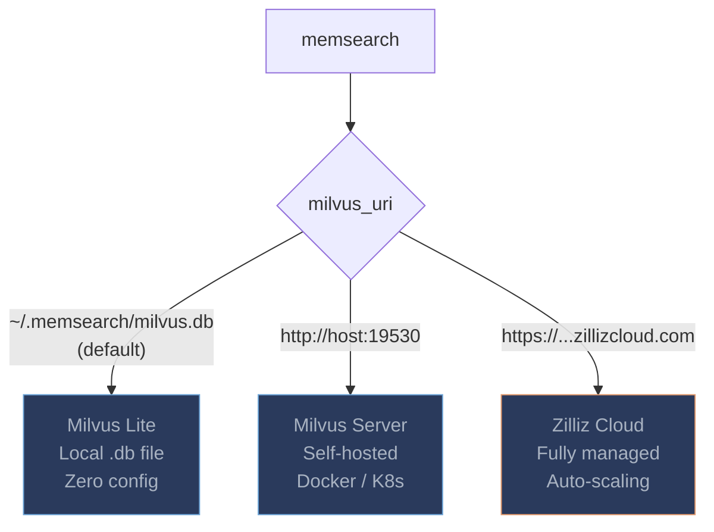
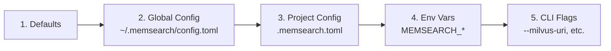
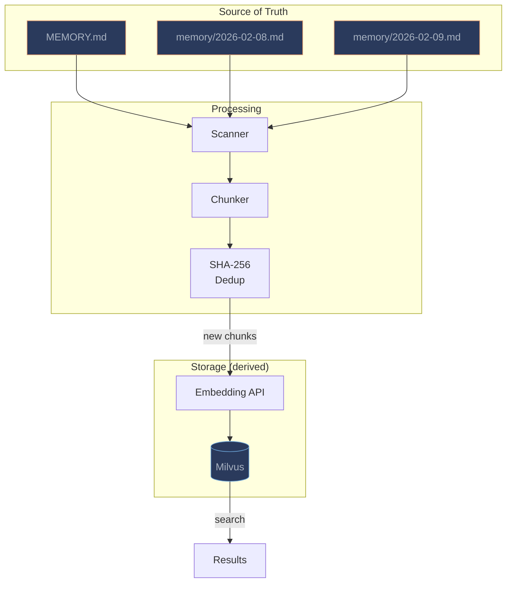

# Architecture

This page explains the architecture, design philosophy, and key implementation decisions behind memsearch.

---

## Design Philosophy

### Markdown as the Source of Truth

The foundational principle of memsearch is simple: **markdown files are the canonical data store**. The vector database is a derived index -- it can be dropped and rebuilt at any time from the markdown files on disk. This is the same philosophy used by [OpenClaw](https://github.com/openclaw/openclaw)'s memory system, and memsearch is designed to be a standalone extraction of that architecture.

**Why markdown?**

- **Human-readable.** Any developer can open a memory file in any text editor and understand what the agent knows. There is no binary format to decode, no special viewer required.
- **Git-friendly.** Markdown diffs are clean and meaningful. You get full version history, blame, branching, and merge conflict resolution for free -- the same tools you already use for code.
- **Zero vendor lock-in.** Markdown is a plain-text format that has been stable for decades. If you stop using memsearch tomorrow, your knowledge base is still right there on disk, fully intact.
- **Trivially portable.** Copy the files to another machine, another tool, another agent framework. No export step, no migration script, no schema translation.

**Why NOT a database as the source of truth?**

- **Opaque.** Database files are binary blobs that require specific software to read. If the tool disappears, so does easy access to your data.
- **Vendor lock-in.** Each database engine has its own storage format, query language, and migration tooling. Switching costs are high.
- **Fragile.** Database corruption, version incompatibilities, and backup complexity are real operational concerns for what should be a simple knowledge store.

In memsearch, the vector store is an acceleration layer -- nothing more. If the Milvus database is lost, corrupted, or simply out of date, a single `memsearch index` command rebuilds the entire index from the markdown files.


### Inspired by OpenClaw

memsearch follows [OpenClaw](https://github.com/openclaw/openclaw)'s memory architecture precisely:

| Concept | OpenClaw | memsearch |
|---------|----------|-----------|
| Memory layout | `MEMORY.md` + `memory/YYYY-MM-DD.md` | Same |
| Chunk ID format | `hash(source:startLine:endLine:contentHash:model)` | Same |
| Dedup strategy | Content-hash primary key | Same |
| Flush target | Append to daily markdown log | Same |
| Source of truth | Markdown files (vector DB is derived) | Same |
| File watch debounce | 1500ms | Same default |

If you are already using OpenClaw's memory directory layout, memsearch works with it directly -- no migration needed.

---

## Pipeline Overview

### Search Flow

When a query arrives, it is embedded into a vector, then used for hybrid search (dense cosine similarity + BM25 full-text) against the Milvus collection. Results are reranked using Reciprocal Rank Fusion (RRF) and returned with source metadata.


### Ingest Flow

Markdown files are scanned, chunked by headings, and deduplicated using SHA-256 content hashes. Only new or changed chunks are sent to the embedding API and upserted into Milvus. Chunks from deleted files are automatically cleaned up.



### Watch and Flush

The file watcher monitors directories for markdown changes and automatically re-indexes modified files. The flush operation compresses indexed chunks into an LLM-generated summary and writes it back to a daily markdown log -- which the watcher then picks up and indexes, closing the loop.


---

## Chunking Strategy

memsearch splits markdown files into semantic chunks using a heading-based strategy, with paragraph-level fallback for oversized sections.

### Heading-Based Chunking

The chunker treats markdown headings (`#` through `######`) as natural chunk boundaries. Each heading and the content below it (up to the next heading of equal or higher level) becomes one chunk. Content before the first heading (the "preamble") is treated as its own chunk.

```
# Project Notes                    <-- preamble chunk starts here

Some introductory text.

## Redis Configuration              <-- chunk boundary

We chose Redis for caching...

### Connection Settings              <-- chunk boundary

host=localhost, port=6379...

## Authentication                    <-- chunk boundary

We use JWT tokens...
```

### Paragraph-Based Splitting for Large Sections

When a heading-delimited section exceeds `max_chunk_size` (default: 1500 characters), the chunker splits it further at paragraph boundaries (blank lines). A configurable `overlap_lines` (default: 2 lines) is carried forward between sub-chunks to preserve context continuity.

### Chunk Metadata

Each chunk carries rich metadata for provenance tracking:

| Field | Description |
|-------|-------------|
| `content` | The raw text of the chunk |
| `source` | Absolute file path the chunk was extracted from |
| `heading` | The nearest heading text (empty string for preamble) |
| `heading_level` | Heading depth: 1--6 for `#`--`######`, 0 for preamble |
| `start_line` | First line number in the source file (1-indexed) |
| `end_line` | Last line number in the source file |
| `content_hash` | Truncated SHA-256 hash of the chunk content (16 hex chars) |

---

## Deduplication

memsearch uses content-addressable storage to avoid redundant embedding API calls and duplicate data in the vector store.

### How It Works

1. Each chunk's content is hashed with SHA-256 (truncated to 16 hex characters).
2. A composite chunk ID is computed from the source path, line range, content hash, and embedding model name -- matching OpenClaw's format: `hash(markdown:source:startLine:endLine:contentHash:model)`.
3. Before embedding, the set of existing chunk IDs for the source file is queried from Milvus.
4. Only chunks whose composite ID is **not** already present get embedded and upserted.
5. Chunks whose composite ID **no longer appears** in the re-chunked file are deleted (stale chunk cleanup).



### Why This Matters

- **No external cache needed.** The hash IS the primary key in Milvus. There is no SQLite sidecar database, no Redis cache, no `.json` tracking file. The deduplication mechanism is the storage key itself.
- **Incremental indexing.** Re-running `memsearch index` on an unchanged knowledge base produces zero embedding API calls. Only genuinely new or modified content is processed.
- **Cost savings.** Embedding API calls are the primary cost of running a semantic search system. Content-addressable dedup ensures you never pay to embed the same content twice.

---

## Storage Architecture

### Collection Schema

All chunks are stored in a single Milvus collection named `memsearch_chunks` (configurable). The schema uses both dense and sparse vector fields to enable hybrid search:

| Field | Type | Purpose |
|-------|------|---------|
| `chunk_hash` | `VARCHAR(64)` | **Primary key** -- composite SHA-256 chunk ID |
| `embedding` | `FLOAT_VECTOR` | Dense embedding from the configured provider |
| `content` | `VARCHAR(65535)` | Raw chunk text (also feeds BM25 via Milvus Function) |
| `sparse_vector` | `SPARSE_FLOAT_VECTOR` | Auto-generated BM25 sparse vector |
| `source` | `VARCHAR(1024)` | File path the chunk was extracted from |
| `heading` | `VARCHAR(1024)` | Nearest heading text |
| `heading_level` | `INT64` | Heading depth (0 = preamble) |
| `start_line` | `INT64` | First line number in source file |
| `end_line` | `INT64` | Last line number in source file |

The `sparse_vector` field is populated automatically by a Milvus BM25 Function that processes the `content` field -- no application-side sparse encoding is needed.

### Hybrid Search

Search combines two retrieval strategies and merges their results:

1. **Dense vector search** -- cosine similarity on the `embedding` field (semantic meaning).
2. **BM25 sparse search** -- keyword matching on the `sparse_vector` field (exact term overlap).
3. **RRF reranking** -- Reciprocal Rank Fusion with k=60 merges the two ranked lists into a single result set.

This hybrid approach catches results that pure semantic search might miss (exact names, error codes, configuration values) while still benefiting from the semantic understanding that dense embeddings provide.

### Three-Tier Deployment

memsearch supports three Milvus deployment modes. Switch between them by changing a single parameter (`milvus_uri`):



| Tier | URI Pattern | Use Case |
|------|-------------|----------|
| **Milvus Lite** | `~/.memsearch/milvus.db` | Personal use, single agent, development. No server to install. |
| **Milvus Server** | `http://localhost:19530` | Multi-agent teams, shared infrastructure, CI/CD. Deploy via Docker or Kubernetes. |
| **Zilliz Cloud** | `https://...zillizcloud.com` | Production SaaS, zero-ops, auto-scaling. Free tier available at [cloud.zilliz.com](https://cloud.zilliz.com). |

### Physical Isolation

All agents and projects share the same collection name (`memsearch_chunks`) by default. Physical isolation between agents is achieved by pointing each one to a **different `milvus_uri`** -- each agent gets its own Milvus Lite database file, its own Milvus server, or its own Zilliz Cloud cluster. This avoids the complexity of multi-tenant collection management while keeping the schema simple.

---

## Configuration System

memsearch uses a 5-layer configuration system. Each layer overrides the one before it:



| Priority | Source | Scope | Example |
|----------|--------|-------|---------|
| 1 (lowest) | Built-in defaults | Hardcoded | `milvus.uri = ~/.memsearch/milvus.db` |
| 2 | `~/.memsearch/config.toml` | User-global | Shared across all projects |
| 3 | `.memsearch.toml` | Per-project | Committed to the repo or gitignored |
| 4 | `MEMSEARCH_*` env vars | Per-session | `MEMSEARCH_MILVUS_URI=http://...` |
| 5 (highest) | CLI flags | Per-command | `--milvus-uri http://...` |

### Environment Variable Convention

Environment variables follow the pattern `MEMSEARCH_SECTION_FIELD`. The `MEMSEARCH_` prefix is stripped, and the remainder is split on the first underscore to determine the config section and field:

```bash
MEMSEARCH_MILVUS_URI="http://localhost:19530"    # milvus.uri
MEMSEARCH_MILVUS_TOKEN="root:Milvus"             # milvus.token
MEMSEARCH_EMBEDDING_PROVIDER="google"            # embedding.provider
MEMSEARCH_CHUNKING_MAX_CHUNK_SIZE="2000"         # chunking.max_chunk_size
MEMSEARCH_WATCH_DEBOUNCE_MS="3000"               # watch.debounce_ms
```

### Config Sections

The full configuration is organized into five sections:

```toml
[milvus]
uri = "~/.memsearch/milvus.db"
token = ""
collection = "memsearch_chunks"

[embedding]
provider = "openai"
model = ""                           # empty = provider default

[flush]
llm_provider = "openai"
llm_model = ""                       # empty = provider default
prompt_file = ""                     # custom prompt template path

[chunking]
max_chunk_size = 1500
overlap_lines = 2

[watch]
debounce_ms = 1500
```

---

## Data Flow Overview

The following diagram shows the complete data flow from source-of-truth markdown files through processing and into the derived vector store:



### The Flush Cycle

The flush operation creates a feedback loop that keeps the knowledge base compact:


1. All (or filtered) chunks are retrieved from Milvus.
2. An LLM compresses them into a concise summary preserving key facts, decisions, and code patterns.
3. The summary is appended to a daily markdown log (`memory/YYYY-MM-DD.md`).
4. The file watcher detects the change and re-indexes the updated file.
5. The cycle completes: the compressed knowledge is now searchable, and the source-of-truth markdown has the full history.

---

## Security

### Local-First by Default

The entire memsearch pipeline runs locally by default:

- **Milvus Lite** stores data in a local `.db` file on your filesystem.
- **Local embedding providers** (`memsearch[local]` with sentence-transformers, or `memsearch[ollama]` with a local Ollama server) process text without any network calls.

In a fully local configuration, your data never leaves your machine.

### When Data Leaves Your Machine

Data is transmitted externally only when you explicitly choose a remote component:

| Component | Local Option | Remote Option |
|-----------|-------------|---------------|
| Vector store | Milvus Lite (default) | Milvus Server, Zilliz Cloud |
| Embeddings | `local`, `ollama` | `openai`, `google`, `voyage` |
| Flush LLM | Ollama (local) | OpenAI, Anthropic, Gemini |

### API Key Handling

API keys are read from standard environment variables (`OPENAI_API_KEY`, `GOOGLE_API_KEY`, `VOYAGE_API_KEY`, `ANTHROPIC_API_KEY`). They are never written to config files by memsearch, never logged, and never stored in the vector database.

### Filesystem Access

memsearch reads only the directories and files you explicitly configure via `paths`. It does not scan outside those paths. Hidden files and directories (those starting with `.`) are skipped by default during scanning.
