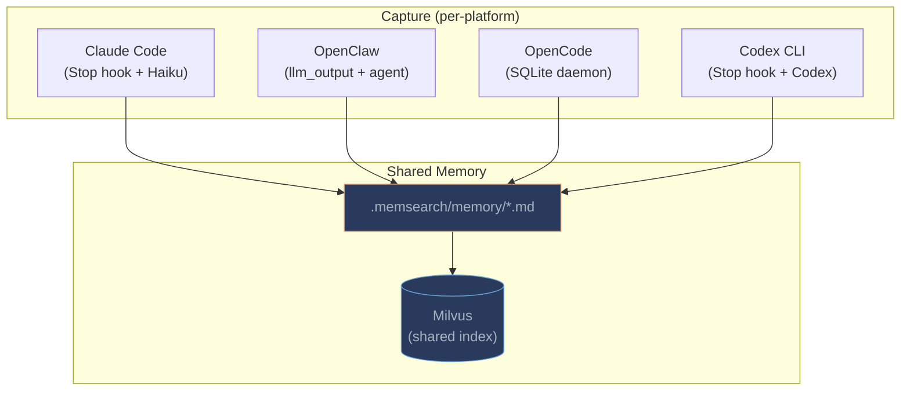
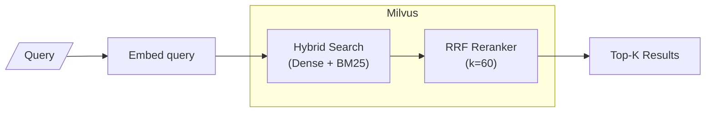
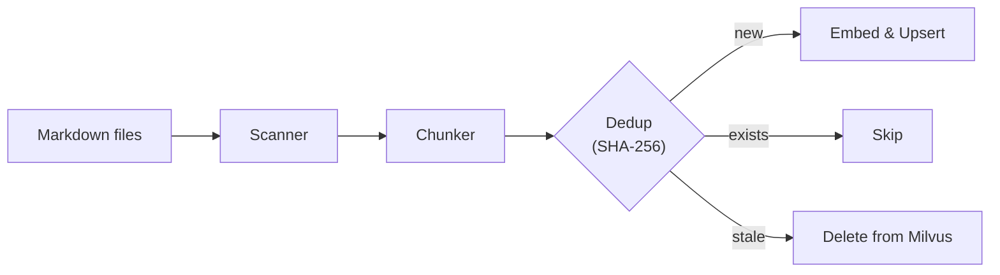
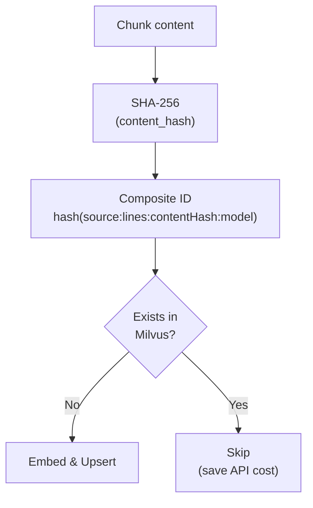
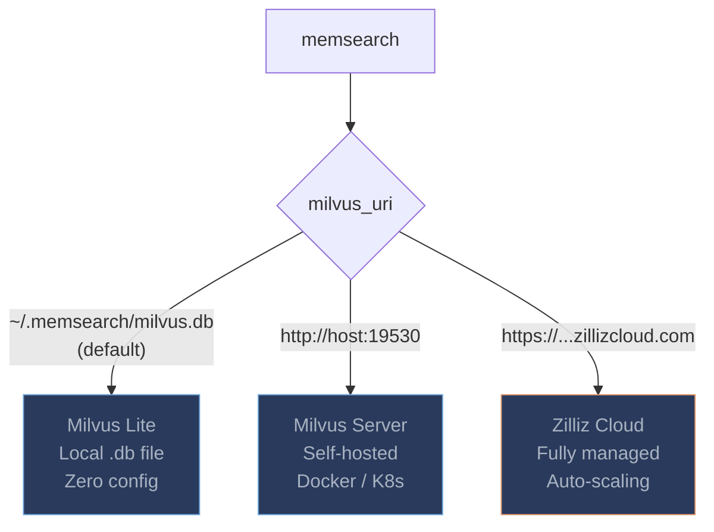
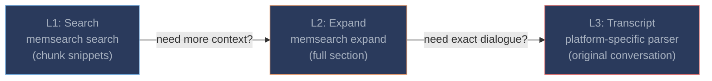
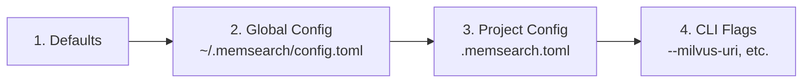
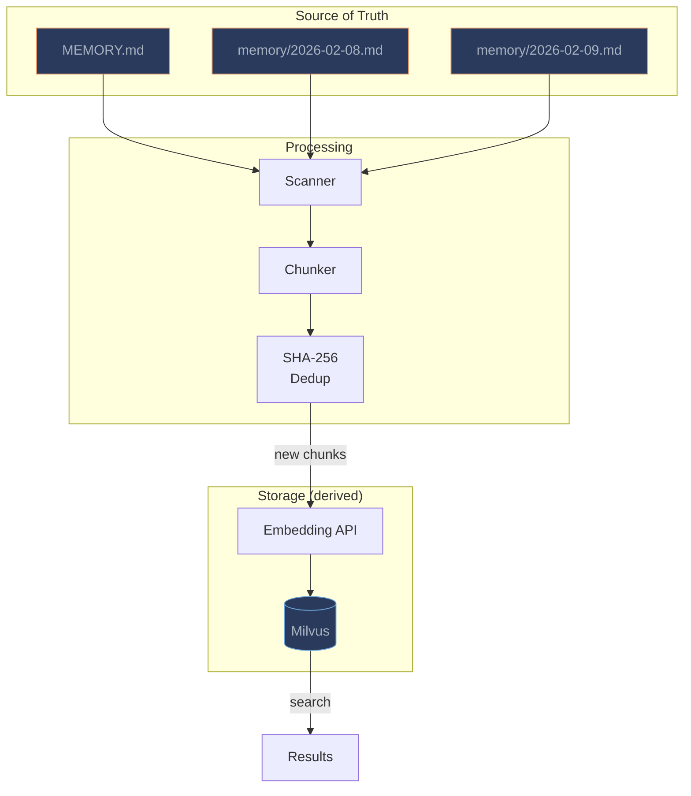
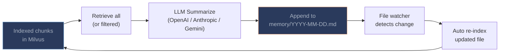

# Architecture

This page explains the technical architecture and key implementation decisions behind memsearch. For design principles, competitor comparison, and the "why" behind these decisions, see [Design Philosophy](design-philosophy.md).

---

## Cross-Platform Memory Sharing

memsearch supports 4 AI coding agent platforms: [Claude Code](platforms/claude-code/index.md), [OpenClaw](platforms/openclaw/index.md), [OpenCode](platforms/opencode/index.md), and [Codex CLI](platforms/codex/index.md). All plugins write to the same markdown format and use the same Milvus index, making memories portable across platforms.


```mermaid
graph TB
    subgraph "Capture (per-platform)"
        CC["Claude Code<br/>(Stop hook + Haiku)"]
        OC["OpenClaw<br/>(llm_output + agent)"]
        OO["OpenCode<br/>(SQLite daemon)"]
        CX["Codex CLI<br/>(Stop hook + Codex)"]
    end

    subgraph "Shared Memory"
        MD[".memsearch/memory/*.md"]
        MIL[("Milvus<br/>(shared index)")]
    end

    CC & OC & OO & CX --> MD
    MD --> MIL

    style MD fill:#2a3a5c,stroke:#e0976b,color:#a8b2c1
    style MIL fill:#2a3a5c,stroke:#6ba3d6,color:#a8b2c1
```

Each platform has its own capture mechanism, but the output is always the same: daily markdown files with session anchors. Point multiple plugins at the same `milvus_uri` and `collection` for shared access, or use per-project collections for isolation (the default).

For a detailed comparison, see the [Platform Overview](platforms/index.md).

---

## Pipeline Overview

### Search Flow

When a query arrives, it is embedded into a vector, then used for hybrid search (dense cosine similarity + BM25 full-text) against the Milvus collection. Results are reranked using Reciprocal Rank Fusion (RRF) and returned with source metadata.


```mermaid
graph LR
    Q[/"Query"/] --> E[Embed query] --> HS["Hybrid Search<br>(Dense + BM25)"]
    HS --> RRF["RRF Reranker<br>(k=60)"] --> R[Top-K Results]

    subgraph Milvus
        HS
        RRF
    end
```

### Ingest Flow

Markdown files are scanned, chunked by headings, and deduplicated using SHA-256 content hashes. Only new or changed chunks are sent to the embedding API and upserted into Milvus. Chunks from deleted files are automatically cleaned up.


```mermaid
graph LR
    F["Markdown files"] --> SC[Scanner] --> C[Chunker] --> D{"Dedup<br>(SHA-256)"}
    D -->|new| E[Embed & Upsert]
    D -->|exists| S[Skip]
    D -->|stale| DEL[Delete from Milvus]
```

### Watch and Compact

The file watcher monitors directories for markdown changes and automatically re-indexes modified files. The compact operation compresses indexed chunks into an LLM-generated summary and writes it back to a daily markdown log -- which the watcher then picks up and indexes, closing the loop.


```mermaid
graph LR
    W[File Watcher] -->|1500ms debounce| I[Auto re-index]
    FL[Compact] --> L[LLM Summarize] --> MD["memory/YYYY-MM-DD.md"]
    MD -.->|triggers| W
```

---

## Chunking Strategy

memsearch splits markdown files into semantic chunks using a heading-based strategy, with paragraph-level fallback for oversized sections.

### Heading-Based Chunking

The chunker treats markdown headings (`#` through `######`) as natural chunk boundaries. Each heading and the content below it (up to the next heading of equal or higher level) becomes one chunk. Content before the first heading (the "preamble") is treated as its own chunk.

```
# Project Notes                    <-- preamble chunk starts here

Some introductory text.

## Redis Configuration              <-- chunk boundary

We chose Redis for caching...

### Connection Settings              <-- chunk boundary

host=localhost, port=6379...

## Authentication                    <-- chunk boundary

We use JWT tokens...
```

### Paragraph-Based Splitting for Large Sections

When a heading-delimited section exceeds `max_chunk_size` (default: 1500 characters), the chunker splits it further at paragraph boundaries (blank lines). A configurable `overlap_lines` (default: 2 lines) is carried forward between sub-chunks to preserve context continuity.

### Chunk Metadata

Each chunk carries rich metadata for provenance tracking:

| Field | Description |
|-------|-------------|
| `content` | The raw text of the chunk |
| `source` | Absolute file path the chunk was extracted from |
| `heading` | The nearest heading text (empty string for preamble) |
| `heading_level` | Heading depth: 1--6 for `#`--`######`, 0 for preamble |
| `start_line` | First line number in the source file (1-indexed) |
| `end_line` | Last line number in the source file |
| `content_hash` | Truncated SHA-256 hash of the chunk content (16 hex chars) |

---

## Deduplication

memsearch uses content-addressable storage to avoid redundant embedding API calls and duplicate data in the vector store.

### How It Works

1. Each chunk's content is hashed with [SHA-256](https://en.wikipedia.org/wiki/SHA-2) (truncated to 16 hex characters).
2. A composite chunk ID is computed from the source path, line range, content hash, and embedding model name -- matching OpenClaw's format: `hash(markdown:source:startLine:endLine:contentHash:model)`.
3. Before embedding, the set of existing chunk IDs for the source file is queried from Milvus.
4. Only chunks whose composite ID is **not** already present get embedded and upserted.
5. Chunks whose composite ID **no longer appears** in the re-chunked file are deleted (stale chunk cleanup).


```mermaid
graph TD
    C["Chunk content"] --> H["SHA-256<br>(content_hash)"]
    H --> CID["Composite ID<br>hash(source:lines:contentHash:model)"]
    CID --> CHECK{"Exists in<br>Milvus?"}
    CHECK -->|No| EMBED["Embed & Upsert"]
    CHECK -->|Yes| SKIP["Skip<br>(save API cost)"]
```

### Why This Matters

- **No external cache needed.** The hash IS the primary key in Milvus. There is no SQLite sidecar database, no Redis cache, no `.json` tracking file. The deduplication mechanism is the storage key itself.
- **Incremental indexing.** Re-running `memsearch index` on an unchanged knowledge base produces zero embedding API calls. Only genuinely new or modified content is processed.
- **Cost savings.** Embedding API calls are the primary cost of running a semantic search system. Content-addressable dedup ensures you never pay to embed the same content twice.

---

## Storage Architecture

### Collection Schema

All chunks are stored in a single Milvus collection named `memsearch_chunks` (configurable). The schema uses both dense and sparse vector fields to enable hybrid search:

| Field | Type | Purpose |
|-------|------|---------|
| `chunk_hash` | `VARCHAR(64)` | **Primary key** -- composite SHA-256 chunk ID |
| `embedding` | `FLOAT_VECTOR` | Dense embedding from the configured provider |
| `content` | `VARCHAR(65535)` | Raw chunk text (also feeds BM25 via Milvus Function) |
| `sparse_vector` | `SPARSE_FLOAT_VECTOR` | Auto-generated BM25 sparse vector |
| `source` | `VARCHAR(1024)` | File path the chunk was extracted from |
| `heading` | `VARCHAR(1024)` | Nearest heading text |
| `heading_level` | `INT64` | Heading depth (0 = preamble) |
| `start_line` | `INT64` | First line number in source file |
| `end_line` | `INT64` | Last line number in source file |

The `sparse_vector` field is populated automatically by a Milvus BM25 Function that processes the `content` field -- no application-side sparse encoding is needed.

### Hybrid Search

Search combines two retrieval strategies and merges their results:

1. **Dense vector search** -- cosine similarity on the `embedding` field (semantic meaning).
2. **[BM25](https://en.wikipedia.org/wiki/Okapi_BM25) sparse search** -- keyword matching on the `sparse_vector` field (exact term overlap).
3. **[RRF](https://en.wikipedia.org/wiki/Reciprocal_rank_fusion) reranking** -- Reciprocal Rank Fusion with k=60 merges the two ranked lists into a single result set.

This hybrid approach catches results that pure semantic search might miss (exact names, error codes, configuration values) while still benefiting from the semantic understanding that dense embeddings provide.

### Three-Tier Deployment

memsearch supports three Milvus deployment modes. Switch between them by changing a single parameter (`milvus_uri`):


```mermaid
graph TD
    A["memsearch"] --> B{"milvus_uri"}
    B -->|"~/.memsearch/milvus.db<br>(default)"| C["Milvus Lite<br>Local .db file<br>Zero config"]
    B -->|"http://host:19530"| D["Milvus Server<br>Self-hosted<br>Docker / K8s"]
    B -->|"https://...zillizcloud.com"| E["Zilliz Cloud<br>Fully managed<br>Auto-scaling"]

    style C fill:#2a3a5c,stroke:#6ba3d6,color:#a8b2c1
    style D fill:#2a3a5c,stroke:#6ba3d6,color:#a8b2c1
    style E fill:#2a3a5c,stroke:#e0976b,color:#a8b2c1
```

| Tier | URI Pattern | Use Case |
|------|-------------|----------|
| **Milvus Lite** | `~/.memsearch/milvus.db` | Personal use, single agent, development. No server to install. |
| **Milvus Server** | `http://localhost:19530` | Multi-agent teams, shared infrastructure, CI/CD. Deploy via Docker or Kubernetes. |
| **Zilliz Cloud** | `https://...zillizcloud.com` | Production SaaS, zero-ops, auto-scaling. Free tier available at [cloud.zilliz.com](https://cloud.zilliz.com). |

### Physical Isolation

Isolation between agents and projects is achieved at two levels:

1. **Per-project collection names.** Each platform plugin derives a collection name from the project path (e.g., `ms_claude_code_myproject`). This keeps memories from different projects separate within the same Milvus instance.
2. **Per-instance `milvus_uri`.** Each agent gets its own Milvus Lite database file, its own Milvus server, or its own Zilliz Cloud cluster.

This avoids the complexity of multi-tenant collection management while keeping the schema simple.

---

## Three-Layer Progressive Disclosure

All platform plugins support a three-layer recall model that minimizes context window usage while allowing deep drill-down when needed:


```mermaid
graph LR
    L1["L1: Search<br/>memsearch search<br/>(chunk snippets)"]
    L2["L2: Expand<br/>memsearch expand<br/>(full section)"]
    L3["L3: Transcript<br/>platform-specific parser<br/>(original conversation)"]

    L1 -->|"need more context?"| L2
    L2 -->|"need exact dialogue?"| L3

    style L1 fill:#2a3a5c,stroke:#6ba3d6,color:#a8b2c1
    style L2 fill:#2a3a5c,stroke:#e0976b,color:#a8b2c1
    style L3 fill:#2a3a5c,stroke:#d66b6b,color:#a8b2c1
```

| Layer | What it returns | Cost |
|-------|----------------|------|
| **L1: Search** | Top-K chunk snippets (summary-level) | Low -- only snippets enter context |
| **L2: Expand** | Full markdown section around a chunk, including anchor metadata | Medium -- one file section |
| **L3: Transcript** | Original conversation turns verbatim (user messages, assistant responses, tool calls) | High -- raw dialogue |

The L3 transcript format varies by platform (Claude Code JSONL, OpenClaw JSONL, OpenCode SQLite, Codex rollout JSONL), but the L1/L2 layers are shared across all platforms via the `memsearch` CLI.

**Session anchors** in memory files enable the L2-to-L3 bridge:

```markdown
### 14:30
<!-- session:abc123 turn:def456 transcript:/path/to/session.jsonl -->
- Implemented Redis caching with 5-minute TTL
```

`memsearch expand` parses these anchors and surfaces the transcript path, which the agent can then pass to the L3 command.

---

## Configuration System

memsearch uses a 4-layer configuration system. Each layer overrides the one before it:


```mermaid
graph LR
    D["1. Defaults"] --> G["2. Global Config<br>~/.memsearch/config.toml"]
    G --> P["3. Project Config<br>.memsearch.toml"]
    P --> C["4. CLI Flags<br>--milvus-uri, etc."]
```

| Priority | Source | Scope | Example |
|----------|--------|-------|---------|
| 1 (lowest) | Built-in defaults | Hardcoded | `milvus.uri = ~/.memsearch/milvus.db` |
| 2 | `~/.memsearch/config.toml` | User-global | Shared across all projects |
| 3 | `.memsearch.toml` | Per-project | Committed to the repo or gitignored |
| 4 (highest) | CLI flags | Per-command | `--milvus-uri http://...` |

> **Note:** API keys for embedding and LLM providers (e.g. `OPENAI_API_KEY`, `GOOGLE_API_KEY`) are read from environment variables by their respective SDKs. They are not part of the memsearch configuration system and are never written to config files.

### Config Sections

The full configuration is organized into five sections:

```toml
[milvus]
uri = "~/.memsearch/milvus.db"
token = ""
collection = "memsearch_chunks"

[embedding]
provider = "openai"
model = ""                           # empty = provider default

[compact]
llm_provider = "openai"
llm_model = ""                       # empty = provider default
prompt_file = ""                     # custom prompt template path

[chunking]
max_chunk_size = 1500
overlap_lines = 2

[watch]
debounce_ms = 1500
```

---

## Data Flow Overview

The following diagram shows the complete data flow from source-of-truth markdown files through processing and into the derived vector store:


```mermaid
graph TB
    subgraph "Source of Truth"
        MEM["MEMORY.md"]
        D1["memory/2026-02-08.md"]
        D2["memory/2026-02-09.md"]
    end

    subgraph "Processing"
        SCAN[Scanner] --> CHUNK[Chunker]
        CHUNK --> HASH["SHA-256<br>Dedup"]
    end

    subgraph "Storage (derived)"
        EMB[Embedding API] --> MIL[(Milvus)]
    end

    MEM & D1 & D2 --> SCAN
    HASH -->|new chunks| EMB
    MIL -->|search| RES[Results]

    style MEM fill:#2a3a5c,stroke:#e0976b,color:#a8b2c1
    style D1 fill:#2a3a5c,stroke:#e0976b,color:#a8b2c1
    style D2 fill:#2a3a5c,stroke:#e0976b,color:#a8b2c1
    style MIL fill:#2a3a5c,stroke:#6ba3d6,color:#a8b2c1
```

### The Compact Cycle

The compact operation creates a feedback loop that keeps the knowledge base compact:


```mermaid
graph LR
    CHUNKS["Indexed chunks<br>in Milvus"] --> RETRIEVE["Retrieve all<br>(or filtered)"]
    RETRIEVE --> LLM["LLM Summarize<br>(OpenAI / Anthropic / Gemini)"]
    LLM --> WRITE["Append to<br>memory/YYYY-MM-DD.md"]
    WRITE --> WATCH["File watcher<br>detects change"]
    WATCH --> REINDEX["Auto re-index<br>updated file"]
    REINDEX --> CHUNKS

    style WRITE fill:#2a3a5c,stroke:#e0976b,color:#a8b2c1
    style CHUNKS fill:#2a3a5c,stroke:#6ba3d6,color:#a8b2c1
```

1. All (or filtered) chunks are retrieved from Milvus.
2. An LLM compresses them into a concise summary preserving key facts, decisions, and code patterns.
3. The summary is appended to a daily markdown log (`memory/YYYY-MM-DD.md`).
4. The file watcher detects the change and re-indexes the updated file.
5. The cycle completes: the compressed knowledge is now searchable, and the source-of-truth markdown has the full history.

---

## Security

### Local-First by Default

The entire memsearch pipeline runs locally by default:

- **Milvus Lite** stores data in a local `.db` file on your filesystem.
- **Local embedding providers** (`memsearch[local]` with sentence-transformers, or `memsearch[ollama]` with a local Ollama server) process text without any network calls.

In a fully local configuration, your data never leaves your machine.

### When Data Leaves Your Machine

Data is transmitted externally only when you explicitly choose a remote component:

| Component | Local Option | Remote Option |
|-----------|-------------|---------------|
| Vector store | Milvus Lite (default) | Milvus Server, Zilliz Cloud |
| Embeddings | `local`, `ollama` | `openai`, `google`, `voyage` |
| Compact LLM | Ollama (local) | OpenAI, Anthropic, Gemini |

### API Key Handling

API keys are read from standard environment variables (`OPENAI_API_KEY`, `GOOGLE_API_KEY`, `VOYAGE_API_KEY`, `ANTHROPIC_API_KEY`). They are never written to config files by memsearch, never logged, and never stored in the vector database.

### Filesystem Access

memsearch reads only the directories and files you explicitly configure via `paths`. It does not scan outside those paths. Hidden files and directories (those starting with `.`) are skipped by default during scanning.
