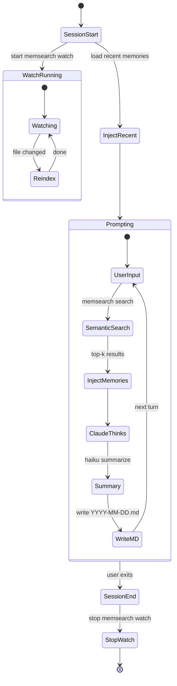
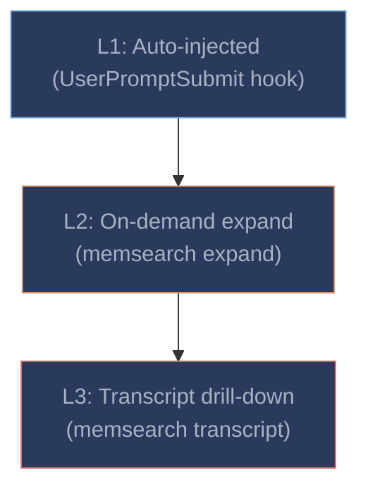

# Claude Code Plugin

**Automatic persistent memory for Claude Code.** No commands to learn, no manual saving -- just install the plugin and Claude remembers what you worked on across sessions.

The plugin is built entirely on Claude Code's own primitives: **Hooks** for lifecycle events, **CLI** for tool access, and **Agent** for autonomous decisions. No MCP servers, no sidecar services, no extra network round-trips. Everything runs locally as shell scripts and a Python CLI.

---

## What It Does

When you launch Claude Code with the memsearch plugin:

1. **Every session is remembered.** When Claude finishes responding, a Haiku model summarizes the exchange and appends it to a daily markdown log (`YYYY-MM-DD.md`).
2. **Every prompt triggers recall.** Before Claude sees your message, a semantic search runs against all past memories and injects the most relevant ones into context.
3. **No manual intervention.** You never need to run a command, tag a memory, or tell Claude to "remember this". The hooks handle everything.

The result: Claude has a persistent, searchable, ever-growing memory -- without you lifting a finger.

---

## Quick Start

```bash
# 1. Install memsearch
pip install memsearch

# 2. Initialize config (first time only)
memsearch config init

# 3. Launch Claude Code with the plugin
claude --plugin-dir /path/to/memsearch/ccplugin

# 4. Have a conversation, then exit. Check your memories:
cat .memsearch/memory/$(date +%Y-%m-%d).md

# 5. Start a new session -- Claude automatically remembers!
claude --plugin-dir /path/to/memsearch/ccplugin
```

!!! tip "Finding the plugin directory"
    If you installed memsearch via pip, the ccplugin directory is inside the package. You can also clone the repo and point to `ccplugin/` directly:
    ```bash
    git clone https://github.com/zilliztech/memsearch.git
    claude --plugin-dir ./memsearch/ccplugin
    ```

---

## How It Works

The plugin hooks into **4 Claude Code lifecycle events**. A singleton `memsearch watch` process runs in the background, keeping the vector index in sync with markdown files as they change.

### Lifecycle Diagram



### Hook Summary

The plugin defines exactly 4 hooks, all declared in `hooks/hooks.json`:

| Hook | Type | Async | Timeout | What It Does |
|------|------|-------|---------|-------------|
| **SessionStart** | command | no | 10s | Start `memsearch watch` singleton, write session heading to today's `.md`, inject recent memories and Memory Tools instructions via `additionalContext` |
| **UserPromptSubmit** | command | no | 15s | Semantic search on user prompt (skip if < 10 chars), inject top-3 relevant memories with `chunk_hash` IDs via `additionalContext` |
| **Stop** | command | **yes** | 120s | Parse transcript with `parse-transcript.sh`, call `claude -p --model haiku` to summarize, append summary with session/turn anchors to daily `.md` |
| **SessionEnd** | command | no | 10s | Stop the `memsearch watch` background process (cleanup) |

### What Each Hook Does

#### SessionStart

Fires once when a Claude Code session begins. This hook:

1. **Starts the watcher.** Launches `memsearch watch .memsearch/memory/` as a singleton background process (PID file lock prevents duplicates). The watcher monitors markdown files and auto-re-indexes on changes with a 1500ms debounce.
2. **Writes a session heading.** Appends `## Session HH:MM` to today's memory file (`.memsearch/memory/YYYY-MM-DD.md`), creating the file if it does not exist.
3. **Injects recent memories.** Reads the last 30 lines from the 2 most recent daily logs. If memsearch is available, also runs `memsearch search "recent session summary" --top-k 3` for semantic results.
4. **Injects Memory Tools instructions.** Tells Claude about `memsearch expand` and `memsearch transcript` commands for progressive disclosure (L2 and L3).

All of this is returned as `additionalContext` in the hook output JSON.

#### UserPromptSubmit

Fires on every user prompt before Claude processes it. This hook:

1. **Extracts the prompt** from the hook input JSON.
2. **Skips short prompts** (under 10 characters) -- greetings and single words are not worth searching.
3. **Runs semantic search.** Calls `memsearch search "$PROMPT" --top-k 3 --json-output`.
4. **Formats results** as a compact index with source file, heading, a 200-character preview, and the `chunk_hash` for each result.
5. **Injects as context.** Returns formatted results under a `## Relevant Memories` heading via `additionalContext`.

This is the key mechanism that makes memory recall automatic -- Claude does not need to decide to search, it simply receives relevant context on every prompt.

#### Stop

Fires after Claude finishes each response. Runs **asynchronously** so it does not block the user. This hook:

1. **Guards against recursion.** Checks `stop_hook_active` to prevent infinite loops (since the hook itself calls `claude -p`).
2. **Validates the transcript.** Skips if the transcript file is missing or has fewer than 3 lines.
3. **Parses the transcript.** Calls `parse-transcript.sh`, which:
    - Takes the last 200 lines of the JSONL transcript
    - Truncates user/assistant text to 500 characters each
    - Extracts tool names with input summaries
    - Skips `file-history-snapshot` entries
4. **Summarizes with Haiku.** Pipes the parsed transcript to `claude -p --model haiku --no-session-persistence` with a system prompt that requests 3-8 bullet points focusing on decisions, problems solved, code changes, and key findings.
5. **Appends to daily log.** Writes a `### HH:MM` sub-heading with an HTML comment anchor containing session ID, turn UUID, and transcript path. The watcher detects the file change and auto-indexes the new content.

#### SessionEnd

Fires when the user exits Claude Code. Simply calls `stop_watch` to kill the `memsearch watch` process and clean up the PID file, including a sweep for any orphaned processes.

---

## Progressive Disclosure

Memory retrieval uses a **three-layer progressive disclosure model**. Layer 1 is fully automatic; layers 2 and 3 are available on demand when Claude needs more context.



### L1: Auto-Injected (Automatic)

On every user prompt, the `UserPromptSubmit` hook injects the top-3 semantic search results. Each result includes:

- Source file and heading
- A 200-character content preview
- The `chunk_hash` identifier

This happens transparently -- no action from Claude or the user is required.

**Example injection:**

```
## Relevant Memories
- [memory/2026-02-08.md:Session 14:30]  Implemented caching system with Redis L1
  and in-process LRU L2. Fixed N+1 query issue in order-service using selectinload...
  `chunk_hash: a1b2c3d4e5f6`
```

### L2: On-Demand Expand

When an L1 preview is not enough, Claude can run the `memsearch expand` command to retrieve the full markdown section surrounding a chunk:

```bash
# Show full section
memsearch expand a1b2c3d4e5f6

# JSON output with anchor metadata (for programmatic L3 drill-down)
memsearch expand a1b2c3d4e5f6 --json-output

# Show N lines of context before/after instead of the full section
memsearch expand a1b2c3d4e5f6 --lines 10
```

The output includes the full markdown content plus the embedded anchor metadata, which links to the original session transcript.

### L3: Transcript Drill-Down

When Claude needs the original conversation verbatim -- for instance, to recall exact code snippets or error messages -- it can drill into the JSONL transcript:

```bash
# Show an index of all turns in a session
memsearch transcript /path/to/session.jsonl

# Show context around a specific turn (prefix match on UUID)
memsearch transcript /path/to/session.jsonl --turn bffc0c1b --context 3

# JSON output for programmatic use
memsearch transcript /path/to/session.jsonl --turn bffc0c1b --json-output
```

### Session Anchors

Each memory summary includes an HTML comment anchor that links the chunk back to its source session, enabling the L2-to-L3 drill-down:

```markdown
### 14:30
<!-- session:abc123def turn:ghi789jkl transcript:/home/user/.claude/projects/.../abc123def.jsonl -->
- Implemented caching system with Redis L1 and in-process LRU L2
- Fixed N+1 query issue in order-service using selectinload
- Decided to use Prometheus counters for cache hit/miss metrics
```

The anchor contains three fields:

| Field | Description |
|-------|-------------|
| `session` | Claude Code session ID (also the JSONL filename without extension) |
| `turn` | UUID of the last user turn in the session |
| `transcript` | Absolute path to the JSONL transcript file |

Claude extracts these fields from `memsearch expand --json-output` and uses them to call `memsearch transcript` for L3 access.

---

## Memory Storage

All memories live in **`.memsearch/memory/`** inside your project directory.

### Directory Structure

```
your-project/
├── .memsearch/
│   ├── .watch.pid            <-- singleton watcher PID file
│   └── memory/
│       ├── 2026-02-07.md     <-- daily memory log
│       ├── 2026-02-08.md
│       └── 2026-02-09.md     <-- today's session summaries
└── ... (your project files)
```

### Example Memory File

A typical daily memory file (`2026-02-09.md`) looks like this:

```markdown
## Session 14:30

### 14:30
<!-- session:abc123def turn:ghi789jkl transcript:/home/user/.claude/projects/.../abc123def.jsonl -->
- Implemented caching system with Redis L1 and in-process LRU L2
- Fixed N+1 query issue in order-service using selectinload
- Decided to use Prometheus counters for cache hit/miss metrics

## Session 17:45

### 17:45
<!-- session:mno456pqr turn:stu012vwx transcript:/home/user/.claude/projects/.../mno456pqr.jsonl -->
- Debugged React hydration mismatch caused by Date.now() during SSR
- Added comprehensive test suite for the caching middleware
- Reviewed PR #42: approved with minor naming suggestions
```

Each file accumulates all sessions from that day. The format is plain markdown -- human-readable, `grep`-able, and git-friendly.

### Markdown Is the Source of Truth

The Milvus vector index is a **derived cache** that can be rebuilt at any time:

```bash
memsearch index .memsearch/memory/
```

This means:

- **No data loss.** Even if Milvus is corrupted or deleted, your memories are safe in `.md` files.
- **Portable.** Copy `.memsearch/memory/` to another machine and rebuild the index.
- **Auditable.** You can read, edit, or delete any memory entry with a text editor.
- **Git-friendly.** Commit your memory files to version control for a complete project history.

---

## Comparison with claude-mem

[claude-mem](https://github.com/nicobailey/claude-mem) is another memory solution for Claude Code. Here is a detailed comparison:

| Aspect | memsearch | claude-mem |
|--------|-----------|------------|
| **Architecture** | 4 shell hooks + 1 watch process | Node.js/Bun worker service + Express server + React UI |
| **Integration** | Native hooks + CLI (zero IPC overhead) | MCP server (stdio); tool definitions permanently consume context window |
| **Memory recall** | **Automatic** -- semantic search on every prompt via hook | **Agent-driven** -- Claude must explicitly call MCP `search` tool |
| **Progressive disclosure** | **3-layer, auto-triggered**: hook injects top-k (L1), then `expand` (L2), then `transcript` (L3) | **3-layer, all manual**: `search`, `timeline`, `get_observations` all require explicit tool calls |
| **Session summary cost** | 1 `claude -p --model haiku` call, runs async | Observation on every tool use + session summary (more API calls at scale) |
| **Vector backend** | Milvus -- hybrid search (dense + BM25), scales from embedded to distributed cluster | Chroma -- dense only, limited scaling path |
| **Storage format** | Transparent `.md` files -- human-readable, git-friendly | Opaque SQLite + Chroma binary |
| **Index sync** | `memsearch watch` singleton -- auto-debounced background sync | Automatic observation writes, but no unified background sync |
| **Data portability** | Copy `.memsearch/memory/*.md` and rebuild | Export from SQLite + Chroma |
| **Runtime dependency** | Python (`memsearch` CLI) + `claude` CLI | Node.js + Bun + MCP runtime |
| **Context window cost** | Minimal -- hook injects only top-k results as plain text | MCP tool definitions always loaded + each tool call/result consumes context |
| **Cost per session** | ~1 Haiku call for summary | Multiple Claude API calls for observation compression |

### The Key Insight: Automatic vs. Agent-Driven Recall

The fundamental architectural difference is **when** memory recall happens.

**memsearch injects relevant memories into every prompt via hooks.** Claude does not need to decide whether to search -- it simply receives relevant context before processing each message. This means memories are **never missed due to Claude forgetting to look them up**. Progressive disclosure starts automatically at L1 (the hook injects top-k results), and only deeper layers (L2 expand, L3 transcript) require explicit CLI calls from the agent.

**claude-mem gives Claude MCP tools to search, explore timelines, and fetch observations.** All three layers require Claude to **proactively decide** to invoke them. While this is more flexible (Claude controls when and what to recall), it means memories are only retrieved when Claude thinks to ask. In practice, Claude often does not call the search tool unless the conversation explicitly references past work -- which means relevant context can be silently lost.

The difference is analogous to push vs. pull: memsearch **pushes** memories to Claude on every turn, while claude-mem requires Claude to **pull** them on demand.

---

## Comparison with Claude's Native Memory

Claude Code has built-in memory features: `CLAUDE.md` files and auto-memory (the `/memory` command). Here is why memsearch provides a stronger solution:

| Aspect | Claude Native Memory | memsearch |
|--------|---------------------|-----------|
| **Storage** | Single `CLAUDE.md` file (or per-project) | Unlimited daily `.md` files with full history |
| **Recall mechanism** | File is loaded at session start (no search) | Semantic search on every prompt (embedding-based) |
| **Granularity** | One monolithic file, manually edited | Per-session bullet points, automatically generated |
| **Search** | None -- Claude reads the whole file or nothing | Hybrid semantic search (dense + BM25) returning top-k relevant chunks |
| **History depth** | Limited to what fits in one file | Unlimited -- every session is logged, every entry is searchable |
| **Automatic capture** | `/memory` command requires manual intervention | Fully automatic -- hooks capture every session |
| **Progressive disclosure** | None -- entire file is loaded into context | 3-layer model (L1 auto-inject, L2 expand, L3 transcript) minimizes context usage |
| **Deduplication** | Manual -- user must avoid adding duplicates | SHA-256 content hashing prevents duplicate embeddings |
| **Portability** | Tied to Claude Code's internal format | Standard markdown files, usable with any tool |

### Why This Matters

`CLAUDE.md` is a blunt instrument: it loads the entire file into context at session start, regardless of relevance. As the file grows, it wastes context window on irrelevant information and eventually hits size limits. There is no search -- Claude cannot selectively recall a specific decision from three weeks ago.

memsearch solves this with **semantic search and progressive disclosure**. Instead of loading everything, it injects only the top-k most relevant memories for each specific prompt. History can grow indefinitely without degrading performance, because the vector index handles the filtering. And the three-layer model means Claude starts with lightweight previews and only drills deeper when needed, keeping context window usage minimal.

---

## Plugin Files

The plugin lives in the `ccplugin/` directory at the root of the memsearch repository:

```
ccplugin/
├── .claude-plugin/
│   └── plugin.json              # Plugin manifest (name, version, description)
└── hooks/
    ├── hooks.json               # Hook definitions (4 lifecycle hooks)
    ├── common.sh                # Shared setup: env, PATH, memsearch detection, watch management
    ├── session-start.sh         # Start watch + write session heading + inject memories & tools
    ├── user-prompt-submit.sh    # Semantic search on prompt -> inject memories with chunk_hash
    ├── stop.sh                  # Parse transcript -> haiku summary -> append to daily .md
    ├── parse-transcript.sh      # Deterministic JSONL-to-text parser with truncation
    └── session-end.sh           # Stop watch process (cleanup)
```

### File Descriptions

| File | Purpose |
|------|---------|
| `plugin.json` | Claude Code plugin manifest. Declares the plugin name (`memsearch`), version, and description. |
| `hooks.json` | Defines the 4 lifecycle hooks (SessionStart, UserPromptSubmit, Stop, SessionEnd) with their types, timeouts, and async flags. |
| `common.sh` | Shared shell library sourced by all hooks. Handles stdin JSON parsing, PATH setup, memsearch binary detection (prefers PATH, falls back to `uv run`), memory directory management, and the watch singleton (start/stop with PID file and orphan cleanup). |
| `session-start.sh` | SessionStart hook implementation. Starts the watcher, writes the session heading, reads recent memory files, runs a semantic search for recent context, and injects Memory Tools instructions. |
| `user-prompt-submit.sh` | UserPromptSubmit hook implementation. Extracts the user prompt, runs `memsearch search` with `--top-k 3 --json-output`, and formats results with `chunk_hash` for progressive disclosure. |
| `stop.sh` | Stop hook implementation. Extracts the transcript path, validates it, delegates parsing to `parse-transcript.sh`, calls Haiku for summarization, and appends the result with session anchors to the daily memory file. |
| `parse-transcript.sh` | Standalone transcript parser. Processes the last 200 lines of a JSONL transcript, truncates content to 500 characters, extracts tool call summaries, and skips file-history-snapshot entries. Used by `stop.sh`. |
| `session-end.sh` | SessionEnd hook implementation. Calls `stop_watch` to terminate the background watcher and clean up. |

---

## The `memsearch` CLI

The plugin is built entirely on the `memsearch` CLI -- every hook is a shell script calling `memsearch` subcommands. Here are the commands most relevant to the plugin:

| Command | Used By | What It Does |
|---------|---------|-------------|
| `search <query>` | UserPromptSubmit hook | Semantic search over indexed memories (`--top-k` for result count, `--json-output` for JSON) |
| `watch <paths>` | SessionStart hook | Background watcher that auto-indexes on file changes (1500ms debounce) |
| `index <paths>` | Manual / rebuild | One-shot index of markdown files (`--force` to re-index all) |
| `expand <chunk_hash>` | Agent (L2 disclosure) | Show full markdown section around a chunk, with anchor metadata |
| `transcript <jsonl>` | Agent (L3 disclosure) | Parse Claude Code JSONL transcript into readable conversation turns |
| `config init` | Quick Start | Interactive config wizard for first-time setup |
| `stats` | Manual | Show index statistics (collection size, chunk count) |
| `reset` | Manual | Drop all indexed data (requires `--yes` to confirm) |

For the full CLI reference, see the [CLI Reference](cli.md) page.
