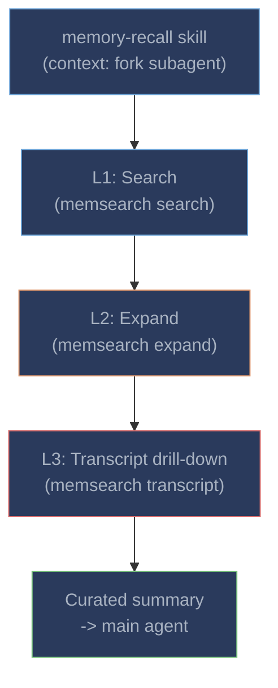

# Progressive Disclosure

Memory retrieval uses a **three-layer progressive disclosure model**, all handled autonomously by the **memory-recall skill** running in a forked subagent context. Claude invokes the skill when it judges the user's question needs historical context -- no manual intervention required.



---

## How the Skill Works

When Claude detects that a user's question could benefit from past context, it automatically invokes the `memory-recall` skill. The skill runs in a **forked subagent context** (`context: fork`), meaning it has its own context window and does not pollute the main conversation. The subagent:

1. **Searches** for relevant memories using `memsearch search`
2. **Evaluates** which results are truly relevant (skips noise)
3. **Expands** promising results with `memsearch expand` to get full markdown sections
4. **Drills into transcripts** when needed with `memsearch transcript`
5. **Returns a curated summary** to the main agent

The main agent only sees the final summary -- all intermediate search results, raw expand output, and transcript parsing happen inside the subagent.

Users can also manually invoke the skill with `/memory-recall <query>` if Claude doesn't trigger it automatically.

---

## L1: Search

The subagent runs `memsearch search` to find relevant chunks from the indexed memory files.

```bash
$ memsearch search "redis caching configuration" --top-k 5
```

This uses [hybrid search](../architecture.md#hybrid-search) (dense vector + BM25 full-text with RRF reranking) to find the most relevant chunks.

---

## L2: Expand

For promising search results, the subagent runs `memsearch expand` to retrieve the **full markdown section** surrounding a chunk:

```bash
$ memsearch expand 7a3f9b21e4c08d56
```

**Example output:**

```
Source: .memsearch/memory/2026-02-10.md (lines 12-32)
Heading: 09:15
Session: abc123de-f456-7890-abcd-ef1234567890
Turn: def456ab-cdef-1234-5678-90abcdef1234
Transcript: /home/user/.claude/projects/.../abc123de...7890.jsonl

### 08:50
<!-- session:abc123de... turn:aaa11122... transcript:/.../abc123de...7890.jsonl -->
- Set up project scaffolding for the new API service
- Configured FastAPI with uvicorn, added health check endpoint
- Connected to PostgreSQL via SQLAlchemy async engine

### 09:15
<!-- session:abc123de... turn:def456ab... transcript:/.../abc123de...7890.jsonl -->
- Added Redis caching middleware to API with 5-minute TTL
- Used redis-py async client with connection pooling (max 10 connections)
- Cache key format: `api:v1:{endpoint}:{hash(params)}`
- Added cache hit/miss Prometheus counters for monitoring
- Wrote integration tests with fakeredis
```

The subagent sees the full context including neighboring sections. The embedded `<!-- session:... -->` anchors link to the original conversation -- if the subagent needs to go even deeper, it moves to L3.

Additional flags:

```bash
# JSON output with anchor metadata (for programmatic L3 drill-down)
memsearch expand 47b5475122b992b6 --json-output

# Show N lines of context before/after instead of the full section
memsearch expand 47b5475122b992b6 --lines 10
```

---

## L3: Transcript Drill-Down

When Claude needs the original conversation verbatim -- for instance, to recall exact code snippets, error messages, or tool outputs -- it drills into the JSONL transcript.

**List all turns** in a session:

```bash
$ memsearch transcript /path/to/session.jsonl
```

```
All turns (73):

  6d6210b7-b84  08:50:14  Set up the project scaffolding for...          [12 tools]
  3075ee94-0f6  09:05:22  Can you add a health check endpoint?
  8e45ce0d-9a0  09:15:03  Add a Redis caching layer to the API...        [8 tools]
  53f5cac3-6d9  09:32:41  The cache TTL should be configurable...         [3 tools]
  c708b40c-8f8  09:45:18  Let's add Prometheus metrics for cache...      [10 tools]
```

Each line shows the turn UUID prefix, timestamp, content preview, and how many tool calls occurred.

**Drill into a specific turn** with surrounding context:

```bash
$ memsearch transcript /path/to/session.jsonl --turn 8e45ce0d --context 1
```

```
Showing 2 turns around 8e45ce0d:

>>> [09:05:22] 3075ee94
Can you add a health check endpoint?

**Assistant**: Sure, I'll add a `/health` endpoint that checks the database
connection and returns the service version.

>>> [09:15:03] 8e45ce0d
Add a Redis caching layer to the API with a 5-minute TTL.

**Assistant**: I'll add Redis caching middleware. Let me first check
your current dependencies and middleware setup.
  [Read] requirements.txt
  [Read] src/middleware/__init__.py
  [Write] src/middleware/cache.py
  [Edit] src/main.py -- added cache middleware to app
```

This recovers the full original conversation -- user messages, assistant responses, and tool call summaries -- so Claude can recall exactly what happened during a past session.

---

## Session Anchors

Each memory summary includes an HTML comment anchor that links the chunk back to its source session, enabling the L2-to-L3 drill-down:

```markdown
### 14:30
<!-- session:abc123def turn:ghi789jkl transcript:/home/user/.claude/projects/.../abc123def.jsonl -->
- Implemented caching system with Redis L1 and in-process LRU L2
- Fixed N+1 query issue in order-service using selectinload
- Decided to use Prometheus counters for cache hit/miss metrics
```

The anchor contains three fields:

| Field | Description |
|-------|-------------|
| `session` | Claude Code session ID (also the JSONL filename without extension) |
| `turn` | UUID of the last user turn in the session |
| `transcript` | Absolute path to the JSONL transcript file |

Claude extracts these fields from `memsearch expand --json-output` and uses them to call `memsearch transcript` for L3 access.

---

## Manual Invocation

If Claude doesn't trigger the skill automatically, you can force it:

```
/memory-recall <your query>
```

This manually triggers the skill, bypassing Claude's judgment about whether memory is needed.
