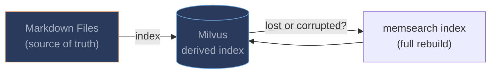
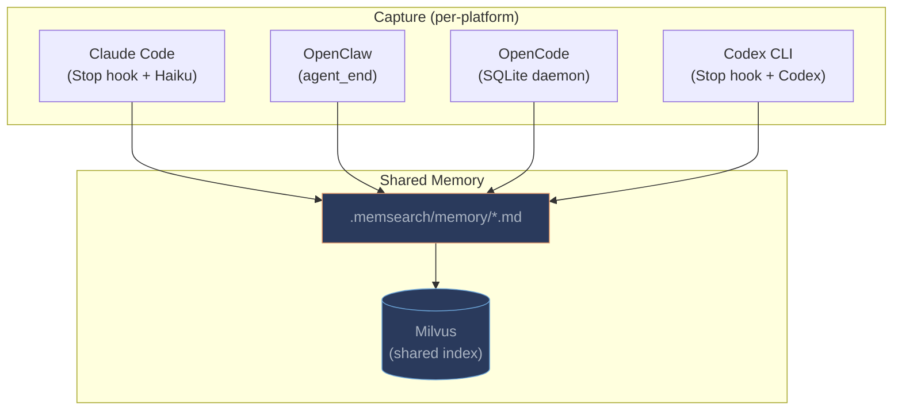
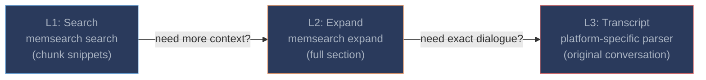
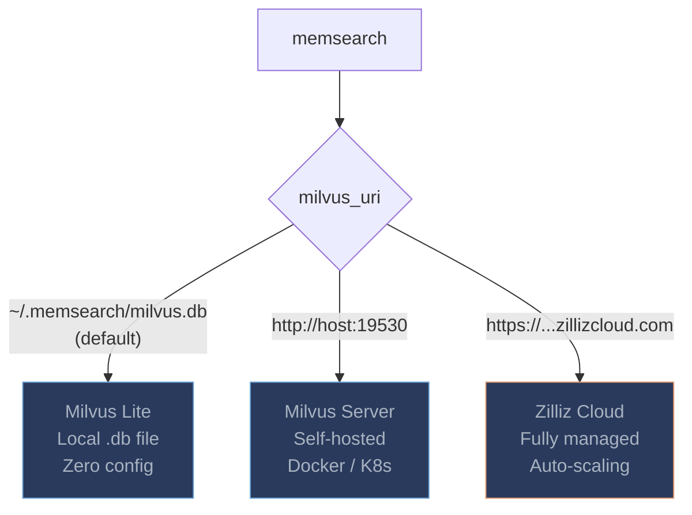

# Design Philosophy

This page explains the core principles behind memsearch and how they differentiate it from other agent memory solutions.

---

## Markdown is the Source of Truth

The foundational principle of memsearch: **markdown files are the canonical data store**. The vector database is a derived index -- it can be dropped and rebuilt at any time from the markdown files on disk.

**Why markdown?**

- **Human-readable.** Any developer can open a memory file in any text editor and understand what the agent knows. There is no binary format to decode, no special viewer required.
- **Git-friendly.** Markdown diffs are clean and meaningful. You get full version history, blame, branching, and merge conflict resolution for free -- the same tools you already use for code.
- **Zero vendor lock-in.** Markdown is a plain-text format that has been stable for decades. If you stop using memsearch tomorrow, your knowledge base is still right there on disk, fully intact.
- **Trivially portable.** Copy the files to another machine, another tool, another agent framework. No export step, no migration script, no schema translation.

**Why NOT a database as the source of truth?**

- **Opaque.** Database files are binary blobs that require specific software to read. If the tool disappears, so does easy access to your data.
- **Vendor lock-in.** Each database engine has its own storage format, query language, and migration tooling. Switching costs are high.
- **Fragile.** Database corruption, version incompatibilities, and backup complexity are real operational concerns for what should be a simple knowledge store.

In memsearch, the vector store is an acceleration layer -- nothing more. If the Milvus database is lost, corrupted, or simply out of date, a single `memsearch index` command rebuilds the entire index from the markdown files.

---

## Cross-Platform Unified Memory

This is memsearch's key differentiator: **memories written by one agent are searchable from any other**.

All 4 platform plugins write to the same markdown format and use the same Milvus backend. This means:

- You can switch between Claude Code and Codex CLI and keep your memories
- Team members using different agents can share a knowledge base
- There is no per-agent silo -- one memory, every agent

Most competing solutions are single-platform. memsearch treats multi-platform as a first-class design goal.

---

## Hybrid Search for Quality

memsearch uses a three-pronged search strategy to deliver the best possible recall:

1. **Dense vector search** -- cosine similarity on embeddings captures semantic meaning ("caching solution" matches "Redis TTL")
2. **BM25 sparse search** -- keyword matching catches exact terms that embeddings might miss (error codes, config values, function names)
3. **RRF reranking** -- [Reciprocal Rank Fusion](https://plg.uwaterloo.ca/~gvcormac/cormacksigir09-rrf.pdf) (k=60) merges the two ranked lists into a single result set

This hybrid approach consistently outperforms pure dense search or pure keyword search alone. The BM25 sparse vector is auto-generated by Milvus -- no application-side sparse encoding is needed.

---

## Progressive Disclosure (L1 → L2 → L3)

Agent memory recall must balance two competing needs: **context quality** (give the agent enough to reason) and **context cost** (don't blow the context window). memsearch solves this with a three-layer progressive disclosure model:

| Layer | What it returns | Cost |
|-------|----------------|------|
| **L1: Search** | Top-K chunk snippets (summary-level) | Low -- only snippets enter context |
| **L2: Expand** | Full markdown section around a chunk, including anchor metadata | Medium -- one file section |
| **L3: Transcript** | Original conversation turns verbatim (user messages, assistant responses, tool calls) | High -- raw dialogue |

The agent starts with L1 (cheap) and drills deeper only when needed. In the Claude Code plugin, the entire recall process runs in a **forked subagent** (`context: fork`), so intermediate results never pollute the main conversation.

---

## Why Milvus

memsearch chose [Milvus](https://milvus.io/) as its vector backend for several reasons:

| Requirement | Milvus | SQLite/ChromaDB |
|-------------|--------|-----------------|
| **Hybrid search** | Native dense + BM25 + RRF in a single query | Requires separate FTS5 index + application-side merge |
| **Concurrent access** | Built for multi-client | Single-writer lock |
| **Scale path** | Lite → Server → Zilliz Cloud (same API) | Limited to single machine |
| **Enterprise ready** | Production-proven at scale, managed cloud option | Dev/prototype only |
| **BM25 built-in** | Auto-generated sparse vectors via Milvus Function | Manual sparse encoding |

The three-tier deployment model is key:

Start with Milvus Lite (zero config, zero install), scale to Zilliz Cloud (zero ops, auto-scaling) when needed -- same API, same code, just change one URI.

---

## Inspired by OpenClaw

memsearch follows [OpenClaw](https://github.com/openclaw/openclaw)'s memory architecture precisely:

| Concept | OpenClaw | memsearch |
|---------|----------|-----------|
| Memory layout | `MEMORY.md` + `memory/YYYY-MM-DD.md` | Same |
| Chunk ID format | `hash(source:startLine:endLine:contentHash:model)` | Same |
| Dedup strategy | Content-hash primary key | Same |
| Compact target | Append to daily markdown log | Same |
| Source of truth | Markdown files (vector DB is derived) | Same |
| File watch debounce | 1500ms | Same default |

If you are already using OpenClaw's memory directory layout, memsearch works with it directly -- no migration needed.

---

## Comparison with Competitors

| Feature | **memsearch** | claude-mem | qmd |
|---------|:---:|:---:|:---:|
| **Cross-platform** | 4 platforms | Claude Code only | Claude Code + MCP |
| **Source of truth** | Markdown files | SQLite + ChromaDB | Markdown files |
| **Search** | Hybrid (dense + BM25 + RRF) | Dense only + FTS5 | Hybrid (dense + BM25 + RRF) + query expansion |
| **Embedding** | Pluggable (6 providers) | Fixed (MiniLM WASM) | Local GGUF (embeddinggemma / Qwen3) |
| **Reranking** | Optional cross-encoder (ONNX) | None | Local LLM (qwen3-reranker) |
| **Progressive disclosure** | L1 → L2 → L3 | Single layer | Single layer |
| **Context isolation** | Skill in forked subagent | MCP tools in main context | MCP tools in main context |
| **Storage format** | `.md` (human-readable, git-friendly) | Binary DB | `.md` (human-readable, git-friendly) |
| **Vector backend** | Milvus (Lite → Server → Cloud) | ChromaDB | SQLite + sqlite-vec |
| **Memory capture** | Automatic (hooks write daily `.md`) | Automatic | External (read-only search engine) |
| **API key required** | No (ONNX default) | No (WASM) | No (all local models) |
| **Language** | Python | TypeScript | TypeScript |

**Key advantages:**

1. **Cross-platform portability.** memsearch works across Claude Code, OpenClaw, OpenCode, and Codex CLI with shared memory.
2. **Transparent storage.** Markdown files are human-readable and git-friendly. You can inspect, edit, and version-control your agent's memories directly.
3. **End-to-end memory.** memsearch captures session summaries automatically and writes them to markdown -- it is both a search engine and a memory writer. qmd is read-only and requires external tools to capture memories.
4. **Search quality.** Hybrid search (dense + BM25 + RRF) catches both semantic matches and exact keyword matches that pure-dense solutions miss.
5. **Scale path.** Milvus Lite for dev, Milvus Server for teams, Zilliz Cloud for production -- same API throughout.
6. **Context efficiency.** Progressive disclosure and forked subagent recall minimize context window usage.
