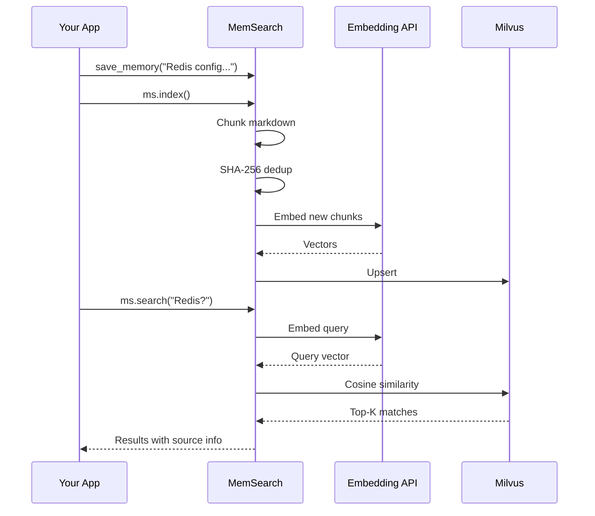
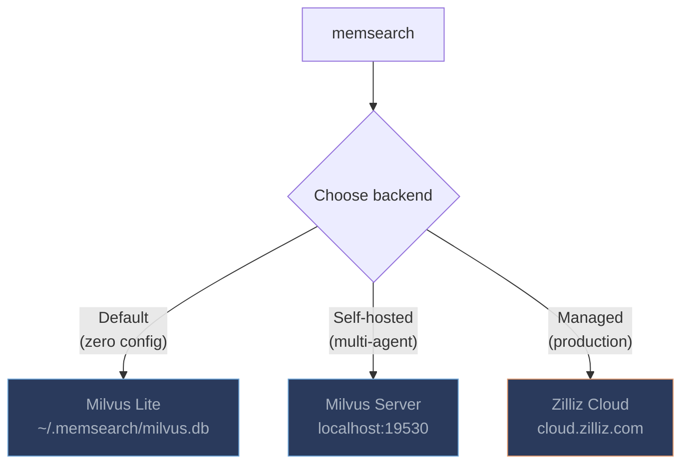

# Getting Started

## Installation

Install memsearch with pip (OpenAI embeddings are included by default):

```bash
$ pip install memsearch
```

### Extras for additional embedding providers

Each optional extra pulls in the provider SDK you need:

```bash
$ pip install "memsearch[google]"      # Google Gemini embeddings
$ pip install "memsearch[voyage]"      # Voyage AI embeddings
$ pip install "memsearch[ollama]"      # Ollama (local, no API key)
$ pip install "memsearch[local]"       # sentence-transformers (local, no API key)
$ pip install "memsearch[anthropic]"   # Anthropic (for flush/summarization LLM)
$ pip install "memsearch[all]"         # Everything above
```

---

## How It All Fits Together

The diagram below shows the full lifecycle: writing markdown, indexing chunks, and searching them later.



**Markdown is the source of truth.** The vector store is a derived index -- rebuildable anytime from the original `.md` files. This means your memory is human-readable, `git`-friendly, and never locked into a proprietary format.

---

## Your First Memory Search

This section walks through the complete flow: create a memory directory, write some markdown files, index them, and search.

### Set up your memory directory

memsearch follows the OpenClaw memory layout: a `MEMORY.md` file for persistent facts, plus daily logs in a `memory/` subdirectory.

```bash
$ mkdir -p my-project/memory
$ cd my-project
```

Write a `MEMORY.md` with long-lived facts:

```bash
$ cat > MEMORY.md << 'EOF'
# MEMORY.md

## Team
- Alice: frontend lead, React expert
- Bob: backend lead, Python/FastAPI
- Charlie: DevOps, manages Kubernetes

## Architecture Decisions
- ADR-001: Use event-driven architecture with Kafka
- ADR-002: PostgreSQL 16 as primary database
- ADR-003: Redis 7 for caching and sessions
- ADR-004: Milvus for product semantic search
EOF
```

Write a daily log:

```bash
$ cat > memory/2026-02-10.md << 'EOF'
# 2026-02-10

## Standup Notes
- Alice finished the checkout redesign, merging today
- Bob fixed the N+1 query in the order service — response time dropped from 800ms to 120ms
- Charlie set up staging auto-deploy via GitHub Actions

## Decision
We decided to migrate from REST to gRPC for inter-service communication.
The main drivers: type safety, streaming support, and ~40% latency reduction in benchmarks.
EOF
```

### Index with the CLI

```bash
$ export OPENAI_API_KEY="sk-..."
$ memsearch index .
Indexed 8 chunks.
```

### Search with the CLI

```bash
$ memsearch search "what caching solution are we using?"
--- Result 1 (score: 0.8432) ---
Source: MEMORY.md
Heading: Architecture Decisions
- ADR-003: Redis 7 for caching and sessions

$ memsearch search "what did Bob work on recently?" --top-k 3
--- Result 1 (score: 0.8817) ---
Source: memory/2026-02-10.md
Heading: Standup Notes
- Bob fixed the N+1 query in the order service — response time dropped from 800ms to 120ms
```

Use `--json-output` to get structured results for piping into other tools:

```bash
$ memsearch search "inter-service communication" --json-output | python -m json.tool
```

### Search with the Python API

The same workflow in Python:

```python
import asyncio
from memsearch import MemSearch

async def main():
    ms = MemSearch(paths=["."])
    await ms.index()

    results = await ms.search("what caching solution are we using?", top_k=3)
    for r in results:
        print(f"[{r['score']:.4f}] {r['source']} — {r['heading']}")
        print(f"  {r['content'][:200]}\n")

    ms.close()

asyncio.run(main())
```

---

## Building an Agent with Memory

The real power of memsearch is giving an LLM agent persistent memory across conversations. The pattern is simple: **recall, think, remember**.

1. **Recall** -- search past memories for context relevant to the user's question
2. **Think** -- call the LLM with that context injected into the system prompt
3. **Remember** -- save the exchange to a daily markdown log and re-index

### OpenAI example (default)

```python
import asyncio
from datetime import date
from pathlib import Path
from openai import OpenAI
from memsearch import MemSearch

MEMORY_DIR = "./memory"
llm = OpenAI()
ms = MemSearch(paths=[MEMORY_DIR])


def save_memory(content: str):
    """Append a note to today's memory log (OpenClaw-style daily markdown)."""
    p = Path(MEMORY_DIR) / f"{date.today()}.md"
    p.parent.mkdir(parents=True, exist_ok=True)
    with open(p, "a") as f:
        if p.stat().st_size == 0:
            f.write(f"# {date.today()}\n")
        f.write(f"\n{content}\n")


async def agent_chat(user_input: str) -> str:
    # 1. Recall — search past memories for relevant context
    memories = await ms.search(user_input, top_k=5)
    context = "\n".join(f"- {m['content'][:300]}" for m in memories)

    # 2. Think — call LLM with memory context
    resp = llm.chat.completions.create(
        model="gpt-4o-mini",
        messages=[
            {
                "role": "system",
                "content": (
                    "You are a helpful assistant with access to the user's memory.\n"
                    f"Relevant memories:\n{context}"
                ),
            },
            {"role": "user", "content": user_input},
        ],
    )
    answer = resp.choices[0].message.content

    # 3. Remember — save this exchange and re-index
    save_memory(f"## User: {user_input}\n\n{answer}")
    await ms.index()

    return answer


async def main():
    # Seed some knowledge
    save_memory("## Team\n- Alice: frontend lead\n- Bob: backend lead")
    save_memory("## Decision\nWe chose Redis for caching over Memcached.")
    await ms.index()

    # Agent can now recall those memories
    print(await agent_chat("Who is our frontend lead?"))
    print(await agent_chat("What caching solution did we pick?"))


asyncio.run(main())
```

### Anthropic Claude variant

Install the Anthropic extra:

```bash
$ pip install "memsearch[anthropic]"
```

Then swap the LLM call:

```python
from anthropic import Anthropic

llm = Anthropic()

# In agent_chat(), replace the OpenAI call with:
resp = llm.messages.create(
    model="claude-sonnet-4-5-20250929",
    max_tokens=1024,
    system=f"You have these memories:\n{context}",
    messages=[{"role": "user", "content": user_input}],
)
answer = resp.content[0].text
```

### Ollama variant (fully local, no API key)

```bash
$ pip install "memsearch[ollama]"
$ ollama pull nomic-embed-text    # embedding model
$ ollama pull llama3.2            # chat model
```

```python
from ollama import chat
from memsearch import MemSearch

# Use Ollama for embeddings too — everything stays local
ms = MemSearch(paths=[MEMORY_DIR], embedding_provider="ollama")

# In agent_chat(), replace the LLM call with:
resp = chat(
    model="llama3.2",
    messages=[
        {"role": "system", "content": f"You have these memories:\n{context}"},
        {"role": "user", "content": user_input},
    ],
)
answer = resp.message.content
```

---

## API Keys

Set the environment variable for your chosen embedding provider. memsearch reads standard SDK environment variables -- no custom key names.

| Provider | Env Var | Notes |
|----------|---------|-------|
| **OpenAI** (default) | `OPENAI_API_KEY` | Included with base install |
| OpenAI-compatible proxy | `OPENAI_BASE_URL` | For Azure OpenAI, vLLM, LiteLLM, etc. |
| Google Gemini | `GOOGLE_API_KEY` | Requires `memsearch[google]` |
| Voyage AI | `VOYAGE_API_KEY` | Requires `memsearch[voyage]` |
| Ollama | `OLLAMA_HOST` (optional) | Defaults to `http://localhost:11434` |
| Local (sentence-transformers) | -- | No API key needed |
| Anthropic | `ANTHROPIC_API_KEY` | Used by `flush` summarization only |

```bash
$ export OPENAI_API_KEY="sk-..."         # OpenAI embeddings (default)
$ export GOOGLE_API_KEY="..."            # Google Gemini embeddings
$ export VOYAGE_API_KEY="..."            # Voyage AI embeddings
$ export ANTHROPIC_API_KEY="..."         # Anthropic (for flush summarization)
```

---

## Milvus Backends

memsearch works with three Milvus deployment modes. Choose based on your needs:



### Milvus Lite (default -- zero config)

Data is stored in a single local `.db` file. No server to install, no ports to open.

**Best for:** personal use, single-agent setups, prototyping, development.

=== "Python"

    ```python
    ms = MemSearch(
        paths=["./docs/"],
        milvus_uri="~/.memsearch/milvus.db",  # default, can be omitted
    )
    ```

=== "CLI"

    ```bash
    $ memsearch index ./docs/
    # Uses ~/.memsearch/milvus.db by default
    ```

### Milvus Server (self-hosted)

Deploy Milvus via Docker or Kubernetes. Multiple agents and users can share the same server instance, each using a separate collection or database.

**Best for:** team environments, multi-agent workloads, shared always-on vector store.

=== "Python"

    ```python
    ms = MemSearch(
        paths=["./docs/"],
        milvus_uri="http://localhost:19530",
        milvus_token="root:Milvus",    # default credentials
    )
    ```

=== "CLI"

    ```bash
    $ memsearch index ./docs/ --milvus-uri http://localhost:19530 --milvus-token root:Milvus
    ```

=== "Docker"

    ```bash
    $ docker run -d --name milvus \
        -p 19530:19530 -p 9091:9091 \
        milvusdb/milvus:latest milvus run standalone
    ```

### Zilliz Cloud (fully managed)

Zero-ops, auto-scaling managed Milvus. Get a free cluster at [cloud.zilliz.com](https://cloud.zilliz.com).

**Best for:** production deployments, teams that do not want to manage infrastructure.

=== "Python"

    ```python
    ms = MemSearch(
        paths=["./docs/"],
        milvus_uri="https://in03-xxx.api.gcp-us-west1.zillizcloud.com",
        milvus_token="your-api-key",
    )
    ```

=== "CLI"

    ```bash
    $ memsearch index ./docs/ \
        --milvus-uri "https://in03-xxx.api.gcp-us-west1.zillizcloud.com" \
        --milvus-token "your-api-key"
    ```

---

## Configuration

memsearch uses a layered configuration system. Settings are resolved in priority order (lowest to highest):

1. **Built-in defaults** -- sensible out-of-the-box values
2. **Global config** -- `~/.memsearch/config.toml`
3. **Project config** -- `.memsearch.toml` in your working directory
4. **Environment variables** -- `MEMSEARCH_SECTION_FIELD` format
5. **CLI flags** -- `--milvus-uri`, `--provider`, etc.

Higher-priority sources override lower ones. This means you can set defaults globally, customize per project, and override on the fly with CLI flags.

### Interactive config wizard

The fastest way to configure memsearch:

```bash
$ memsearch config init
memsearch configuration wizard
Writing to: /home/user/.memsearch/config.toml

── Milvus ──
  Milvus URI [~/.memsearch/milvus.db]:
  Milvus token (empty for none) []:
  Collection name [memsearch_chunks]:

── Embedding ──
  Provider (openai/google/voyage/ollama/local) [openai]:
  Model (empty for provider default) []:

── Chunking ──
  Max chunk size (chars) [1500]:
  Overlap lines [2]:
...

Config saved to /home/user/.memsearch/config.toml
```

Use `--project` to write to `.memsearch.toml` in the current directory instead:

```bash
$ memsearch config init --project
```

### Config file locations

| Scope | Path | Use case |
|-------|------|----------|
| Global | `~/.memsearch/config.toml` | Machine-wide defaults (Milvus URI, preferred provider) |
| Project | `.memsearch.toml` | Per-project overrides (collection name, custom model) |

Both files use TOML format:

```toml
# Example ~/.memsearch/config.toml

[milvus]
uri = "http://localhost:19530"
token = "root:Milvus"
collection = "memsearch_chunks"

[embedding]
provider = "openai"
model = ""

[chunking]
max_chunk_size = 1500
overlap_lines = 2

[watch]
debounce_ms = 1500

[flush]
llm_provider = "openai"
llm_model = ""
prompt_file = ""
```

### Get and set individual values

```bash
$ memsearch config set milvus.uri http://localhost:19530
Set milvus.uri = http://localhost:19530 in /home/user/.memsearch/config.toml

$ memsearch config get milvus.uri
http://localhost:19530

$ memsearch config set embedding.provider ollama --project
Set embedding.provider = ollama in .memsearch.toml
```

### View resolved configuration

```bash
$ memsearch config list --resolved    # Final merged config from all sources
$ memsearch config list --global      # Show ~/.memsearch/config.toml only
$ memsearch config list --project     # Show .memsearch.toml only
```

### Environment variable overrides

Environment variables follow the pattern `MEMSEARCH_SECTION_FIELD`:

```bash
$ export MEMSEARCH_MILVUS_URI="http://10.0.0.5:19530"
$ export MEMSEARCH_EMBEDDING_PROVIDER="google"
$ export MEMSEARCH_CHUNKING_MAXCHUNKSIZE="2000"
$ export MEMSEARCH_WATCH_DEBOUNCEMS="3000"
```

These override both config files but are themselves overridden by CLI flags.

### CLI flag overrides

CLI flags always take the highest priority:

```bash
$ memsearch index ./docs/ --provider google --milvus-uri http://localhost:19530
$ memsearch search "Redis config" --top-k 10 --milvus-uri http://10.0.0.5:19530
```

---

## What's Next

- **[Architecture](architecture.md)** -- deep dive into the chunking pipeline, dedup strategy, and data flow diagrams
- **[CLI Reference](cli.md)** -- complete reference for all `memsearch` commands, flags, and options
- **[Claude Code Plugin](claude-plugin.md)** -- give Claude automatic persistent memory across sessions with zero configuration
