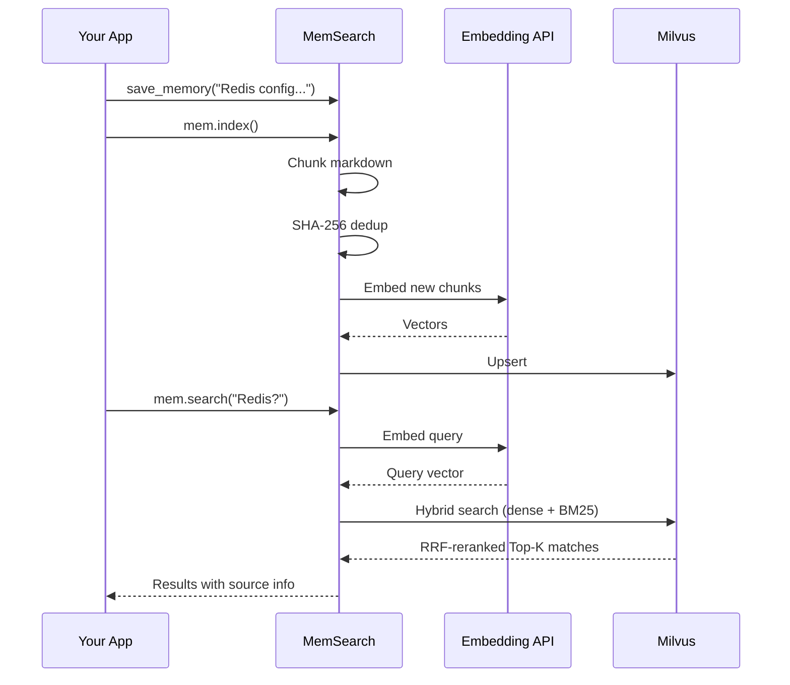
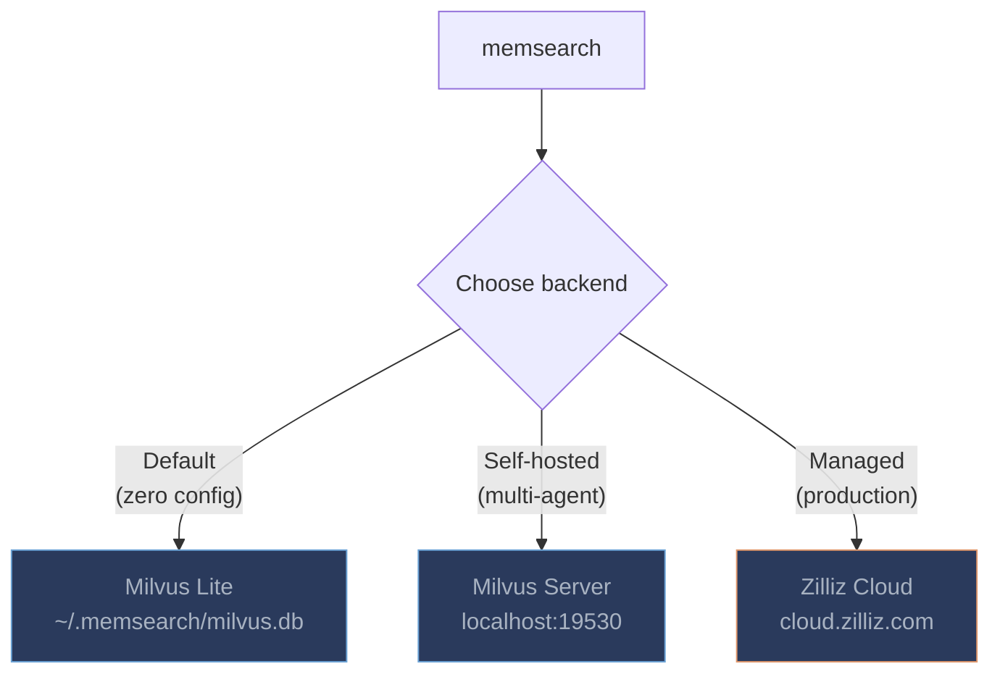
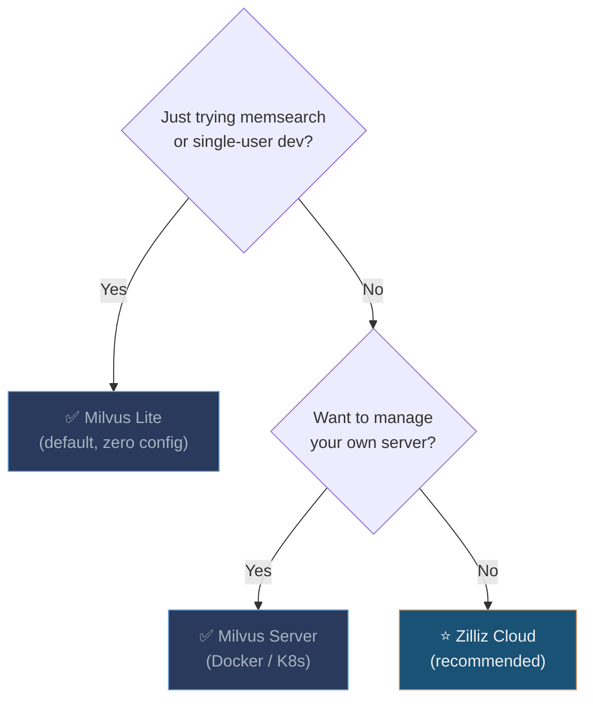

# Getting Started

## Installation

Install memsearch with pip (OpenAI embeddings are included by default):

```bash
$ pip install memsearch
```

### Extras for additional embedding providers

Each optional extra pulls in the provider SDK you need:

```bash
$ pip install "memsearch[onnx]"        # ONNX Runtime — bge-m3 int8, CPU, no API key
$ pip install "memsearch[google]"      # Google Gemini embeddings
$ pip install "memsearch[voyage]"      # Voyage AI embeddings
$ pip install "memsearch[ollama]"      # Ollama (local, no API key)
$ pip install "memsearch[local]"       # sentence-transformers (local, no API key)
$ pip install "memsearch[anthropic]"   # Anthropic (for compact/summarization LLM)
$ pip install "memsearch[all]"         # Everything above
```

---

## How It All Fits Together

The diagram below shows the full lifecycle: writing markdown, indexing chunks, and searching them later.


```mermaid
sequenceDiagram
    participant U as Your App
    participant M as MemSearch
    participant E as Embedding API
    participant V as Milvus

    U->>M: save_memory("Redis config...")
    U->>M: mem.index()
    M->>M: Chunk markdown
    M->>M: SHA-256 dedup
    M->>E: Embed new chunks
    E-->>M: Vectors
    M->>V: Upsert
    U->>M: mem.search("Redis?")
    M->>E: Embed query
    E-->>M: Query vector
    M->>V: Hybrid search (dense + BM25)
    V-->>M: RRF-reranked Top-K matches
    M-->>U: Results with source info
```

**Markdown is the source of truth.** The vector store is a derived index -- rebuildable anytime from the original `.md` files. This means your memory is human-readable, `git`-friendly, and never locked into a proprietary format.

---

## Your First Memory Search

This section walks through the complete flow: create a memory directory, write some markdown files, index them, and search.

### Set up your memory directory

memsearch follows the OpenClaw memory layout: a `MEMORY.md` file for persistent facts, plus daily logs in a `memory/` subdirectory.

```bash
$ mkdir -p my-project/memory
$ cd my-project
```

Write a `MEMORY.md` with long-lived facts:

```bash
$ cat > MEMORY.md << 'EOF'
# MEMORY.md

## Team
- Alice: frontend lead, React expert
- Bob: backend lead, Python/FastAPI
- Charlie: DevOps, manages Kubernetes

## Architecture Decisions
- ADR-001: Use event-driven architecture with Kafka
- ADR-002: PostgreSQL 16 as primary database
- ADR-003: Redis 7 for caching and sessions
- ADR-004: Milvus for product semantic search
EOF
```

Write a daily log:

```bash
$ cat > memory/2026-02-10.md << 'EOF'
# 2026-02-10

## Standup Notes
- Alice finished the checkout redesign, merging today
- Bob fixed the N+1 query in the order service — response time dropped from 800ms to 120ms
- Charlie set up staging auto-deploy via GitHub Actions

## Decision
We decided to migrate from REST to gRPC for inter-service communication.
The main drivers: type safety, streaming support, and ~40% latency reduction in benchmarks.
EOF
```

### Index with the CLI

```bash
$ export OPENAI_API_KEY="sk-..."
$ memsearch index .
Indexed 8 chunks.
```

### Search with the CLI

```bash
$ memsearch search "what caching solution are we using?"
--- Result 1 (score: 0.0332) ---
Source: MEMORY.md
Heading: Architecture Decisions
- ADR-003: Redis 7 for caching and sessions

$ memsearch search "what did Bob work on recently?" --top-k 3
--- Result 1 (score: 0.0328) ---
Source: memory/2026-02-10.md
Heading: Standup Notes
- Bob fixed the N+1 query in the order service — response time dropped from 800ms to 120ms
```

Use `--json-output` to get structured results for piping into other tools:

```bash
$ memsearch search "inter-service communication" --json-output | python -m json.tool
```

### Search with the Python API

The same workflow in Python:

```python
import asyncio
from memsearch import MemSearch

async def main():
    mem = MemSearch(paths=["."])
    await mem.index()

    results = await mem.search("what caching solution are we using?", top_k=3)
    for r in results:
        print(f"[{r['score']:.4f}] {r['source']} — {r['heading']}")
        print(f"  {r['content'][:200]}\n")

    mem.close()

asyncio.run(main())
```

---

## Building an Agent with Memory

The real power of memsearch is giving an LLM agent persistent memory across conversations. The pattern is simple: **recall, think, remember**.

1. **Recall** -- search past memories for context relevant to the user's question
2. **Think** -- call the LLM with that context injected into the system prompt
3. **Remember** -- save the exchange to a daily markdown log and re-index

### OpenAI example (default)

```python
import asyncio
from datetime import date
from pathlib import Path
from openai import OpenAI
from memsearch import MemSearch

MEMORY_DIR = "./memory"
llm = OpenAI()
mem = MemSearch(paths=[MEMORY_DIR])


def save_memory(content: str):
    """Append a note to today's memory log (OpenClaw-style daily markdown)."""
    p = Path(MEMORY_DIR) / f"{date.today()}.md"
    p.parent.mkdir(parents=True, exist_ok=True)
    with open(p, "a") as f:
        if p.stat().st_size == 0:
            f.write(f"# {date.today()}\n")
        f.write(f"\n{content}\n")


async def agent_chat(user_input: str) -> str:
    # 1. Recall — search past memories for relevant context
    memories = await mem.search(user_input, top_k=5)
    context = "\n".join(f"- {m['content'][:300]}" for m in memories)

    # 2. Think — call LLM with memory context
    resp = llm.chat.completions.create(
        model="gpt-4o-mini",
        messages=[
            {
                "role": "system",
                "content": (
                    "You are a helpful assistant with access to the user's memory.\n"
                    f"Relevant memories:\n{context}"
                ),
            },
            {"role": "user", "content": user_input},
        ],
    )
    answer = resp.choices[0].message.content

    # 3. Remember — save this exchange and re-index
    save_memory(f"## User: {user_input}\n\n{answer}")
    await mem.index()

    return answer


async def main():
    # Seed some knowledge
    save_memory("## Team\n- Alice: frontend lead\n- Bob: backend lead")
    save_memory("## Decision\nWe chose Redis for caching over Memcached.")
    await mem.index()

    # Agent can now recall those memories
    print(await agent_chat("Who is our frontend lead?"))
    print(await agent_chat("What caching solution did we pick?"))


asyncio.run(main())
```

### Anthropic Claude variant

Install the Anthropic extra:

```bash
$ pip install "memsearch[anthropic]"
```

Then swap the LLM call:

```python
from anthropic import Anthropic

llm = Anthropic()

# In agent_chat(), replace the OpenAI call with:
resp = llm.messages.create(
    model="claude-sonnet-4-5-20250929",
    max_tokens=1024,
    system=f"You have these memories:\n{context}",
    messages=[{"role": "user", "content": user_input}],
)
answer = resp.content[0].text
```

### Ollama variant (fully local, no API key)

```bash
$ pip install "memsearch[ollama]"
$ ollama pull nomic-embed-text    # embedding model
$ ollama pull llama3.2            # chat model
```

```python
from ollama import chat
from memsearch import MemSearch

# Use Ollama for embeddings too — everything stays local
mem = MemSearch(paths=[MEMORY_DIR], embedding_provider="ollama")

# In agent_chat(), replace the LLM call with:
resp = chat(
    model="llama3.2",
    messages=[
        {"role": "system", "content": f"You have these memories:\n{context}"},
        {"role": "user", "content": user_input},
    ],
)
answer = resp.message.content
```

---

## API Keys

Set the environment variable for your chosen embedding provider. memsearch reads standard SDK environment variables -- no custom key names.

| Provider | Env Var | Notes |
|----------|---------|-------|
| **OpenAI** (default) | `OPENAI_API_KEY` | Included with base install |
| **ONNX** (plugin default) | -- | No API key needed. CPU-only, bge-m3 int8. Requires `memsearch[onnx]` |
| OpenAI-compatible proxy | `OPENAI_BASE_URL` | For Azure OpenAI, vLLM, LiteLLM, etc. |
| Google Gemini | `GOOGLE_API_KEY` | Requires `memsearch[google]` |
| Voyage AI | `VOYAGE_API_KEY` | Requires `memsearch[voyage]` |
| Ollama | `OLLAMA_HOST` (optional) | Defaults to `http://localhost:11434` |
| Local (sentence-transformers) | -- | No API key needed |
| Anthropic | `ANTHROPIC_API_KEY` | Used by `compact` summarization only |

```bash
$ export OPENAI_API_KEY="sk-..."         # OpenAI embeddings (default)
$ export GOOGLE_API_KEY="..."            # Google Gemini embeddings
$ export VOYAGE_API_KEY="..."            # Voyage AI embeddings
$ export ANTHROPIC_API_KEY="..."         # Anthropic (for compact summarization)
```

---

## Milvus Backends

memsearch works with three Milvus deployment modes. Choose based on your needs:


```mermaid
graph TD
    A[memsearch] --> B{Choose backend}
    B -->|"Default<br>(zero config)"| C["Milvus Lite<br>~/.memsearch/milvus.db"]
    B -->|"Self-hosted<br>(multi-agent)"| D["Milvus Server<br>localhost:19530"]
    B -->|"Managed<br>(production)"| E["Zilliz Cloud<br>cloud.zilliz.com"]

    style C fill:#2a3a5c,stroke:#6ba3d6,color:#a8b2c1
    style D fill:#2a3a5c,stroke:#6ba3d6,color:#a8b2c1
    style E fill:#2a3a5c,stroke:#e0976b,color:#a8b2c1
```

### Milvus Lite (default -- zero config)

Data is stored in a single local `.db` file. No server to install, no ports to open.

**Best for:** personal use, single-agent setups, prototyping, development.

!!! warning "Windows not supported"
    Milvus Lite does not provide Windows binaries ([milvus-lite#176](https://github.com/milvus-io/milvus-lite/issues/176)). On Windows, use **Milvus Server** (Docker) or **Zilliz Cloud** instead. Alternatively, run memsearch inside [WSL2](https://learn.microsoft.com/en-us/windows/wsl/install).

=== "Python"

    ```python
    mem = MemSearch(
        paths=["./memory/"],
        milvus_uri="~/.memsearch/milvus.db",  # default, can be omitted
    )
    ```

=== "CLI"

    ```bash
    $ memsearch index ./memory/
    # Uses ~/.memsearch/milvus.db by default
    ```

### Milvus Server (self-hosted)

Deploy Milvus via Docker or Kubernetes. Multiple agents and users can share the same server instance, each using a separate collection or database.

**Best for:** team environments, multi-agent workloads, shared always-on vector store.

=== "Python"

    ```python
    mem = MemSearch(
        paths=["./memory/"],
        milvus_uri="http://localhost:19530",
        milvus_token="root:Milvus",    # default credentials
    )
    ```

=== "CLI"

    ```bash
    $ memsearch index ./memory/ --milvus-uri http://localhost:19530 --milvus-token root:Milvus
    ```

=== "Docker"

    ```bash
    $ docker run -d --name milvus \
        -p 19530:19530 -p 9091:9091 \
        milvusdb/milvus:latest milvus run standalone
    ```

### Zilliz Cloud (fully managed) :star: Recommended

Zero-ops, auto-scaling managed Milvus. **[Get a free cluster →](https://cloud.zilliz.com/signup?utm_source=github&utm_medium=referral&utm_campaign=memsearch-docs)**

**Best for:** production deployments, teams that do not want to manage infrastructure, anyone who wants real-time indexing without running Docker.

<details markdown>
<summary>Sign up for a free Zilliz Cloud cluster 👈</summary>

You can [sign up](https://cloud.zilliz.com/signup?utm_source=github&utm_medium=referral&utm_campaign=memsearch-docs) on Zilliz Cloud to get a free cluster and API key.


Copy your Personal Key to use as `milvus_token` in the examples below.

</details>

=== "Python"

    ```python
    mem = MemSearch(
        paths=["./memory/"],
        milvus_uri="https://in03-xxx.api.gcp-us-west1.zillizcloud.com",
        milvus_token="your-api-key",
    )
    ```

=== "CLI"

    ```bash
    $ memsearch index ./memory/ \
        --milvus-uri "https://in03-xxx.api.gcp-us-west1.zillizcloud.com" \
        --milvus-token "your-api-key"
    ```

!!! tip "Why Zilliz Cloud?"
    Zilliz Cloud removes all the operational overhead of running Milvus yourself — no Docker, no port management, no upgrades, no backup scripts. You get a production-ready endpoint in under 2 minutes, with a generous [free tier](https://cloud.zilliz.com/signup?utm_source=github&utm_medium=referral&utm_campaign=memsearch-docs) that covers most personal and small-team use cases.

### Which backend should I choose?

| | Milvus Lite | Milvus Server | Zilliz Cloud |
|---|:---:|:---:|:---:|
| Setup complexity | Zero config | Docker required | Zero config |
| Concurrent access | :material-close: | :material-check: | :material-check: |
| Real-time `watch` indexing | :material-close: | :material-check: | :material-check: |
| Multi-machine / team sharing | :material-close: | Manual networking | Built-in |
| Ops burden | None | Self-managed | Fully managed |
| Auto-scaling | :material-close: | Manual | Automatic |
| Free tier | Unlimited (local) | Self-hosted cost | :material-check: [Free cluster](https://cloud.zilliz.com/signup?utm_source=github&utm_medium=referral&utm_campaign=memsearch-docs) |


```mermaid
graph TD
    Q1{"Just trying memsearch<br>or single-user dev?"}
    Q1 -->|Yes| LITE["✅ Milvus Lite<br>(default, zero config)"]
    Q1 -->|No| Q2{"Want to manage<br>your own server?"}
    Q2 -->|Yes| SERVER["✅ Milvus Server<br>(Docker / K8s)"]
    Q2 -->|No| CLOUD["⭐ Zilliz Cloud<br>(recommended)"]

    style CLOUD fill:#1a5276,stroke:#e0976b,color:#f0f0f0
    style LITE fill:#2a3a5c,stroke:#6ba3d6,color:#a8b2c1
    style SERVER fill:#2a3a5c,stroke:#6ba3d6,color:#a8b2c1
```

!!! note "Upgrade anytime"
    Starting with Milvus Lite? You can switch to Zilliz Cloud later by changing a single config value — your data will be re-indexed automatically from the source markdown files.

---

## Configuration

memsearch uses a layered configuration system. Settings are resolved in priority order (lowest to highest):

1. **Built-in defaults** -- sensible out-of-the-box values
2. **Global config** -- `~/.memsearch/config.toml`
3. **Project config** -- `.memsearch.toml` in your working directory
4. **CLI flags** -- `--milvus-uri`, `--provider`, etc.

Higher-priority sources override lower ones. This means you can set defaults globally, customize per project, and override on the fly with CLI flags.

> **Note:** API keys can be configured via environment variables (e.g. `OPENAI_API_KEY`) or in config files using the `env:` reference syntax (e.g. `api_key = "env:MY_API_KEY"`). See [API Keys](#api-keys) and [Environment Variable References](#environment-variable-references) below.

### Interactive config wizard

The fastest way to configure memsearch:

```bash
$ memsearch config init
memsearch configuration wizard
Writing to: /home/user/.memsearch/config.toml

── Milvus ──
  Milvus URI [~/.memsearch/milvus.db]:
  Milvus token (empty for none) []:
  Collection name [memsearch_chunks]:

── Embedding ──
  Provider (openai/google/voyage/ollama/local) [openai]:
  Model (empty for provider default) []:

── Chunking ──
  Max chunk size (chars) [1500]:
  Overlap lines [2]:
...

Config saved to /home/user/.memsearch/config.toml
```

Use `--project` to write to `.memsearch.toml` in the current directory instead:

```bash
$ memsearch config init --project
```

### Config file locations

| Scope | Path | Use case |
|-------|------|----------|
| Global | `~/.memsearch/config.toml` | Machine-wide defaults (Milvus URI, preferred provider) |
| Project | `.memsearch.toml` | Per-project overrides (collection name, custom model) |

Both files use TOML format:

```toml
# Example ~/.memsearch/config.toml

[milvus]
uri = "http://localhost:19530"
token = "root:Milvus"
collection = "memsearch_chunks"

[embedding]
provider = "openai"
model = ""
base_url = ""
api_key = ""

[chunking]
max_chunk_size = 1500
overlap_lines = 2

[watch]
debounce_ms = 1500

[compact]
llm_provider = "openai"
llm_model = ""
prompt_file = ""
```

### Environment variable references

Any string value in the config file can reference an environment variable using the `env:` prefix. This lets you keep secrets out of config files while still configuring them per-project:

```toml
# .memsearch.toml
[embedding]
provider = "openai"
base_url = "https://my-azure.openai.azure.com"
api_key = "env:AZURE_OPENAI_API_KEY"       # resolved from $AZURE_OPENAI_API_KEY at runtime

[milvus]
token = "env:MILVUS_TOKEN"                 # works for any string field
```

If the referenced environment variable is not set, memsearch raises an error at startup with a clear message. Plain string values (without the `env:` prefix) are used as-is.

### Custom OpenAI-compatible endpoints

The `embedding.base_url` and `embedding.api_key` fields allow using any OpenAI-compatible embedding API (Azure OpenAI, vLLM, LiteLLM, SiliconFlow, NVIDIA, etc.):

```toml
# .memsearch.toml — Azure OpenAI example
[embedding]
provider = "openai"
model = "text-embedding-3-small"
base_url = "https://my-resource.openai.azure.com"
api_key = "env:AZURE_OPENAI_API_KEY"
```

```toml
# .memsearch.toml — local vLLM example
[embedding]
provider = "openai"
model = "BAAI/bge-small-en-v1.5"
base_url = "http://localhost:8000/v1"
api_key = "dummy"
```

These settings can also be passed via CLI flags (`--base-url`, `--api-key`) or the Python API (`embedding_base_url`, `embedding_api_key`).

### Get and set individual values

```bash
$ memsearch config set milvus.uri http://localhost:19530
Set milvus.uri = http://localhost:19530 in /home/user/.memsearch/config.toml

$ memsearch config get milvus.uri
http://localhost:19530

$ memsearch config set embedding.provider ollama --project
Set embedding.provider = ollama in .memsearch.toml
```

### View resolved configuration

```bash
$ memsearch config list --resolved    # Final merged config from all sources
$ memsearch config list --global      # Show ~/.memsearch/config.toml only
$ memsearch config list --project     # Show .memsearch.toml only
```

### CLI flag overrides

CLI flags always take the highest priority:

```bash
$ memsearch index ./memory/ --provider google --milvus-uri http://localhost:19530
$ memsearch search "Redis config" --top-k 10 --milvus-uri http://10.0.0.5:19530
```

---

## Multi-Developer Workflows

In a typical multi-developer workflow, each person clones the repo locally and runs their own agent sessions. The plugin stores memory in `.memsearch/memory/YYYY-MM-DD.md` files -- these are **personal session logs** generated from each developer's own conversations. They are local by nature and do not need to be pushed to the shared remote.

| What | Scope | Version-controlled? | Example |
|------|-------|---------------------|---------|
| **Project conventions** | Shared across team | Yes -- commit to git | `CLAUDE.md` (coding standards, architecture decisions, team agreements) |
| **Session memories** | Personal to each developer | No -- add to `.gitignore` | `.memsearch/memory/2026-02-10.md` (what *you* worked on today) |

```gitignore
# .gitignore
.memsearch/
```

**Why this works:**

- **No merge conflicts.** Each developer's memory files only exist on their own machine. There is nothing to merge.
- **No noise.** Your colleagues don't need to know that you spent 45 minutes debugging a typo. Your session logs are yours.
- **Shared knowledge goes in `CLAUDE.md`.** Decisions that the whole team should know about (e.g., "we use Redis for caching", "never use `SELECT *`") belong in `CLAUDE.md` or a shared docs directory -- version-controlled, reviewed via PR, the normal git workflow.

If your team *does* want to share certain memories (e.g., onboarding notes, architecture decisions), you can put those in a shared directory that is tracked by git, and keep personal session logs in `.memsearch/` which is gitignored. memsearch can index multiple paths:

```python
mem = MemSearch(paths=["./docs/shared-knowledge", "./.memsearch/memory"])
```

---

## What's Next

- **[Architecture](architecture.md)** -- deep dive into the chunking pipeline, dedup strategy, and data flow diagrams
- **[Design Philosophy](design-philosophy.md)** -- why markdown, why Milvus, comparison with competitors
- **[CLI Reference](cli.md)** -- complete reference for all `memsearch` commands, flags, and options
- **[Claude Code Plugin](platforms/claude-code/index.md)** -- install memsearch for Claude Code
- **[Platform Comparison](platforms/index.md)** -- compare all 4 supported platforms
- **[Python API](python-api.md)** -- build custom agent integrations
