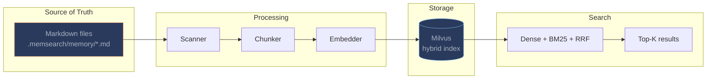

# memsearch

**Cross-platform semantic memory for AI coding agents.**

> Install the plugin, get persistent memory. No commands to learn, no manual saving -- your agent remembers what you worked on across sessions, automatically.

---

## For Agent Users

Pick your platform, install the plugin, and you're done. memsearch captures conversations, indexes them with hybrid search, and recalls relevant context when your agent needs it.

### Claude Code Plugin

The most mature plugin. Marketplace install, zero config.

```bash
# In Claude Code:
/plugin marketplace add zilliztech/memsearch
/plugin install memsearch
```

Shell hooks + SKILL.md with `context: fork` subagent. Conversations are auto-summarized via Haiku and recalled via semantic search -- all without polluting your main context window.

[:octicons-arrow-right-24: Claude Code Plugin docs](platforms/claude-code/index.md){ .md-button .md-button--primary }
[:octicons-arrow-right-24: Troubleshooting](platforms/claude-code/troubleshooting.md){ .md-button }

### OpenClaw Plugin

Native TypeScript plugin with `kind: memory`. Multi-agent isolation out of the box.

```bash
git clone https://github.com/zilliztech/memsearch.git
openclaw plugins install ./memsearch/plugins/openclaw
openclaw gateway restart
```

Three tools (`memory_search`, `memory_get`, `memory_transcript`) with per-agent isolation -- each agent gets its own memory directory and Milvus collection.

[:octicons-arrow-right-24: OpenClaw Plugin docs](platforms/openclaw/index.md){ .md-button .md-button--primary }

### OpenCode Plugin

TypeScript plugin with daemon-based capture from OpenCode's SQLite database.

```bash
bash memsearch/plugins/opencode/install.sh
```

[:octicons-arrow-right-24: OpenCode Plugin docs](platforms/opencode/index.md){ .md-button }

### Codex CLI Plugin

Shell hooks, similar architecture to Claude Code. Requires `--yolo` mode.

```bash
bash memsearch/plugins/codex/scripts/install.sh
codex --yolo
```

[:octicons-arrow-right-24: Codex CLI Plugin docs](platforms/codex/index.md){ .md-button }

### Cross-Platform Memory Sharing

All platforms share the same markdown memory format and Milvus backend -- memories written by one agent are searchable from any other.

| | [Claude Code](platforms/claude-code/index.md) | [OpenClaw](platforms/openclaw/index.md) | [OpenCode](platforms/opencode/index.md) | [Codex CLI](platforms/codex/index.md) |
|---|:---:|:---:|:---:|:---:|
| **Plugin type** | Shell hooks | TS plugin | TS plugin | Shell hooks |
| **Capture** | Stop hook + Haiku | llm_output debounce | SQLite daemon | Stop hook + Codex |
| **Recall** | SKILL.md (fork) | memory_search tool | memory_search tool | SKILL.md |
| **Install** | Plugin marketplace | `openclaw plugins install` | npm + opencode.json | `install.sh` |

[:octicons-arrow-right-24: Platform comparison](platforms/index.md){ .md-button }

---

## For Agent Developers

Build custom agent integrations with the memsearch CLI or Python API.

### Python API

```python
from memsearch import MemSearch

mem = MemSearch(paths=["./memory"])

await mem.index()                                      # index markdown files
results = await mem.search("Redis config", top_k=3)    # semantic search
print(results[0]["content"], results[0]["score"])       # content + similarity
```

[:octicons-arrow-right-24: Python API reference](python-api.md){ .md-button }

### CLI

```bash
memsearch search "how to configure Redis?" --top-k 5
memsearch expand <chunk_hash>              # full section context
memsearch index ./memory/                  # index markdown files
memsearch watch ./memory/                  # live sync
```

[:octicons-arrow-right-24: CLI reference](cli.md){ .md-button }

### Install

```bash
# Install the CLI (with ONNX embedding -- no API key needed)
uv tool install "memsearch[onnx]"

# Or with pip
pip install "memsearch[onnx]"
```

[:octicons-arrow-right-24: Getting Started](getting-started.md){ .md-button }

---

## How It Works



**Markdown is the source of truth.** The vector store is just a derived index -- rebuildable anytime from the original `.md` files. Human-readable, `git`-friendly, zero vendor lock-in.

### Core Features

- **Hybrid search** -- dense vector + BM25 sparse + RRF reranking for best recall
- **Smart dedup** -- SHA-256 content hashing means unchanged content is never re-embedded
- **Live sync** -- file watcher auto-indexes on changes, deletes stale chunks
- **Memory compact** -- LLM-powered summarization compresses old memories
- **Three-layer progressive disclosure** -- search summaries, expand to full sections, drill into original transcripts
- **Cross-platform memory sharing** -- shared Milvus backend lets agents on different platforms access the same memories

[:octicons-arrow-right-24: Architecture](architecture.md){ .md-button } [:octicons-arrow-right-24: Design Philosophy](design-philosophy.md){ .md-button }

---

## Embedding Providers

| Provider | Install | Default Model |
|----------|---------|---------------|
| ONNX (plugin default) | `memsearch[onnx]` | `bge-m3-onnx-int8` (CPU, no API key) |
| OpenAI | `memsearch` (included) | `text-embedding-3-small` |
| Google | `memsearch[google]` | `gemini-embedding-001` |
| Voyage | `memsearch[voyage]` | `voyage-3-lite` |
| Ollama | `memsearch[ollama]` | `nomic-embed-text` |
| Local | `memsearch[local]` | `all-MiniLM-L6-v2` |

---

## Milvus Backend

| Mode | `milvus_uri` | Best for |
|------|-------------|----------|
| **Milvus Lite** (default) | `~/.memsearch/milvus.db` | Personal use, dev -- zero config |
| **Milvus Server** | `http://localhost:19530` | Multi-agent, team environments |
| **Zilliz Cloud** | `https://in03-xxx.zillizcloud.com` | Production, fully managed -- [free tier](https://cloud.zilliz.com/signup?utm_source=github&utm_medium=referral&utm_campaign=memsearch-docs) |

---

## License

MIT
