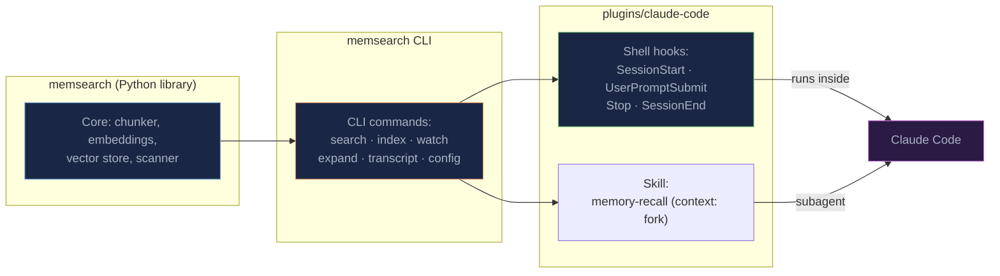
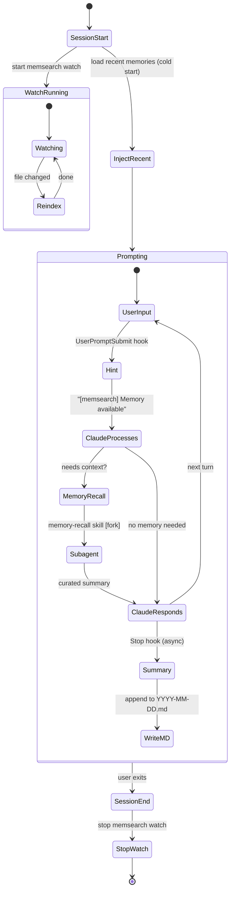
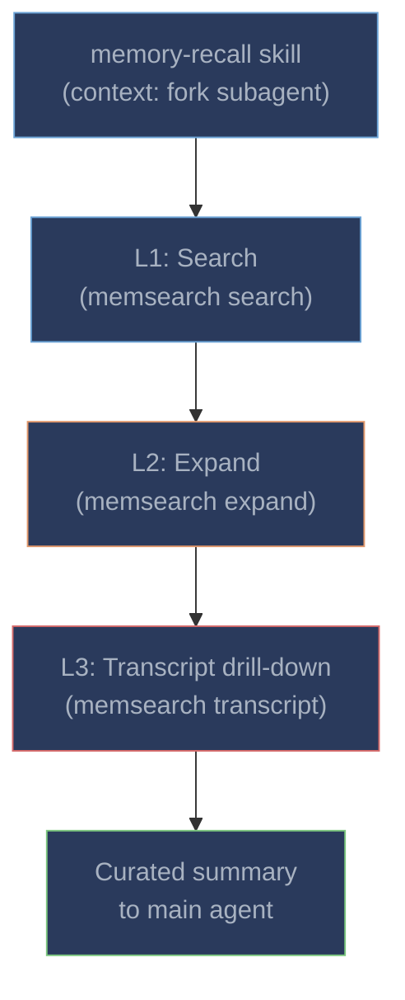

# Claude Code Plugin

**Automatic persistent memory for [Claude Code](https://docs.anthropic.com/en/docs/claude-code).** No commands to learn, no manual saving -- just install the plugin and Claude remembers what you worked on across sessions.

The plugin is built entirely on Claude Code's own primitives: **[Hooks](https://docs.anthropic.com/en/docs/claude-code/hooks)** for lifecycle events, **[Skills](https://docs.anthropic.com/en/docs/claude-code/skills)** for intelligent retrieval, and **[CLI](../cli.md)** for tool access. No MCP servers, no sidecar services, no extra network round-trips.

---

## Quick Start

### Install from Marketplace (recommended)

```bash
# 1. In Claude Code, add the marketplace and install the plugin
/plugin marketplace add zilliztech/memsearch
/plugin install memsearch

# 2. Have a conversation, then exit. Check your memories:
cat .memsearch/memory/$(date +%Y-%m-%d).md

# 3. Start a new session -- Claude automatically remembers!
```

### Install from source (development)

```bash
git clone https://github.com/zilliztech/memsearch.git
cd memsearch && uv sync
claude --plugin-dir ./plugins/claude-code
```

!!! note "First-time ONNX model download"
    The plugin defaults to **ONNX bge-m3** embedding -- no API key required, runs locally on CPU. On first launch, the model (~558 MB) is downloaded from HuggingFace Hub. Pre-download it manually:

    ```bash
    uvx --from 'memsearch[onnx]' memsearch search --provider onnx "warmup" 2>/dev/null || true
    ```

    If the download is slow, set `export HF_ENDPOINT=https://hf-mirror.com` to use a mirror.

---

## How It Works

### Architecture



### Without vs. With the Plugin

```mermaid
sequenceDiagram
    participant You
    participant Claude as Claude Code

    rect rgb(60, 30, 30)
    note right of You: Without plugin
    You->>Claude: Monday: "Add Redis caching with 5min TTL"
    Claude->>You: Done
    note over Claude: Session ends. Context is gone.
    You->>Claude: Wednesday: "The /orders endpoint is slow"
    Claude->>You: Suggests solutions from scratch
    end

    rect rgb(20, 50, 30)
    note right of You: With plugin
    You->>Claude: Monday: "Add Redis caching with 5min TTL"
    Claude->>You: Done
    note over Claude: Plugin auto-summarizes to memory/2026-02-10.md
    You->>Claude: Wednesday: "The /orders endpoint is slow"
    note over Claude: Plugin injects: "Added Redis caching with 5min TTL..."
    Claude->>You: "We already have Redis caching -- let me add /orders to it"
    end
```



---

## Hooks

The plugin defines 4 lifecycle hooks:

| Hook | Type | Async | Timeout | What It Does |
|------|------|-------|---------|-------------|
| **SessionStart** | command | no | 10s | Start `memsearch watch`, write session heading, inject recent memories as cold-start context, display config status |
| **UserPromptSubmit** | command | no | 15s | Return `systemMessage` hint "[memsearch] Memory available" (skips prompts < 10 chars) |
| **Stop** | command | **yes** | 120s | Parse last turn from transcript, call `claude -p --model haiku` to summarize, append to daily `.md`, re-index |
| **SessionEnd** | command | no | 10s | Stop the `memsearch watch` background process |

### Lifecycle Diagram



### SessionStart

1. Reads config and validates API key for the configured embedding provider
2. Starts `memsearch watch .memsearch/memory/` as a singleton background process (PID file lock)
3. Writes `## Session HH:MM` heading to today's memory file
4. Injects cold-start context: last 30 lines from the 2 most recent daily logs as `additionalContext`
5. Checks PyPI for updates (2s timeout)
6. Returns config status in `systemMessage`

### Stop (Capture)

1. Guards against recursion (the hook calls `claude -p` internally)
2. Validates transcript file (skips if < 3 lines)
3. Parses last turn via `parse-transcript.sh` -- extracts from last user message to EOF with role labels
4. Pipes to `claude -p --model haiku` with a third-person note-taker system prompt (2-6 bullet points)
5. Appends summary with `<!-- session:ID turn:ID transcript:PATH -->` anchor to daily `.md`
6. Runs `memsearch index` to ensure immediate indexing

---

## Memory Recall (Skill)

When Claude detects that a user's question could benefit from past context, it automatically invokes the `memory-recall` skill. The skill runs in a **forked subagent context** (`context: fork`), meaning it has its own context window and does not pollute the main conversation.

### Three-Layer Progressive Disclosure



| Layer | Command | What it returns |
|-------|---------|----------------|
| **L1: Search** | `memsearch search "<query>" --top-k 5 --json-output` | Top-K relevant chunk snippets |
| **L2: Expand** | `memsearch expand <chunk_hash>` | Full markdown section with anchor metadata |
| **L3: Transcript** | `python3 transcript.py <jsonl> --turn <uuid> --context 3` | Original conversation turns verbatim |

The subagent autonomously searches, evaluates relevance, expands promising results, and drills into transcripts when needed. Only the curated summary reaches the main conversation.

Users can also manually invoke the skill with `/memory-recall <query>`.

---

## Memory Storage

All memories live in `.memsearch/memory/` inside your project directory:

```
your-project/
├── .memsearch/
│   ├── .watch.pid            # singleton watcher PID file
│   └── memory/
│       ├── 2026-02-07.md     # daily memory log
│       ├── 2026-02-08.md
│       └── 2026-02-09.md     # today's session summaries
└── ... (your project files)
```

### Example Memory File

```markdown
## Session 14:30

### 14:30
<!-- session:abc123def turn:ghi789jkl transcript:/home/user/.claude/projects/.../abc123def.jsonl -->
- Implemented caching system with Redis L1 and in-process LRU L2
- Fixed N+1 query issue in order-service using selectinload
- Decided to use Prometheus counters for cache hit/miss metrics

## Session 17:45

### 17:45
<!-- session:mno456pqr turn:stu012vwx transcript:/home/user/.claude/projects/.../mno456pqr.jsonl -->
- Debugged React hydration mismatch caused by Date.now() during SSR
- Added comprehensive test suite for the caching middleware
```

The `<!-- session:... -->` anchors enable L2-to-L3 drill-down: `memsearch expand` parses them to provide transcript paths for `memsearch transcript`.

---

## Configuration

The plugin defaults to **ONNX bge-m3** embedding (no API key, CPU-only). To use a different provider:

```bash
memsearch config set embedding.provider openai
export OPENAI_API_KEY="sk-..."
```

For Milvus backend configuration, see [Getting Started -- Milvus Backends](../getting-started.md#milvus-backends).

---

## Plugin Files

```
plugins/claude-code/
├── .claude-plugin/
│   └── plugin.json              # Plugin manifest (name, version, description)
├── hooks/
│   ├── hooks.json               # Hook definitions (4 lifecycle hooks)
│   ├── common.sh                # Shared setup: env, PATH, memsearch detection, watch management
│   ├── session-start.sh         # Start watch + write session heading + inject cold-start context
│   ├── user-prompt-submit.sh    # Lightweight systemMessage hint
│   ├── stop.sh                  # Parse transcript -> haiku summary -> append to daily .md
│   ├── parse-transcript.sh      # Deterministic JSONL-to-text parser with truncation
│   └── session-end.sh           # Stop watch process (cleanup)
├── scripts/
│   └── derive-collection.sh     # Derive per-project collection name from project path
├── skills/
│   └── memory-recall/
│       └── SKILL.md             # Memory retrieval skill (context: fork subagent)
└── transcript.py                # Python JSONL parser for L3 drill-down
```

---

## Comparison with claude-mem

| Aspect | memsearch | claude-mem |
|--------|-----------|------------|
| **Architecture** | 4 shell hooks + 1 skill + 1 watch process | 5 JS hooks + 1 skill + MCP tools + Express worker |
| **Memory recall** | Skill in forked subagent -- intermediate results stay isolated | Skill + MCP hybrid -- tool definitions consume context tokens |
| **Session capture** | 1 async `claude -p --model haiku` call at session end | AI observation on every tool use (`PostToolUse` hook) |
| **Vector backend** | Milvus -- hybrid search (dense + BM25 + RRF) | ChromaDB -- dense only; SQLite FTS5 for keyword search |
| **Embedding** | Pluggable: OpenAI, Google, Voyage, Ollama, ONNX | Fixed: all-MiniLM-L6-v2 (384-dim, WASM) |
| **Storage format** | Transparent `.md` files -- human-readable, git-friendly | SQLite + ChromaDB binary |
| **Context cost** | No MCP tool definitions; skill runs in fork | MCP tool definitions permanently loaded |

## Comparison with Claude's Native Memory

| Aspect | Claude Native Memory | memsearch |
|--------|---------------------|-----------|
| **Storage** | Single `CLAUDE.md` file | Unlimited daily `.md` files with full history |
| **Recall** | File loaded at session start (no search) | Skill-based semantic search -- auto-invoked when needed |
| **Search** | None -- reads whole file or nothing | Hybrid semantic search returning top-k relevant chunks |
| **History depth** | Limited to what fits in one file | Unlimited -- every session is logged and searchable |
| **Capture** | `/memory` requires manual intervention | Fully automatic via hooks |
| **Progressive disclosure** | None -- entire file loaded into context | 3-layer (search, expand, transcript) minimizes context usage |
