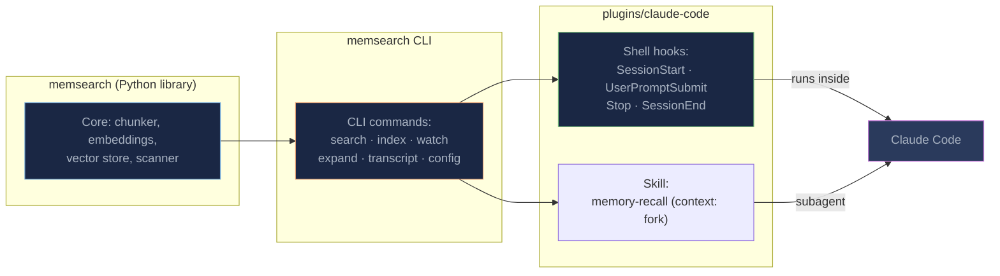
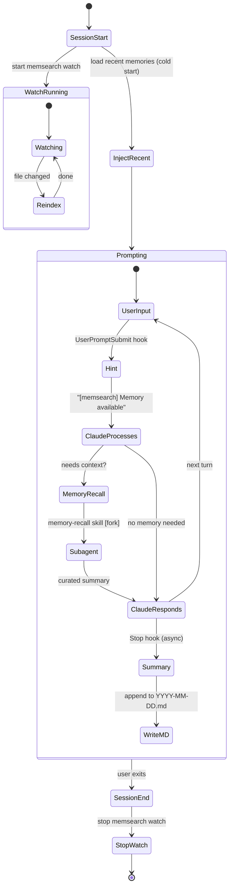
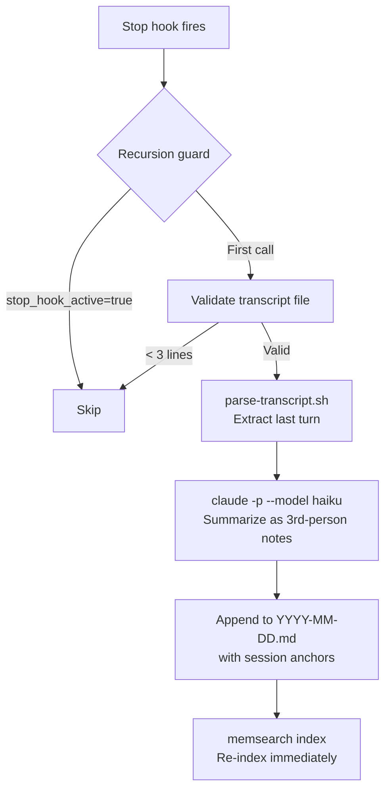

# How It Works

## How the Pieces Fit Together

The memsearch Claude Code plugin is a thin integration layer that connects three independent systems:



The **memsearch Python library** provides the core engine (chunking, embedding, vector storage, search). The **memsearch CLI** wraps the library into shell-friendly commands. The **Claude Code Plugin** ties those CLI commands to Claude Code's hook lifecycle and skill system -- hooks handle session management and memory capture, while the **memory-recall skill** handles intelligent retrieval in a forked subagent context.

This layered design means each piece is independently testable and replaceable. The plugin is just shell scripts and a skill definition -- no compiled code, no background services, no MCP servers.

---

## Hooks

The plugin defines 4 lifecycle hooks that map to Claude Code's session events:

| Hook | Type | Async | Timeout | What It Does |
|------|------|-------|---------|-------------|
| **SessionStart** | command | no | 10s | Start `memsearch watch`, write session heading, inject recent memories as cold-start context, display config status |
| **UserPromptSubmit** | command | no | 15s | Return `systemMessage` hint "[memsearch] Memory available" (skips prompts < 10 chars) |
| **Stop** | command | **yes** | 120s | Parse last turn from transcript, call `claude -p --model haiku` to summarize, append to daily `.md`, re-index |
| **SessionEnd** | command | no | 10s | Stop the `memsearch watch` background process |

All hooks output JSON to stdout -- `additionalContext` for context injection, `systemMessage` for visible hints, or empty `{}` for no-op. The `common.sh` shared library is sourced by every hook, providing JSON parsing, memsearch binary detection, and watch process management.

### Hook Lifecycle Diagram

This diagram shows how a complete session flows through all four hooks:



### SessionStart -- Bootstrapping the Session

The SessionStart hook runs once when Claude Code opens a new session. It performs five steps:

1. **Config validation** -- reads the memsearch config and validates the API key for the configured embedding provider (ONNX needs no key)
2. **Start watcher** -- launches `memsearch watch .memsearch/memory/` as a singleton background process (PID file at `.memsearch/.watch.pid` prevents duplicates)
3. **Session heading** -- writes `## Session HH:MM` to today's memory file (`YYYY-MM-DD.md`), marking the start of a new session
4. **Cold-start injection** -- reads the last 30 lines from the 2 most recent daily logs and returns them as `additionalContext` so Claude has immediate awareness of recent work
5. **Update check** -- queries PyPI (2s timeout) and shows an update banner if a newer version exists

The cold-start injection is critical for early-session context. Without it, Claude would have no idea what happened yesterday until the memory-recall skill triggers -- but the skill only triggers when Claude judges it would help, which requires knowing that relevant history exists.

### UserPromptSubmit -- The Memory Hint

A lightweight hook that returns a `systemMessage` hint: `[memsearch] Memory available -- use /memory-recall if needed`. This keeps Claude aware that the memory system exists, increasing the likelihood that it will invoke the memory-recall skill when a question benefits from historical context.

The hook skips prompts shorter than 10 characters (e.g., "y", "ok") to avoid noise on trivial confirmations.

### Stop -- Capturing the Conversation

The Stop hook is the core of the capture pipeline. It runs **asynchronously** after each Claude response (it does not block the user from sending the next prompt).



Step by step:

1. **Recursion guard** -- the hook calls `claude -p` internally (for summarization), which would trigger another Stop hook. The `stop_hook_active` flag prevents infinite recursion. The child process also sets `CLAUDECODE=` to bypass Claude Code's nested session detection, and `MEMSEARCH_NO_WATCH=1` to prevent it from interfering with the main session's watch process.

2. **Transcript validation** -- checks that the transcript JSONL file exists and has >= 3 lines (very short sessions are skipped).

3. **Last-turn extraction** -- `parse-transcript.sh` is a Python 3 script (no `jq` dependency) that extracts the last user question through to EOF. It outputs role-labeled text:
    ```
    [Human] How do I fix the N+1 query in order-service?
    [Claude Code] Let me look at the order-service...
    [Claude Code calls tool] Read src/order-service/db.py
    [Tool output] (first 200 chars of file content)
    [Claude Code] The issue is in the get_orders function...
    ```

4. **Haiku summarization** -- the extracted turn is piped to `claude -p --model haiku` with a system prompt instructing it to write 2-6 third-person bullet points. The third-person framing ("User asked about...", "Agent implemented...") makes the summaries more useful as memory entries than first-person notes.

5. **Append with anchors** -- the summary is written to `.memsearch/memory/YYYY-MM-DD.md` under a `### HH:MM` heading with an HTML comment anchor:
    ```markdown
    ### 14:30
    <!-- session:abc123def turn:ghi789jkl transcript:/home/user/.claude/projects/.../abc123def.jsonl -->
    - User asked about N+1 query performance in order-service
    - Agent identified selectinload as the fix and applied it to get_orders()
    - Added index on order.user_id for the new query pattern
    ```
    These anchors enable the L2→L3 drill-down: `memsearch expand` parses them to surface the transcript path, and the memory-recall skill can then use `memsearch transcript` or `transcript.py` to read the original conversation.

6. **Re-index** -- runs `memsearch index` to ensure the new memory is immediately searchable (not just when the watcher picks up the file change).

### SessionEnd -- Cleanup

Calls `stop_watch` to terminate the background `memsearch watch` process and clean up the PID file. Also kills any orphaned `memsearch index` processes.

---

## Memory Storage

All memories live in **`.memsearch/memory/`** inside your project directory.

### Directory Structure

```
your-project/
├── .memsearch/
│   ├── .watch.pid            # singleton watcher PID file
│   └── memory/
│       ├── 2026-02-07.md     # daily memory log
│       ├── 2026-02-08.md
│       └── 2026-02-09.md     # today's session summaries
└── ... (your project files)
```

### Example Memory File

A typical daily memory file (`2026-02-09.md`) accumulates all sessions from that day:

```markdown
## Session 14:30

### 14:30
<!-- session:abc123def turn:ghi789jkl transcript:/home/user/.claude/projects/.../abc123def.jsonl -->
- Implemented caching system with Redis L1 and in-process LRU L2
- Fixed N+1 query issue in order-service using selectinload
- Decided to use Prometheus counters for cache hit/miss metrics

### 14:52
<!-- session:abc123def turn:xyz456abc transcript:/home/user/.claude/projects/.../abc123def.jsonl -->
- User asked how to test the cache middleware
- Agent wrote integration tests using fakeredis and pytest fixtures
- Added cache invalidation test covering TTL expiry edge case

## Session 17:45

### 17:45
<!-- session:mno456pqr turn:stu012vwx transcript:/home/user/.claude/projects/.../mno456pqr.jsonl -->
- Debugged React hydration mismatch caused by Date.now() during SSR
- Added comprehensive test suite for the caching middleware
- Reviewed PR #42: approved with minor naming suggestions
```

Each entry is plain markdown -- human-readable, `grep`-able, and git-friendly. The `<!-- session:... -->` HTML comments are invisible when rendered but enable programmatic drill-down.

---

## Markdown Is the Source of Truth

The Milvus vector index is a **derived cache** that can be rebuilt at any time from the markdown files:

```bash
memsearch index .memsearch/memory/
```

This design choice has several important consequences:

- **No data loss.** Even if Milvus is corrupted or deleted, your memories are safe in `.md` files. Rebuild the index and you're back to full functionality.
- **Portable.** Copy `.memsearch/memory/` to another machine, run `memsearch index`, and all your memories are searchable there.
- **Auditable.** You can read, edit, or delete any memory entry with a text editor. Bad summary? Fix it. Sensitive information captured? Delete the line.
- **Git-friendly.** Commit your memory files to version control for a complete project history. Diff, blame, and revert all work naturally.
- **Cross-platform.** Memories written by the Claude Code plugin are searchable from [OpenClaw](../openclaw/index.md), [OpenCode](../opencode/index.md), or [Codex](../codex/index.md) -- just point them at the same `.memsearch/memory/` directory.

This contrasts with solutions that store memories in opaque databases (SQLite, ChromaDB, LanceDB). With memsearch, if you can open a text editor, you can read your memories.

---

## Plugin Files

```
plugins/claude-code/
├── .claude-plugin/
│   └── plugin.json              # Plugin manifest (name, version, description)
├── hooks/
│   ├── hooks.json               # Hook definitions (4 lifecycle hooks)
│   ├── common.sh                # Shared setup: env, PATH, memsearch detection, watch management
│   ├── session-start.sh         # Start watch + write session heading + inject cold-start context
│   ├── user-prompt-submit.sh    # Lightweight systemMessage hint
│   ├── stop.sh                  # Parse transcript -> haiku summary -> append to daily .md
│   ├── parse-transcript.sh      # Deterministic JSONL-to-text parser with truncation
│   └── session-end.sh           # Stop watch process (cleanup)
├── scripts/
│   └── derive-collection.sh     # Derive per-project collection name from project path
├── skills/
│   └── memory-recall/
│       └── SKILL.md             # Memory retrieval skill (context: fork subagent)
└── transcript.py                # Python JSONL parser for L3 drill-down
```

| File | Purpose |
|------|---------|
| `plugin.json` | Claude Code plugin manifest. Declares the plugin name (`memsearch`), version, and description. |
| `hooks.json` | Defines the 4 lifecycle hooks with their types, timeouts, and async flags. |
| `common.sh` | Shared shell library sourced by all hooks. Handles stdin JSON parsing, PATH setup, memsearch binary detection (prefers PATH, falls back to `uv run`), memory directory management, and the watch singleton (start/stop with PID file and orphan cleanup). Changes here affect all hooks. |
| `session-start.sh` | Starts the watcher, writes session heading, reads recent memory files for cold-start injection, checks for updates. |
| `user-prompt-submit.sh` | Returns lightweight `systemMessage` hint. No search -- retrieval is handled by the memory-recall skill. |
| `stop.sh` | Extracts transcript, validates it, calls `parse-transcript.sh`, summarizes via Haiku, appends with anchors. Has recursion guard (`stop_hook_active`) and sets `CLAUDECODE=` / `MEMSEARCH_NO_WATCH=1` on child processes. |
| `parse-transcript.sh` | Standalone last-turn extractor using Python 3. Outputs role-labeled text. No `jq` dependency. |
| `session-end.sh` | Calls `stop_watch` to terminate background watcher and clean up. |
| `derive-collection.sh` | Generates a deterministic per-project Milvus collection name from the project path (e.g., `ms_myproject_a1b2c3`). |
| `SKILL.md` | The memory-recall skill definition. Uses `context: fork` to run in an isolated subagent. |
| `transcript.py` | Python JSONL parser for L3 deep drill-down into original Claude Code conversations. Plugin-specific (not in core library). |
