# Claude Code Plugin

**Automatic persistent memory for [Claude Code](https://docs.anthropic.com/en/docs/claude-code).** No commands to learn, no manual saving -- just install the plugin and Claude remembers what you worked on across sessions.

The plugin is built entirely on Claude Code's own primitives: **[Hooks](https://docs.anthropic.com/en/docs/claude-code/hooks)** for lifecycle events, **[Skills](https://docs.anthropic.com/en/docs/claude-code/skills)** for intelligent retrieval, and **[CLI](../../cli.md)** for tool access. No MCP servers, no sidecar services, no extra network round-trips.

---

## Without vs. With the Plugin

Every Claude Code session starts with a blank slate. Close a session and the context is gone -- Claude has no idea what you discussed yesterday, what decisions you made, or what code you touched. The memsearch plugin changes this fundamentally.

```mermaid
sequenceDiagram
    participant You
    participant Claude as Claude Code

    rect rgb(60, 30, 30)
    note right of You: Without plugin
    You->>Claude: Monday: "Add Redis caching with 5min TTL"
    Claude->>You: Done
    note over Claude: Session ends. Context is gone.
    You->>Claude: Wednesday: "The /orders endpoint is slow"
    Claude->>You: Suggests solutions from scratch<br/>(forgot about the Redis cache from Monday)
    end

    rect rgb(20, 50, 30)
    note right of You: With plugin
    You->>Claude: Monday: "Add Redis caching with 5min TTL"
    Claude->>You: Done
    note over Claude: Plugin auto-summarizes to memory/2026-02-10.md
    You->>Claude: Wednesday: "The /orders endpoint is slow"
    note over Claude: Plugin injects: "Added Redis caching with 5min TTL..."
    Claude->>You: "We already have Redis caching --<br/>let me add /orders to it"
    end
```

**Without the plugin**, Claude treats every session as independent. You end up re-explaining context, re-describing past decisions, and watching Claude suggest solutions you already tried. This is especially painful on long-running projects where architectural decisions accumulate over weeks.

**With the plugin**, every conversation is automatically summarized and indexed. When you ask a question that benefits from historical context, Claude autonomously searches past sessions and retrieves relevant memories -- no manual intervention required. The result is a Claude that builds on its own past work instead of starting from scratch.

---

## When Is This Useful?

- **Picking up where you left off.** You debugged an auth issue yesterday but didn't finish. Today Claude remembers the root cause, which files you touched, and what you tried -- no re-explaining needed.

- **Recalling past decisions.** "Why did we switch from JWT to session cookies?" Claude can trace back to the original conversation where the trade-offs were discussed, thanks to the [3-layer progressive disclosure](memory-recall.md) that drills from summary to full section to original transcript.

- **Long-running projects.** Over days or weeks of development, architectural context accumulates automatically. Claude stays aware of your codebase conventions, past refactors, and resolved issues without you having to maintain a manual changelog.

- **Multi-session debugging.** A bug that spans multiple sessions -- first investigation, then a failed fix, then the real fix -- is fully tracked. Claude can recall the entire debugging timeline and avoid repeating failed approaches.

- **Onboarding and handoff.** When a new team member picks up a project, the accumulated memory provides a narrative of what was built, why, and what was tried along the way.

---

## Key Differentiators

| | memsearch |
|---|---|
| **Zero intervention** | Capture and recall are fully automatic -- no commands, no manual saves |
| **Forked subagent recall** | Memory search runs in an isolated `context: fork`, keeping your main conversation clean |
| **Hybrid search** | Dense vectors + BM25 sparse search fused with RRF -- better recall than vector-only |
| **Transparent storage** | Plain `.md` files you can read, edit, grep, and commit to git |
| **No API key required** | ONNX bge-m3 runs locally on CPU by default |
| **No MCP overhead** | Pure hooks + skills -- no tool definitions consuming context tokens |

---

## Key Features

- **Zero-config capture** -- conversations are automatically summarized and saved after each turn
- **Semantic recall** -- Claude automatically searches past sessions when your question needs historical context
- **Three-layer progressive disclosure** -- search, expand, and drill into original transcripts ([details](memory-recall.md))
- **Forked subagent** -- memory recall runs in an isolated context, keeping your main conversation clean
- **ONNX embedding by default** -- no API key required, runs locally on CPU
- **Markdown is the source of truth** -- human-readable, git-friendly, portable ([details](how-it-works.md#markdown-is-the-source-of-truth))

---

## Pages

- [Installation](installation.md) -- install from marketplace or source, first-time setup
- [How It Works](how-it-works.md) -- architecture, hooks, capture mechanism, memory storage
- [Memory Recall](memory-recall.md) -- three-layer progressive disclosure, comparisons, tips
- [Troubleshooting](troubleshooting.md) -- debug mode, common issues, diagnostic commands

---

## Comparison with claude-mem

[claude-mem](https://github.com/thedotmack/claude-mem) is another memory solution for Claude Code. Both projects solve the same problem -- giving Claude persistent memory across sessions -- but take fundamentally different architectural approaches.

| Aspect | memsearch | claude-mem |
|--------|-----------|------------|
| **Architecture** | 4 shell hooks + 1 skill + 1 watch process | 5 JS hooks + 1 skill + MCP tools + Express worker service (port 37777) |
| **Memory recall** | Skill in forked subagent -- intermediate results stay isolated | Skill + MCP hybrid -- tool definitions permanently consume context tokens |
| **Session capture** | 1 async `claude -p --model haiku` call at session end | AI observation compression on every tool use (`PostToolUse` hook) |
| **Vector backend** | [Milvus](https://milvus.io/) -- [hybrid search](../../architecture.md#hybrid-search) (dense + BM25 + RRF) | [ChromaDB](https://www.trychroma.com/) -- dense only; SQLite FTS5 for keyword search (separate, not fused) |
| **Embedding model** | Pluggable: OpenAI, Google, Voyage, Ollama, ONNX (default: bge-m3 int8) | Fixed: all-MiniLM-L6-v2 (384-dim, WASM backend) |
| **Storage format** | Transparent `.md` files -- human-readable, git-friendly | SQLite database + ChromaDB binary |
| **Data portability** | Copy `.memsearch/memory/*.md` and rebuild index | Export from SQLite + ChromaDB |
| **Runtime dependency** | Python (`memsearch` CLI) + `claude` CLI | Node.js / Bun + Express worker service |
| **Context window cost** | No MCP tool definitions; skill runs in forked context -- only curated summary enters main context | MCP tool definitions permanently loaded + each MCP tool call/result consumes main context |

### The Key Difference: Forked Subagent vs. MCP Tools

Both projects use hooks for session lifecycle and skills for memory recall. The architectural divergence is in **how retrieval interacts with the main context window**.

**memsearch** runs memory recall in a **forked subagent** (`context: fork`). The `memory-recall` skill gets its own isolated context window -- all search, expand, and transcript operations happen there. Only the curated summary is returned to the main conversation. This means: (1) intermediate search results never pollute the main context, (2) multi-step retrieval is autonomous, and (3) no MCP tool definitions consume context tokens.

**claude-mem** combines a `mem-search` skill with **MCP tools** (`search`, `timeline`, `get_observations`, `save_memory`). The MCP tools give Claude explicit control over memory access in the main conversation, at the cost of tool definitions permanently consuming context tokens. The `PostToolUse` hook also records every tool call as an observation, providing richer per-action granularity but incurring more API calls.

The other key difference is **storage philosophy**: memsearch treats markdown files as the source of truth (human-readable, git-friendly, rebuildable), while claude-mem uses SQLite + ChromaDB (opaque but structured, with richer queryable metadata).

---

## Comparison with Claude's Native Memory

Claude Code has built-in memory features: `CLAUDE.md` files for project instructions and auto-memory (`~/.claude/projects/.../memory/`) for remembered facts. Here is why memsearch provides a stronger solution:

| Aspect | Claude Native Memory | memsearch |
|--------|---------------------|-----------|
| **Storage** | Single `CLAUDE.md` + small per-project memory files | Unlimited daily `.md` files with full session history |
| **Recall mechanism** | File loaded at session start (no search) | Skill-based semantic search -- Claude auto-invokes when context is needed |
| **Granularity** | One monolithic file, manually edited | Per-session bullet points, automatically generated |
| **Search** | None -- Claude reads the whole file or nothing | Hybrid semantic search (dense + BM25) returning top-k relevant chunks |
| **History depth** | Limited to what fits in one file | Unlimited -- every session is logged, every entry is searchable |
| **Automatic capture** | `/memory` command requires manual intervention | Fully automatic -- hooks capture every session |
| **Progressive disclosure** | None -- entire file loaded into context | 3-layer model (search, expand, transcript) minimizes context usage |
| **Deduplication** | Manual -- user must avoid adding duplicates | SHA-256 content hashing prevents duplicate embeddings |
| **Portability** | Tied to Claude Code's internal format | Standard markdown files, usable with any tool or platform |

### Why This Matters

`CLAUDE.md` is a blunt instrument: it loads the entire file into context at session start, regardless of relevance. As the file grows, it wastes context window on irrelevant information and eventually hits size limits. There is no search -- Claude cannot selectively recall a specific decision from three weeks ago.

Claude's auto-memory (the `~/.claude/projects/.../memory/` system) is better but still limited. It stores discrete facts, not session narratives. It has no semantic search -- memories are loaded based on recency, not relevance. And it only works within Claude Code, so memories are not portable to other platforms.

memsearch solves this with **skill-based semantic search and progressive disclosure**. When Claude judges that historical context would help, it auto-invokes the `memory-recall` skill, which runs in a forked subagent and autonomously searches, expands, and curates relevant memories. History can grow indefinitely without degrading performance, because the vector index handles the filtering. And the three-layer model (search → expand → transcript) runs entirely in the subagent, keeping the main context window clean.
