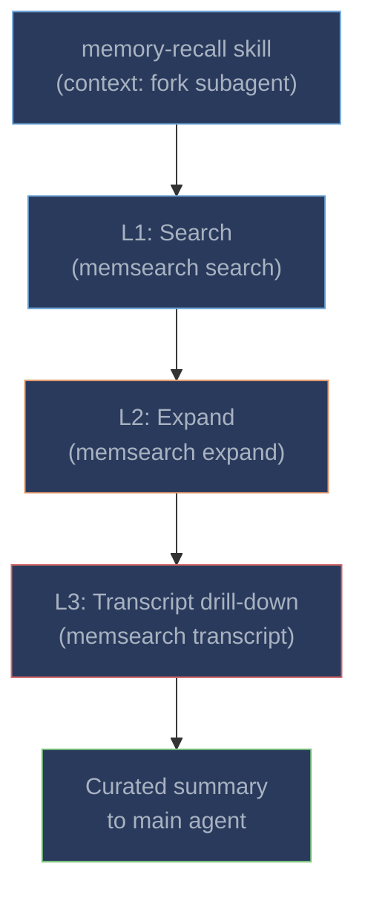

# Memory Recall

When Claude detects that a user's question could benefit from past context, it automatically invokes the `memory-recall` skill. The skill runs in a **forked subagent context** (`context: fork`), meaning it has its own context window and does not pollute the main conversation.

---

## Three-Layer Progressive Disclosure

The memory-recall skill uses a three-layer progressive disclosure model. Each layer provides increasing detail, and the subagent autonomously decides how deep to drill based on the query:


```mermaid
graph TD
    SKILL["memory-recall skill<br/>(context: fork subagent)"]
    SKILL --> L1["L1: Search<br/>(memsearch search)"]
    L1 --> L2["L2: Expand<br/>(memsearch expand)"]
    L2 --> L3["L3: Transcript drill-down<br/>(memsearch transcript)"]
    L3 --> RETURN["Curated summary<br/>to main agent"]

    style SKILL fill:#2a3a5c,stroke:#6ba3d6,color:#a8b2c1
    style L1 fill:#2a3a5c,stroke:#6ba3d6,color:#a8b2c1
    style L2 fill:#2a3a5c,stroke:#e0976b,color:#a8b2c1
    style L3 fill:#2a3a5c,stroke:#d66b6b,color:#a8b2c1
    style RETURN fill:#2a3a5c,stroke:#7bc67e,color:#a8b2c1
```

| Layer | Command | What it returns | When to use |
|-------|---------|----------------|-------------|
| **L1: Search** | `memsearch search "<query>" --top-k 5 --json-output` | Top-K relevant chunk snippets with scores | Always -- the starting point for every recall |
| **L2: Expand** | `memsearch expand <chunk_hash>` | Full markdown section with anchor metadata | When a snippet looks relevant but needs more context |
| **L3: Transcript** | `memsearch transcript <jsonl> --turn <uuid> --context 3` | Original conversation turns verbatim | When you need the exact exchange -- what was tried, what failed, what was decided |

The subagent autonomously searches, evaluates relevance, expands promising results, and drills into transcripts when needed. Only the curated summary reaches the main conversation.

---

## Real-World Example

Here is what a typical memory recall looks like from the user's perspective. The user asks a question, Claude invokes the skill, and the subagent does multi-step retrieval behind the scenes:

**User prompt:**
```
The /orders endpoint is still slow after yesterday's fix. What did we do?
```

**Behind the scenes (in the forked subagent):**

1. **L1 Search** -- the subagent runs `memsearch search "orders endpoint performance fix" --top-k 5 --json-output` and gets back:
    ```
    Score 0.82: "Fixed N+1 query in order-service using selectinload..."
    Score 0.71: "Added Redis caching middleware with 5min TTL..."
    Score 0.65: "Decided to use Prometheus counters for cache hit/miss..."
    ```

2. **L2 Expand** -- the top result looks directly relevant, so the subagent runs `memsearch expand <chunk_hash>`:
    ```markdown
    ### 14:30
    <!-- session:abc123 turn:def456 transcript:/home/user/.claude/projects/.../abc123.jsonl -->
    - Fixed N+1 query issue in order-service using selectinload
    - Changed get_orders() to eager-load order_items relationship
    - Added index on order.user_id for the new query pattern
    - Before: 47 queries per page load; after: 2 queries
    ```

3. **L3 Transcript** (optional) -- the subagent decides it has enough context and skips L3.

**What Claude returns to the user:**
```
Yesterday we fixed the /orders endpoint performance:

- Replaced the N+1 query in get_orders() with SQLAlchemy selectinload
  to eager-load order_items (went from 47 queries to 2 per page load)
- Added a database index on order.user_id
- Also added Redis caching middleware with 5min TTL

If it's still slow, the issue may be elsewhere -- perhaps the Redis
cache isn't being hit for this endpoint. Let me check the cache
middleware configuration...
```

The user sees a concise, contextual answer. The intermediate search results, chunk hashes, and expansion steps all happened in the forked subagent's context and never entered the main conversation.

---

## How to Trigger

**Manual invocation** — explicitly invoke the skill with a query:

```
/memory-recall what did we discuss about the auth refactor?
```

**Auto invocation** — just ask naturally, Claude auto-invokes the skill when it senses the question needs history:

```
We refactored the auth module last week, what was the approach?
```

Manual invocation is useful when:

- You want to explicitly search past sessions for a specific topic
- Claude doesn't automatically trigger the recall (some questions don't obviously need historical context)
- You want to verify what Claude "remembers" about a past session

---

## Tips for Better Recall

**Use specific queries.** "Redis caching" will return better results than "the thing we did last week". The search uses both semantic similarity (dense vectors) and keyword matching (BM25), so including specific terms helps.

**Check cold-start context.** The SessionStart hook injects up to 40 lines from each of the 2 most recent daily logs. For very recent work (today or yesterday), Claude may already have the context without needing to invoke the skill.

**Don't over-manage.** The system is designed to be autonomous. You don't need to tell Claude to "check memory" -- if the question benefits from historical context, the `UserPromptSubmit` hint and Claude's own judgment will trigger the skill.

**Edit memory files directly.** If a summary is inaccurate or contains sensitive information, open `.memsearch/memory/YYYY-MM-DD.md` in your editor and fix it. The watcher will re-index automatically. Memory files are plain markdown -- you're in full control.

**Debug collection mismatches from subdirectories.** If Claude Code is launched from a git subdirectory, derive the collection from the repo root so manual debugging matches the hook and skill behavior:
```bash
root=$(git rev-parse --show-toplevel 2>/dev/null || pwd)
bash /path/to/plugins/claude-code/scripts/derive-collection.sh "$root"
```

**Rebuild the index if search quality degrades.** If you change embedding providers or suspect index corruption:
```bash
memsearch index .memsearch/memory/ --force
```

---

## Which Model Runs the Skill

The plugin's three skills (`memory-recall`, `memory-config`, and `memory-to-skill`) use `context: fork` and leave `model` unset in their frontmatter. By default, they use `CLAUDE_CODE_SUBAGENT_MODEL` when set, or your main conversation's model otherwise.

For example, to use Sonnet as the default for subagents, add this entry to the `env` object in your Claude Code `settings.json`:

```json
{
  "env": {
    "CLAUDE_CODE_SUBAGENT_MODEL": "sonnet"
  }
}
```

Start a new session to use the setting. It also affects other subagents, so it is not specific to this plugin.

In Claude Code 2.1.251 and later, an ordinary subagent's model is selected in this order: a per-invocation `model`, the agent or forked skill's frontmatter `model`, `CLAUDE_CODE_SUBAGENT_MODEL`, then the main conversation's model. Before 2.1.251, the environment variable came first, even over `model: inherit`. The plugin leaves `model` unset, so its forked skills use your configured default. Setting only `CLAUDE_CODE_SUBAGENT_MODEL` does not change the built-in Explore or Plan subagents.

Every requested model is still checked against your organization's `availableModels` allowlist. If a blocked value is a model-family alias, Claude Code substitutes the newest allowed model in that family. Other blocked values, providers where substitution is unavailable, and families with no allowed model fall back to the inherited model.

Claude Code 2.1.257 and later also supports `CLAUDE_CODE_SUBAGENT_MODEL_FORCE=1`:

- With both variables set, ordinary subagents and the built-in Explore and Plan subagents use `CLAUDE_CODE_SUBAGENT_MODEL`, ignoring per-invocation and frontmatter choices.
- With only `CLAUDE_CODE_SUBAGENT_MODEL_FORCE` set, subagents use the main conversation's model, although Explore keeps its model cap.
- Conversation forks always use the main conversation's model. A `context: fork` skill with an explicit `model: inherit` does too, even when both variables are set. The MemSearch skills do not declare `model: inherit`; they omit `model`, so this exception does not apply to them.

See [the Claude Code subagent model rules](https://code.claude.com/docs/en/sub-agents#choose-a-model) and [forked skill rules](https://code.claude.com/docs/en/skills#run-skills-in-a-subagent) for the authoritative behavior.

---

## Comparison with claude-mem's Recall

Both memsearch and [claude-mem](https://github.com/thedotmack/claude-mem) provide memory recall for Claude Code, but the retrieval architecture differs significantly:

| Aspect | memsearch | claude-mem |
|--------|-----------|------------|
| **Recall trigger** | Skill auto-invoked by Claude based on context | `mem-search` skill + 5 MCP tools available in main context |
| **Execution context** | Forked subagent (`context: fork`) -- isolated context window | Main conversation context -- tool calls visible |
| **Intermediate results** | Never enter main context | Each MCP tool call/result consumes main context tokens |
| **Search approach** | Hybrid: dense + BM25 + RRF fusion | Dense only (ChromaDB); keyword search via separate SQLite FTS5 |
| **Progressive depth** | Autonomous: subagent decides search → expand → transcript | Manual: user/Claude explicitly calls MCP tools |
| **Context cost** | Zero -- no MCP tool definitions loaded | 5 MCP tool schemas permanently in context |

The forked subagent design means memsearch's recall is **invisible to the main conversation**. The user sees only the curated summary, not the intermediate search steps. This keeps the main context window clean and focused on the actual task.

---

## Comparison with Claude's Native Memory Recall

Claude Code's built-in memory (`CLAUDE.md` and auto-memory files) has no recall mechanism at all -- the entire file is loaded at session start regardless of relevance. This creates two problems:

1. **No selective recall.** Claude cannot search for a specific decision from three weeks ago. Either it's in the loaded file or it's not available.
2. **Context waste.** As `CLAUDE.md` grows, irrelevant instructions consume context tokens on every session, reducing the window available for actual work.

memsearch's skill-based recall solves both: memories are only loaded when relevant (via semantic search), and the three-layer model lets the subagent fetch exactly the right amount of detail -- from a one-line snippet to the full original conversation.
