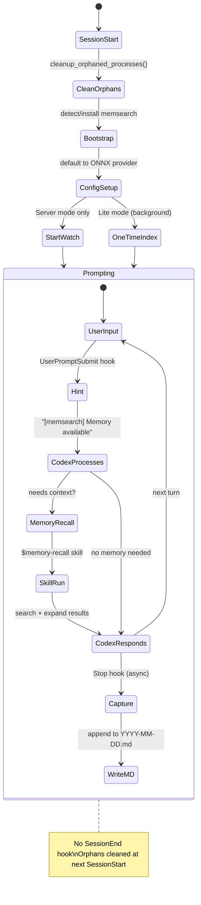

# How It Works

## What Happens Automatically

| Event | What memsearch does |
|-------|-------------------|
| **Session starts** | Clean up orphaned processes, start watch (Server) or one-time index (Lite), write session heading, inject recent memories, check for updates |
| **Each prompt** | Memory-recall skill hint displayed via `systemMessage` |
| **Each turn ends** | Conversation summarized via `codex exec` (async) and saved to daily `.md` |

---

## Hook Architecture

The Codex plugin uses 3 shell hooks (Codex does not have a `SessionEnd` hook):

| Hook | Type | Async | Timeout | What It Does |
|------|------|-------|---------|-------------|
| **SessionStart** | command | no | 10s | Cleanup orphans, bootstrap memsearch, start watch/index, write session heading, inject memories, display status |
| **UserPromptSubmit** | command | no | 15s | Return `systemMessage` hint "[memsearch] Memory available" |
| **Stop** | command | **yes** | 120s | Parse rollout, summarize via `codex exec`, append to daily `.md`, re-index (Server only) |

### Hook Lifecycle



---

## SessionStart -- Bootstrap and Inject

The SessionStart hook handles several Codex-specific concerns:

1. **Orphan cleanup** -- since Codex has no `SessionEnd` hook, orphaned `memsearch watch` and `memsearch index` processes from previous sessions are cleaned up here. Also sweeps orphaned `milvus_lite` processes.

2. **Bootstrap** -- if `memsearch` is not found in PATH, the hook auto-installs `uv` and warms up the `uvx` cache with `memsearch[onnx]`.

3. **Config setup** -- defaults to `onnx` provider if no config file exists (no API key needed).

4. **Watch vs. one-time index** -- detects the Milvus backend:
    - **Server mode** (`http://` or `tcp://` URI): starts `memsearch watch` as a persistent background process via `setsid`
    - **Lite mode** (local `.db` file): runs a one-time `memsearch index` in a background subshell (watch would fail due to Milvus Lite's file lock)

5. **Cold-start injection** -- injects memory file count and date range as `additionalContext`, with a hint to use `$memory-recall`.

6. **Update check** -- queries PyPI (2s timeout) and shows update banner if newer version exists.

### Milvus Lite Lock Handling

Milvus Lite uses a file-level lock that prevents concurrent access. This means `memsearch watch` (which runs continuously) would block `memsearch search` (which runs on-demand). The plugin handles this by:

- **Not starting watch in Lite mode** -- the SessionStart hook detects the URI format and skips `start_watch()` for non-HTTP/TCP URIs
- **Skipping re-index in Stop hook for Lite mode** -- the Stop hook only runs `memsearch index` when using a Server backend
- **One-time index at session start** -- a single background index run at SessionStart ensures existing memories are searchable
- **Dimension mismatch auto-recovery** -- if indexing fails with "dimension mismatch" (e.g., after switching embedding providers), the hook auto-resets and re-indexes

For real-time indexing without lock issues, use [Milvus Server or Zilliz Cloud](../../getting-started.md#milvus-backends).

---

## Stop Hook -- Capture

The Stop hook is the core capture mechanism. It runs **asynchronously** after each Codex response, returning `{}` immediately so the user can continue working.

```mermaid
graph TD
    A[Stop hook fires] --> B{Recursion guard}
    B -->|"stop_hook_active=true"| Z[Skip — return empty JSON]
    B -->|First call| C{API key available?}
    C -->|No| Z
    C -->|Yes| D[Validate rollout file]
    D -->|"< 3 lines"| Z
    D -->|Valid| E["parse-rollout.sh<br/>Extract last turn"]
    E --> F{"codex exec available?"}
    F -->|Yes| G["codex exec --ephemeral<br/>-s read-only -m gpt-5.1-codex-mini<br/>(isolated CODEX_HOME)"]
    F -->|No| H["Local fallback<br/>Truncate raw text"]
    G --> I["Append to YYYY-MM-DD.md<br/>with rollout anchors"]
    H --> I
    I --> J{Server mode?}
    J -->|Yes| K["memsearch index"]
    J -->|No (Lite)| L[Skip re-index]
```

### Codex exec Isolation

The Stop hook calls `codex exec` for LLM summarization. To prevent **hook recursion** (the summarization call triggering another Stop hook), it uses an isolated `CODEX_HOME`:

```bash
CODEX_ISOLATED="/tmp/codex-no-hooks"
mkdir -p "$CODEX_ISOLATED"
# Symlink auth.json for API access, but NO hooks.json → no hooks trigger
ln -sf "$HOME/.codex/auth.json" "$CODEX_ISOLATED/auth.json"

CODEX_HOME="$CODEX_ISOLATED" MEMSEARCH_NO_WATCH=1 \
  codex exec --ephemeral --skip-git-repo-check -s read-only \
  -m gpt-5.1-codex-mini "$LLM_PROMPT"
```

The isolated `CODEX_HOME` contains only `auth.json` (for API authentication) -- no `hooks.json` means no hooks fire in the child process. The `--ephemeral` flag prevents session state pollution.

### Local Fallback

If `codex exec` is unavailable or returns empty output, the hook falls back to raw text truncation:

```bash
# Fallback: use raw user question + Codex response (truncated to 800 chars)
SUMMARY="- User asked: ${USER_QUESTION}
- Codex: ${TRUNCATED_MSG}"
```

This ensures memory capture works even when the summarization model is unavailable.

---

## hooks.json Format

Codex CLI uses a `hooks.json` file (at `~/.codex/hooks.json`) to define hook scripts. The installer generates this file with a `matcher` field (required by Codex):

```json
[
  {
    "event": "SessionStart",
    "command": "/path/to/plugins/codex/hooks/session-start.sh",
    "matcher": ".*",
    "timeout_ms": 10000
  },
  {
    "event": "UserPromptSubmit",
    "command": "/path/to/plugins/codex/hooks/user-prompt-submit.sh",
    "matcher": ".*",
    "timeout_ms": 15000
  },
  {
    "event": "Stop",
    "command": "/path/to/plugins/codex/hooks/stop.sh",
    "matcher": ".*",
    "timeout_ms": 120000,
    "async": true
  }
]
```

!!! note "matcher field"
    The `matcher` field is required by Codex CLI. Use `".*"` to match all events of the specified type.

---

## Memory Files

```
your-project/.memsearch/memory/
├── 2026-03-24.md
├── 2026-03-25.md
└── 2026-03-26.md
```

### Example Memory File

```markdown
# 2026-03-25

## Session 10:30

### 10:30
<!-- session:abc123 rollout:~/.codex/sessions/abc123.rollout.jsonl -->
- User asked about database migration strategy for the new preferences feature
- Codex implemented Alembic migration for new user_preferences table with 4 columns
- Added rollback script and tested migration on staging database
- Created index on user_id column for query performance

### 11:15
<!-- session:abc123 rollout:~/.codex/sessions/abc123.rollout.jsonl -->
- User asked to add validation for the preferences API endpoint
- Codex added pydantic models for request/response validation
- Implemented custom validators for preference value types
- Added unit tests covering edge cases (empty values, invalid types)

## Session 15:00

### 15:00
<!-- session:def456 rollout:~/.codex/sessions/def456.rollout.jsonl -->
- User reported 500 error when saving preferences with Unicode characters
- Codex traced issue to missing UTF-8 encoding in the SQLAlchemy column definition
- Fixed by adding `String(collation='utf8mb4_unicode_ci')` to the model
- Added regression test with emoji and CJK characters
```

The `<!-- session:... rollout:... -->` anchors enable L3 drill-down: the memory-recall skill uses `parse-rollout.sh` to read the original Codex conversation when deeper context is needed.

---

## Differences from Claude Code Plugin

| Aspect | Codex Plugin | Claude Code Plugin |
|--------|-------------|-------------------|
| **SessionEnd hook** | Not available -- orphans cleaned at next SessionStart | Available -- clean shutdown |
| **Summarizer** | `codex exec -m gpt-5.1-codex-mini` | `claude -p --model haiku` |
| **Recursion prevention** | Isolated `CODEX_HOME` (no hooks.json) | `stop_hook_active` flag + `CLAUDECODE=` |
| **Skill context** | Main context (no `context: fork`) | Forked subagent (`context: fork`) |
| **Milvus Lite** | One-time index + skip re-index in Stop | Same approach via `start_watch()` logic |
| **Auto-install** | Bootstrap installs `uv` if missing | Requires pre-installed memsearch |
| **hooks.json** | Generated by install.sh (requires `matcher`) | Part of plugin manifest |

---

## Plugin Files

```
plugins/codex/
├── hooks/
│   ├── common.sh                   # Shared setup: JSON helpers, process management, orphan cleanup
│   ├── session-start.sh            # SessionStart: bootstrap, watch/index, cold-start injection
│   ├── stop.sh                     # Stop: async capture via codex exec, local fallback
│   └── user-prompt-submit.sh       # UserPromptSubmit: memory availability hint
├── skills/
│   └── memory-recall/
│       └── SKILL.md                # Memory recall skill ($memory-recall)
└── scripts/
    ├── derive-collection.sh        # Per-project collection name
    ├── install.sh                  # One-click installer (skill, hooks.json, feature flag)
    └── parse-rollout.sh            # Codex rollout JSONL parser for L3 drill-down
```

| File | Purpose |
|------|---------|
| `common.sh` | Shared library sourced by all hooks. Includes JSON helpers (`_json_val`, `_json_encode_str`), memsearch detection, watch/index singleton management, and `cleanup_orphaned_processes()` for Codex's missing SessionEnd. |
| `session-start.sh` | Bootstrap memsearch, start watch (Server) or one-time index (Lite), write session heading, inject cold-start context, check for updates. |
| `stop.sh` | Async capture: parse rollout, summarize via `codex exec` with isolated `CODEX_HOME`, append to daily `.md`, re-index (Server only). Falls back to raw text if `codex exec` fails. |
| `user-prompt-submit.sh` | Return lightweight `systemMessage` hint about memory availability. |
| `SKILL.md` | Memory recall skill with `__INSTALL_DIR__` placeholder (resolved at install time). Includes direct file read fallback for L2 in case `memsearch expand` hits sandbox restrictions. |
| `install.sh` | One-click installer: checks/installs memsearch, copies skill, generates `hooks.json` with `matcher` field, enables experimental hooks feature flag. |
| `parse-rollout.sh` | Parses Codex rollout JSONL files, extracting the last user message through EOF with role labels. |
