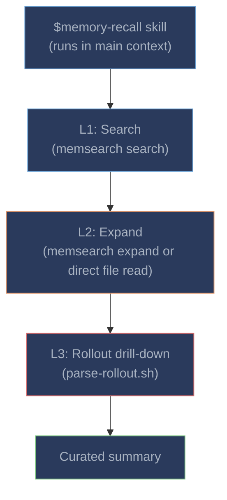

# Memory Recall

The `$memory-recall` skill provides semantic search over past sessions. Codex can invoke it automatically when it judges historical context would help, or you can trigger it manually.

---

## Invoking the Skill

- **Automatically**: Codex decides when past context would help, based on the `UserPromptSubmit` hint and skill description
- **Manually**: `$memory-recall <your query>`

### Manual Example

```
$memory-recall database migration fix from last week
```

Codex will search past memories, expand relevant results, and return a curated summary.

---

## Three-Layer Progressive Disclosure



| Layer | Command | What it returns | When to use |
|-------|---------|----------------|-------------|
| **L1: Search** | `memsearch search "<query>" --top-k 5 --json-output` | Top-K relevant chunk snippets with scores | Always -- the starting point |
| **L2: Expand** | `memsearch expand <chunk_hash>` (or direct `cat` fallback) | Full markdown section with rollout anchors | When a snippet needs more context |
| **L3: Rollout** | `bash parse-rollout.sh <rollout_path>` | Original Codex conversation turns | When you need the exact exchange |

### L2 Fallback: Direct File Read

Unlike Claude Code, Codex's sandbox restrictions may prevent `memsearch expand` from accessing the Milvus database. The skill includes a **direct file read fallback**:

```
If memsearch expand fails, read the source file directly.
Search results include `source` (file path) and `start_line`/`end_line`.
Use `cat <source_file>` or read the relevant line range.
```

This ensures L2 works even in strict sandbox mode by reading the markdown files directly rather than querying Milvus.

---

## Real-World Example

**User:** "What approach did we take for the caching layer?"

**L1 -- Search:** Skill runs `memsearch search "caching layer approach" --top-k 5 --json-output`:
```
Score 0.82: "Codex implemented Redis caching middleware with 5min TTL..."
Score 0.71: "Added cache invalidation via pub/sub channel..."
```

**L2 -- Expand:** Skill reads the full section:
```markdown
### 14:30
<!-- session:abc123 rollout:~/.codex/sessions/abc123.rollout.jsonl -->
- User asked about caching strategy for API responses
- Codex implemented Redis L1 cache with 5min TTL using ioredis
- Added in-process LRU as L2 (1000 entries) for hot path
- Configured cache invalidation via Redis pub/sub on writes
- Decided against Memcached due to lack of pub/sub support
```

**L3 (optional):** If the summary isn't enough, the skill runs `parse-rollout.sh` to get the original conversation.

**Result returned to user:** "We implemented a two-layer caching strategy: Redis L1 (5min TTL) + in-process LRU L2 (1000 entries). Cache invalidation uses Redis pub/sub on writes. We chose Redis over Memcached specifically for pub/sub support."

---

## Comparison with Claude Code's Memory Recall

The key architectural difference is in **skill execution context**:

| Aspect | Codex | Claude Code |
|--------|-------|-------------|
| **Skill context** | Main context -- results visible in conversation | Forked subagent (`context: fork`) -- isolated |
| **Intermediate results** | Visible to user (search output, expand output) | Hidden -- only curated summary reaches main context |
| **Context cost** | Search/expand results consume main context tokens | Zero -- subagent has its own context window |
| **Autonomy** | Skill steps visible and interruptible | Fully autonomous inside subagent |
| **L2 fallback** | Direct file read (bypasses Milvus sandbox issues) | Always uses `memsearch expand` |
| **Skill prefix** | `$memory-recall` | `/memory-recall` |

### Why No Fork Context?

Codex CLI does not support `context: fork` for skills. This means the `$memory-recall` skill runs in the **main conversation context** -- all intermediate search results, chunk expansions, and rollout parsing steps are visible to the user and consume main context tokens.

In practice, this works well for targeted queries but is less efficient for broad searches (where many intermediate results would clutter the context). For the best experience with large memory histories, consider using [Milvus Server](../../getting-started.md#milvus-backends) for faster search responses.

---

## Tips for Better Recall

**Use specific queries.** "Redis caching" will return better results than "the thing we did". The hybrid search combines semantic similarity with keyword matching, so including specific terms helps.

**Check the skill install.** The `$memory-recall` skill must be installed at `~/.agents/skills/memory-recall/SKILL.md`. The installer substitutes `__INSTALL_DIR__` with the actual plugin path. If recall doesn't work, verify the skill file exists and paths are correct.

**Derive collection manually.** If you need to debug collection issues:
```bash
bash /path/to/plugins/codex/scripts/derive-collection.sh
```

**Rebuild the index.** If search quality degrades after changing embedding providers:
```bash
memsearch index .memsearch/memory/ --force --collection <collection_name>
```
