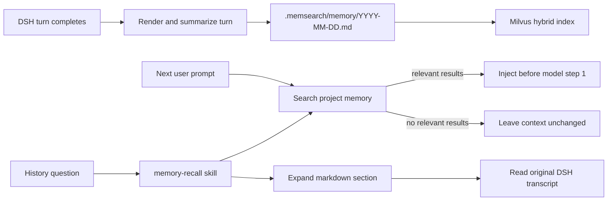

# How the DeepSeek Harness Plugin Works

The DSH plugin connects MemSearch to native DSH lifecycle events and services. It does not poll the UI or require the user to save notes manually.

## Lifecycle

## Capture

The plugin listens for DSH `session/event` notifications and handles completed turns. It:

1. resolves the durable project directory from the session;
2. renders user, assistant, and tool activity into a bounded transcript;
3. summarizes the turn without blocking the active conversation;
4. appends the result to `.memsearch/memory/YYYY-MM-DD.md` with a session anchor;
5. lets the shared MemSearch index make the new entry searchable.

Capture jobs are serialized so summarizers do not overlap. Session and turn anchors make writes idempotent if DSH replays an event.

## Selective Pre-Step Injection

At the first model step of a new turn, the plugin searches memory using the user's question. When useful matches exist, it injects a small set of relevant snippets and a `[memsearch] Memory available.` hint. When the search has no relevant result, the model context is left unchanged.

This keeps routine turns lightweight while still surfacing past decisions when they matter.

## Native Memory Recall

The plugin registers `memory-recall` through DSH's native skill service. The agent can use three levels of progressive disclosure:

| Layer | Result | Typical use |
|-------|--------|-------------|
| **Search** | Ranked memory snippets | Find likely sessions or decisions |
| **Expand** | Full markdown section around a result | Recover surrounding rationale and outcomes |
| **Transcript** | Original DSH conversation and tool activity | Confirm exact commands, paths, or wording |

The same markdown journal can contain entries produced by Claude Code, Codex, DSH, OpenClaw, and OpenCode. Recall is not limited to the platform that wrote a memory.

## Summarization

`summarizeMode` selects the capture backend:

- **`auto`** (default) uses a configured `[plugins.dsh.summarize]` provider when present; otherwise it uses `dsh-headless`.
- **`dsh-headless`** starts a one-shot headless DSH agent using the model selected by the DSH deployment. The child process disables the MemSearch plugin to prevent recursive capture.
- **`custom-llm`** calls a provider from the shared MemSearch configuration directly, which is useful for assigning a small dedicated summarization model.

There is no silent fallback to a different backend. If the selected summarizer is unavailable, the journal records a short unavailable note with the original transcript anchor instead of writing an unsummarized conversation dump.

## Project Isolation and Sharing

The memory directory defaults to `<project>/.memsearch`; `MEMSEARCH_DIR` can explicitly select a global location. Collections are derived from the project path, so a long-running DSH web process can serve multiple projects without mixing them.

Point another supported plugin at the same project and it sees the same markdown history and collection.

## Web Memory Dock

Web profiles receive a compact MemSearch capsule above the composer. Expanding it provides:

- pending and installed skill candidates;
- actions that queue a candidate for agent review or start a user-approved installation;
- a lazily loaded directory tree for `.memsearch`;
- rendered Markdown and plain-text previews for supported files.

The browser is read-only, restricts access to the session project's real `.memsearch` tree, rejects path and symlink escapes, and caps preview payloads at 256 KB. TUI and headless profiles do not register the browser routes; their capture and recall behavior is unchanged.

## Background Maintenance

When enabled, maintenance runs after a session closes and on a periodic fallback timer:

- **Project review** keeps `.memsearch/PROJECT.md` aligned with durable project state.
- **User profile** maintains `.memsearch/USER.md` with reusable preferences and working patterns.
- **Memory to skill** distills recurring workflows into `.memsearch/skill-candidates/`.

Each task runs only when new journal content exists and its minimum interval has elapsed. Candidates are reviewable but never installed automatically.

## Source Layout

| Path | Purpose |
|------|---------|
| `plugins/dsh/index.js` | DSH lifecycle integration, host routes, capture, injection, and maintenance |
| `plugins/dsh/client.js` | Web dock, candidate review UI, and read-only memory browser |
| `plugins/dsh/skills/` | Native `memory-recall`, `memory-config`, and memory-to-skill instructions |
| `plugins/dsh/scripts/` | Summarization, transcript parsing, collection derivation, and maintenance helpers |
| `plugins/dsh/cordis.patch.yml` | DSH bundle-layer insertion |
