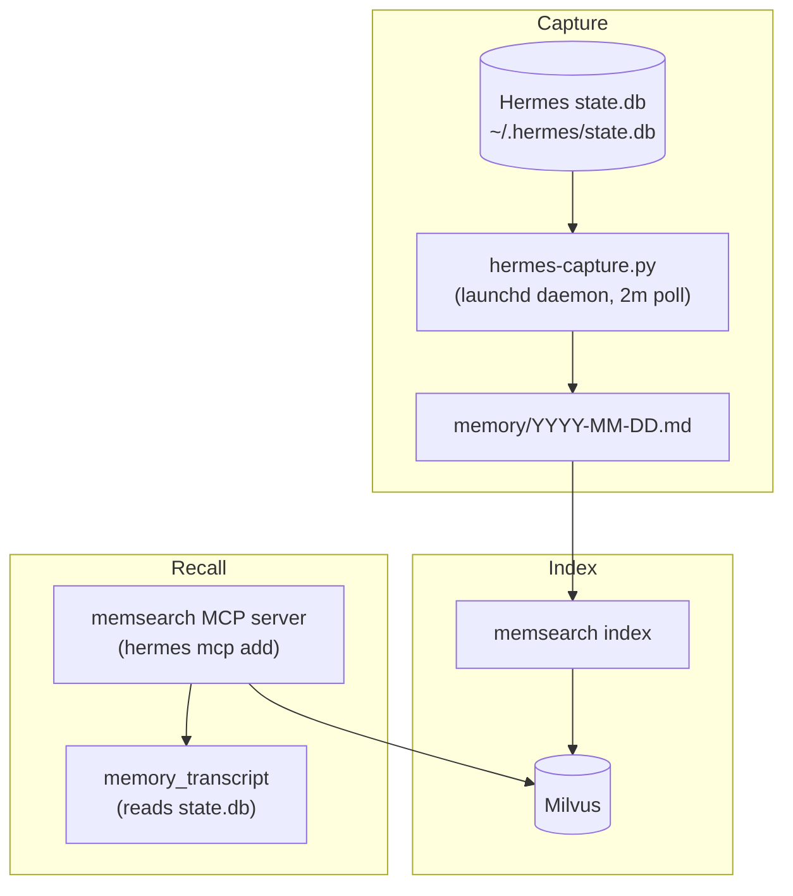

# How It Works

## Architecture



## Capture (state.db poller)

Hermes has no plugin hook system for capture, so the plugin uses a background
poller — the same model as the OpenCode plugin. A launchd daemon (or cron)
runs `hermes-capture.py`:

1. Reads `~/.hermes/state.db` (`messages` table: `session_id, role, content, timestamp`) for turns newer than the last captured one per session.
2. Appends them to `<memory-home>/.memsearch/memory/YYYY-MM-DD.md` in the shared format:
   ```
   ## Session 09:20
   <!-- hermes session_id:<sid> capture:<msgid> transcript:hermes-state-db -->
   === Transcript of a conversation between User and Hermes ===
   [Assistant]: ...
   ```
3. Runs `memsearch index` into the `ms_hermes_*` collection.

A per-session checkpoint file prevents duplicate appends, and the daemon
flocks so concurrent polls never double-write.

## Recall (MCP server)

Hermes connects to the MCP server via `hermes mcp add` — the 4 memory tools
become first-class Hermes tools. The server reads `~/.hermes/state.db` for
transcript/capture and queries the shared Milvus collection for search.

## Differences from the OpenCode plugin

| | OpenCode | Hermes |
|---|----------|--------|
| Capture trigger | background daemon (10s) | launchd daemon (2m) or cron |
| Tool registration | `tool()` API (TS) | MCP server (Python, fastmcp) |
| Session store | `~/.local/share/opencode/opencode.db` | `~/.hermes/state.db` |
| Memory home | project `.memsearch/` | dedicated `~/hermes/.memsearch/` |