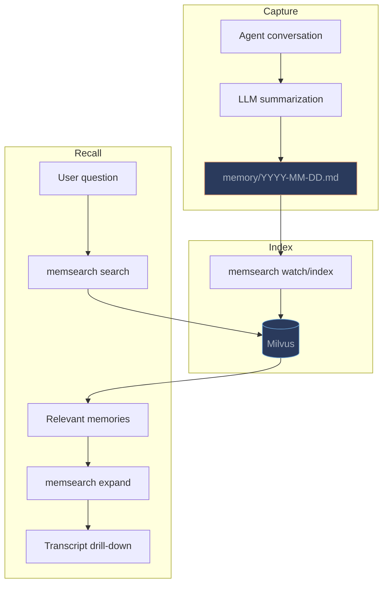

# Platform Overview

memsearch provides plugins for 4 AI coding agent platforms. All plugins share the same core architecture: capture conversations to markdown, index with Milvus, recall via semantic search.

---

## Comparison Table

| Feature | [Claude Code](claude-code/index.md) | [OpenClaw](openclaw/index.md) | [OpenCode](opencode/index.md) | [Codex CLI](codex/index.md) |
|---------|:---:|:---:|:---:|:---:|
| **Plugin type** | Shell hooks | TS registerTool | TS npm plugin | Shell hooks |
| **Capture method** | Stop hook (async) | llm_output debounce | SQLite daemon | Stop hook (async) |
| **Summarization** | `claude -p --model haiku` | OpenClaw agent | `opencode run` | `codex exec` |
| **Recall mechanism** | SKILL.md (context: fork) | memory_search tool | memory_search tool | SKILL.md |
| **L3 transcript format** | Claude Code JSONL | OpenClaw JSONL | OpenCode SQLite | Codex rollout JSONL |
| **Isolation** | Per-project collection | Per-agent directory | Per-project collection | Per-project collection |
| **Install method** | Plugin marketplace | `openclaw plugins install` | npm + opencode.json | `install.sh` |
| **Embedding default** | ONNX bge-m3 (CPU) | ONNX bge-m3 (CPU) | ONNX bge-m3 (CPU) | ONNX bge-m3 (CPU) |
| **API key required** | No (ONNX default) | No (ONNX default) | No (ONNX default) | No (ONNX default) |

---

## Shared Architecture

All plugins follow the same **capture-index-recall** pattern:



### Three-Layer Progressive Disclosure

Every plugin supports the same three-layer recall model:

| Layer | Command | What it returns |
|-------|---------|----------------|
| **L1: Search** | `memsearch search` | Top-K relevant chunk snippets |
| **L2: Expand** | `memsearch expand` | Full markdown section around a chunk |
| **L3: Transcript** | Platform-specific parser | Original conversation verbatim |

### Memory File Format

All plugins write to the same markdown format:

```markdown
# 2026-03-25

## Session 14:30

### 14:30
<!-- session:abc123 turn:def456 transcript:/path/to/session.jsonl -->
- User asked about Redis caching configuration
- Agent implemented cache middleware with 5-minute TTL
- Added Prometheus counters for cache hit/miss metrics
```

### Cross-Platform Memory Sharing

Since all plugins write standard markdown and use the same Milvus index, memories are portable:

- Memories written in **Claude Code** are searchable from **Codex**, **OpenCode**, or **OpenClaw**
- Point multiple plugins at the same `milvus_uri` and `collection` for shared access
- Or use per-project collections for isolation (the default)

---

## When to Use Which

| Scenario | Recommended Platform |
|----------|---------------------|
| Primary Claude Code user | [Claude Code plugin](claude-code/index.md) -- most mature, marketplace install |
| OpenClaw agent development | [OpenClaw plugin](openclaw/index.md) -- native TS integration, multi-agent isolation |
| OpenCode user | [OpenCode plugin](opencode/index.md) -- npm package, SQLite-native capture |
| Codex CLI user | [Codex plugin](codex/index.md) -- shell hooks, similar to Claude Code |
| Using multiple platforms | Install plugins on each -- they share the same memory backend |

---

## Prerequisites (all platforms)

- **Python 3.10+**
- **memsearch** installed: `uv tool install "memsearch[onnx]"` (or `pip install "memsearch[onnx]"`)
- First-time ONNX model download: ~558 MB from HuggingFace Hub (cached after first run)
