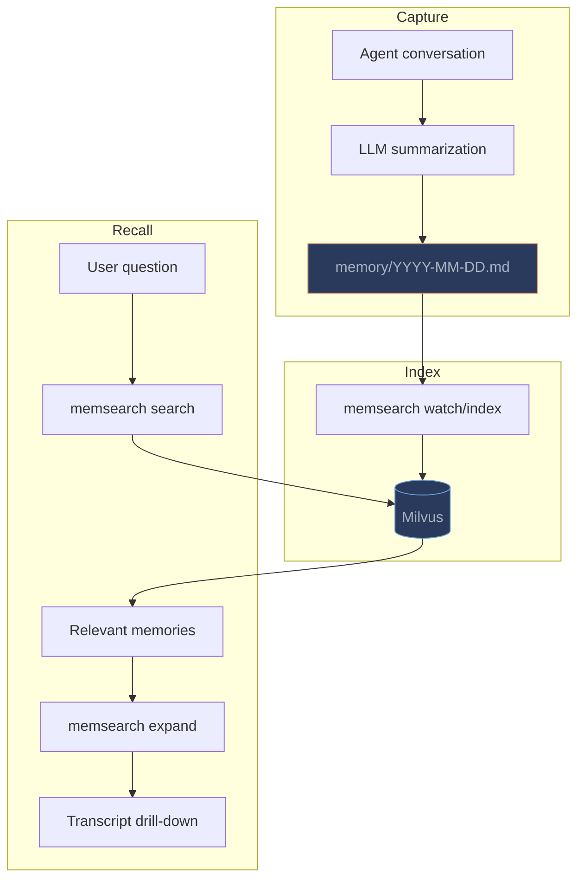

# Platform Overview

memsearch provides plugins for 5 AI coding agent platforms. All plugins share the same core architecture: capture conversations to markdown, index with Milvus, recall via semantic search.

---

## Comparison Table

| Feature | [Claude Code](claude-code/index.md) | [Codex](codex/index.md) | [DeepSeek Harness](dsh/index.md) | [OpenClaw](openclaw/index.md) | [OpenCode](opencode/index.md) |
|---------|:---:|:---:|:---:|:---:|:---:|
| **Plugin type** | Shell hooks | Shell hooks | Native ESM + web client | TS registerTool | TS npm plugin |
| **Capture method** | Stop hook (async) | Stop hook (async) | `session/event` turn end | agent_end hook | SQLite daemon |
| **Summarization** | `claude -p --model haiku` | `codex exec` | DSH headless agent | OpenClaw agent | `opencode run` |
| **Recall mechanism** | SKILL.md (context: fork) | SKILL.md | Native skill | memory_search tool | memory_search tool |
| **L3 transcript format** | Claude Code JSONL | Codex rollout JSONL | DSH session database | OpenClaw JSONL | OpenCode SQLite |
| **Isolation** | Per-project collection | Per-project collection | Per-project collection | Per-workspace collection | Per-project collection |
| **Install method** | Plugin marketplace | `install.sh` | `dsh plugin add` | `openclaw plugins install --force` + hook permissions | npm + opencode.json |
| **Embedding default** | ONNX bge-m3 (CPU) | ONNX bge-m3 (CPU) | ONNX bge-m3 (CPU) | ONNX bge-m3 (CPU) | ONNX bge-m3 (CPU) |
| **API key required** | No (ONNX default) | No (ONNX default) | No (ONNX default) | No (ONNX default) | No (ONNX default) |

Each plugin keeps its current native summarizer when the plugin-specific
provider setting is empty. Claude Code, Codex, OpenClaw, and OpenCode also
accept `native`; DSH selects its headless-agent backend when the provider is
unset. To override one plugin's native model, set
`plugins.<platform>.summarize.model`, for example
`plugins.claude-code.summarize.model`, `plugins.codex.summarize.model`,
`plugins.dsh.summarize.model`, `plugins.openclaw.summarize.model`, or
`plugins.opencode.summarize.model`.
To route summarization through a memsearch-managed API provider, define
`[llm.providers.<name>]` and set `plugins.<platform>.summarize.provider` to that
name. These plugin settings do not fall back to `llm.model`.

---

## Shared Architecture

All plugins follow the same **capture-index-recall** pattern:


```mermaid
graph TB
    subgraph "Capture"
        CONV[Agent conversation] --> SUM[LLM summarization]
        SUM --> MD["memory/YYYY-MM-DD.md"]
    end

    subgraph "Index"
        MD --> WATCH[memsearch watch/index]
        WATCH --> MIL[(Milvus)]
    end

    subgraph "Recall"
        Q[User question] --> SEARCH[memsearch search]
        SEARCH --> MIL
        MIL --> RES[Relevant memories]
        RES --> EXPAND[memsearch expand]
        EXPAND --> TRANSCRIPT[Transcript drill-down]
    end

    style MD fill:#2a3a5c,stroke:#e0976b,color:#a8b2c1
    style MIL fill:#2a3a5c,stroke:#6ba3d6,color:#a8b2c1
```

### Three-Layer Progressive Disclosure

Every plugin supports the same three-layer recall model:

| Layer | Command | What it returns |
|-------|---------|----------------|
| **L1: Search** | `memsearch search` | Top-K relevant chunk snippets |
| **L2: Expand** | `memsearch expand` | Full markdown section around a chunk |
| **L3: Transcript** | Platform-specific parser | Original conversation verbatim |

### Memory File Format

All plugins write to the same markdown format:

```markdown
# 2026-03-25

## Session 14:30

### 14:30
<!-- session:abc123 turn:def456 transcript:/path/to/session.jsonl -->
- User asked about Redis caching configuration
- Agent implemented cache middleware with 5-minute TTL
- Added Prometheus counters for cache hit/miss metrics
```

### Cross-Platform Memory Sharing

All plugins write standard markdown and derive collection names from the project directory using the same algorithm. Memories are automatically shared across platforms -- no manual configuration needed:

- Memories written in **Claude Code** are searchable from **Codex**, **DSH**, **OpenClaw**, or **OpenCode**
- Same project directory = same collection name = shared memories
- Different project directories are naturally isolated

---

## When to Use Which

| Scenario | Recommended Platform |
|----------|---------------------|
| Primary Claude Code user | [Claude Code plugin](claude-code/index.md) -- most mature, marketplace install |
| Codex user | [Codex plugin](codex/index.md) -- shell hooks, similar to Claude Code |
| DeepSeek Harness user | [DSH plugin](dsh/index.md) -- native lifecycle events, skill recall, and web memory browser |
| OpenClaw agent development | [OpenClaw plugin](openclaw/index.md) -- native TS integration, multi-agent isolation |
| OpenCode user | [OpenCode plugin](opencode/index.md) -- npm package, SQLite-native capture |
| Using multiple platforms | Install plugins on each -- they share the same memory backend |

---

## Prerequisites (all platforms)

- **Python 3.10+**
- **memsearch** installed: `uv tool install "memsearch[onnx]"` (or `pip install "memsearch[onnx]"`)
- First-time ONNX model download: ~558 MB from HuggingFace Hub (cached after first run)
