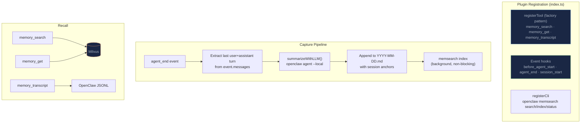
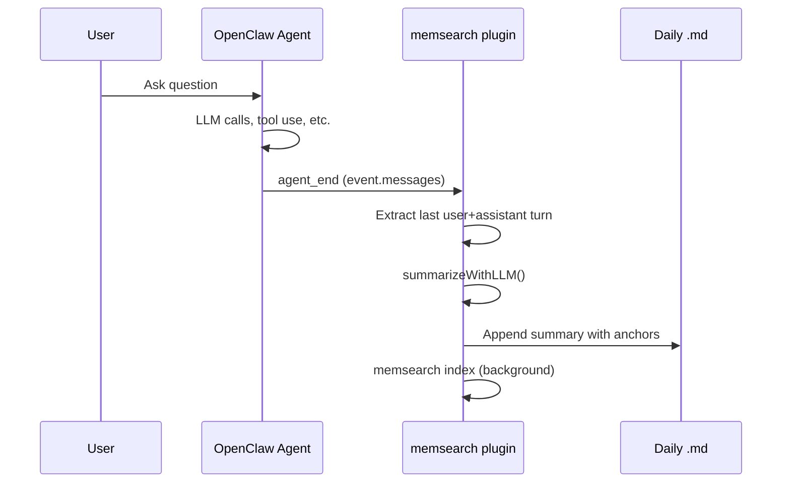

# How It Works

## What Happens Automatically

| Event | What memsearch does |
|-------|-------------------|
| **Agent starts** | Recent memories from the 2 most recent daily logs are injected as context (`before_agent_start`) |
| **Each turn ends** | Conversation is summarized by the OpenClaw agent and appended to daily `.md` (`agent_end` hook) |
| **LLM needs history** | Calls `memory_search`, `memory_get`, or `memory_transcript` tools progressively |

---

## TypeScript Plugin Architecture

The plugin is a single `index.ts` file that registers tools, hooks, and a CLI subcommand using OpenClaw's plugin API:



### Tool Registration: Factory Pattern

The tools use OpenClaw's `registerTool` **factory pattern** -- each tool receives the current `ctx` (context) on every invocation. This is how per-agent isolation works:

```typescript
api.registerTool(
  (ctx) => {
    updateAgentContext(ctx);  // update agentId, projectDir, collectionName
    return {
      name: "memory_search",
      // ... tool definition with current collectionName
    };
  },
  { name: "memory_search" }
);
```

When the tool is called, `ctx.agentId` tells the plugin which agent is running. The plugin updates its internal state (`projectDir`, `memoryDir`, `collectionName`) accordingly, so memory operations always target the correct agent's data.

---

## Capture

The capture pipeline hooks into OpenClaw's `agent_end` event, which fires after every conversational turn in TUI mode. The event provides `event.messages` — a complete snapshot of the message history up to that point.



The plugin extracts the last user question and assistant response from `event.messages`, summarizes them via LLM, and appends the summary to the daily markdown file. No debounce or noise filtering is needed — `agent_end` provides a clean, complete message history for each turn.

!!! note "Known limitations"

    - Non-default agents may not fire `agent_end` reliably ([#50025](https://github.com/openclaw/openclaw/issues/50025))
    - Feishu channel mode does not trigger `agent_end` ([#51189](https://github.com/openclaw/openclaw/issues/51189))
    - Main agent vs subagent distinction not yet available in event metadata ([#57636](https://github.com/openclaw/openclaw/issues/57636))

### Summarization

Summaries are generated via `openclaw agent --local` with a third-person note-taker system prompt:

```
You are a third-person note-taker. Record what happened as factual
third-person notes. Output 2-6 bullet points, each starting with '- '.
Write in third person: 'User asked...', 'OpenClaw replied...'
```

If `openclaw agent` fails (e.g., no model configured), the plugin falls back to raw truncated text.

---

## Cold-Start Context

On agent start (`before_agent_start` hook), the plugin reads recent daily memory files and returns them as `prependContext`:

```typescript
api.on("before_agent_start", async () => {
  const context = getRecentMemories(memoryDir);
  if (context) {
    return { prependContext: context };
  }
});
```

The `getRecentMemories` function reads the last 15 lines from the 2 most recent daily `.md` files, extracting only bullet-point lines (`- ...`) to keep the context concise. This gives the LLM awareness of recent sessions so it can decide when to use the memory tools.

If no memory files exist yet, a hint is injected instead: `"You have N past memory file(s). Use the memory_search tool when the user's question could benefit from historical context."`

---

## Multi-Agent Isolation

OpenClaw supports multiple agents (e.g., `main`, `work`). The plugin provides automatic isolation based on workspace directories:

| Agent | Memory Directory | Collection |
|-------|-----------------|------------|
| `main` | `~/.openclaw/workspace/.memsearch/memory/` | `ms_workspace_<hash>` |
| `work` | `~/.openclaw/workspace-work/.memsearch/memory/` | `ms_workspace_work_<hash>` |
| custom | `<workspace-dir>/.memsearch/memory/` | `ms_<basename>_<hash>` |

Collection names are derived from the workspace path using the same algorithm as Claude Code, Codex, and OpenCode. This means when an agent's workspace points to a project directory used by other platforms, memories are automatically shared across platforms.

---

## Memory Files

Memory files live alongside other workspace files in the agent's workspace directory:

```
~/.openclaw/workspace/.memsearch/memory/
├── 2026-03-24.md
├── 2026-03-25.md
└── 2026-03-26.md
```

### Example Memory File

```markdown
# 2026-03-25

## Session 14:47

### 14:47
<!-- session:a1b2c3d4 transcript:~/.openclaw/agents/main/sessions/a1b2c3d4.jsonl -->
- User asked about memsearch architecture and how chunks are deduplicated
- Agent explained the SHA-256 content hashing mechanism in chunker.py
- Agent showed the composite chunk ID format: hash(source:startLine:endLine:contentHash:model)

### 15:12
<!-- session:a1b2c3d4 transcript:~/.openclaw/agents/main/sessions/a1b2c3d4.jsonl -->
- User asked to add a new embedding provider for Cohere
- Agent created src/memsearch/embeddings/cohere.py with CohereProvider class
- Agent registered the provider in embeddings/__init__.py factory
- Added cohere to optional deps in pyproject.toml

## Session 17:30

### 17:30
<!-- session:e5f6g7h8 transcript:~/.openclaw/agents/main/sessions/e5f6g7h8.jsonl -->
- User reported search returning stale results after re-indexing
- Agent identified the issue: Milvus Server stats lag after upsert
- Explained that stats update after segment flush/compaction, but search works immediately
```

The `<!-- session:... transcript:... -->` anchors enable L3 drill-down: the `memory_transcript` tool parses these to locate and read the original JSONL conversation.

---

## Plugin Files

```
plugins/openclaw/
├── package.json                    # npm package with openclaw peer dependency
├── openclaw.plugin.json            # Plugin config schema (kind: memory)
├── index.ts                        # Main plugin: tools, hooks, helpers (~800 lines)
├── install.sh                      # Installation script
├── skills/
│   └── memory-recall/
│       └── SKILL.md                # Decision guide for memory tools
└── scripts/
    ├── derive-collection.sh        # Per-agent collection name derivation
    └── parse-transcript.sh         # OpenClaw JSONL transcript parser
```

| File | Purpose |
|------|---------|
| `package.json` | npm package with `openclaw >=2026.3.11` as peer dependency |
| `openclaw.plugin.json` | Plugin configuration schema: `provider`, `autoCapture`, `autoRecall` settings |
| `index.ts` | Main plugin entry. Registers 3 tools (factory pattern), 3 event hooks, and CLI subcommand |
| `install.sh` | Installation script: checks memsearch availability, registers plugin |
| `SKILL.md` | Memory recall skill guide -- helps the LLM decide when and how to use the memory tools |
| `derive-collection.sh` | Generates deterministic per-agent Milvus collection names |
| `parse-transcript.sh` | Parses OpenClaw JSONL transcripts into readable `[Human]`/`[Assistant]` format |
