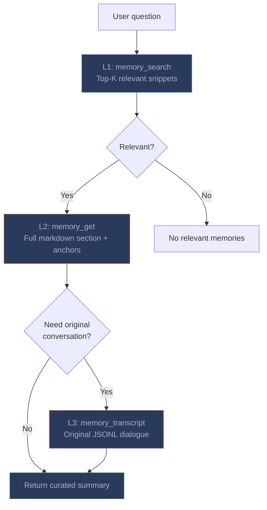

# Memory Tools

The plugin registers three tools via OpenClaw's `registerTool` factory pattern. Each tool captures the current agent context on invocation, ensuring operations target the correct per-agent memory directory and Milvus collection.

---

## Tool Reference

| Tool | Parameters | What it does |
|------|-----------|-------------|
| `memory_search` | `query` (string), `top_k` (number, optional) | Semantic search over indexed memories via `memsearch search --json-output`. Returns top-K relevant chunks with scores, dates, and content snippets. |
| `memory_get` | `chunk_hash` (string) | Expand a chunk to full markdown section via `memsearch expand`. Shows the complete section with surrounding context and session anchors. |
| `memory_transcript` | `transcript_path` (string) | Parse original OpenClaw JSONL transcript via `parse-transcript.sh`. Returns the formatted dialogue with `[Human]` and `[Assistant]` labels. |

---

## Three-Layer Progressive Recall



| Layer | Tool | What it returns | When to use |
|-------|------|----------------|-------------|
| **L1: Search** | `memory_search` | Top-K chunk snippets with relevance scores | Starting point -- find potentially relevant memories |
| **L2: Expand** | `memory_get` | Full markdown section with session anchors | When a snippet looks relevant but needs more context |
| **L3: Transcript** | `memory_transcript` | Original conversation from OpenClaw JSONL | When you need the exact exchange -- what was tried, what failed |

The LLM autonomously decides which layers to use. For most questions, L1 + L2 is sufficient. L3 is reserved for cases where the exact original conversation matters (e.g., "what exactly did we try when debugging the auth issue?").

### Real-World Example

**User:** "What was the approach we took for the caching layer last week?"

**L1 -- memory_search:** LLM calls `memory_search` with query "caching layer approach":
```json
{
  "results": [
    {
      "chunk_hash": "abc123...",
      "score": 0.85,
      "content": "- User asked about caching strategy for the API gateway\n- Agent implemented Redis L1 + in-process LRU L2...",
      "source": "2026-03-20.md"
    }
  ]
}
```

**L2 -- memory_get:** LLM calls `memory_get` with chunk_hash `abc123...`:
```markdown
### 14:30
<!-- session:xyz789 transcript:~/.openclaw/agents/main/sessions/xyz789.jsonl -->
- User asked about caching strategy for the API gateway
- Agent implemented Redis L1 with 5min TTL + in-process LRU L2 with 1000 entries
- Added cache invalidation via pub/sub channel
- Decided against Memcached due to lack of pub/sub support
```

**LLM response to user:** "Last week we implemented a two-layer caching strategy: Redis L1 (5min TTL) + in-process LRU L2 (1000 entries). We chose Redis over Memcached specifically because Redis supports pub/sub for cache invalidation."

---

## Compared to memory-core

OpenClaw's built-in **memory-core** provides a single `memory_search` tool backed by SQLite + sqlite-vec:

| Aspect | memsearch tools | memory-core |
|--------|----------------|-------------|
| **Number of tools** | 3 (search, get, transcript) | 1 (search only) |
| **Search backend** | Milvus hybrid (dense + BM25 + RRF) | SQLite + sqlite-vec (dense only) |
| **Progressive disclosure** | Three layers with increasing detail | Single layer -- search returns everything at once |
| **Keyword recall** | BM25 catches exact terms/identifiers | Dense-only may miss specific terms |
| **Transcript access** | `memory_transcript` reads original JSONL | No transcript drill-down |
| **Per-agent isolation** | Automatic via tool factory `ctx.agentId` | Shared database |
| **Storage** | Plain `.md` files (editable, portable) | SQLite (opaque) |

The three-layer model is particularly valuable for OpenClaw because agents often need different levels of detail. An initial `memory_search` might reveal that a topic was discussed, `memory_get` provides the full decision context, and `memory_transcript` shows the exact original exchange when needed.

---

## Compared to memory-lancedb

**memory-lancedb** is another third-party OpenClaw memory plugin using [LanceDB](https://lancedb.github.io/lancedb/) as the vector backend:

| Aspect | memsearch | memory-lancedb |
|--------|-----------|----------------|
| **Vector backend** | Milvus (hybrid: dense + BM25 + RRF) | LanceDB (dense only) |
| **Search quality** | Hybrid search fuses semantic + keyword | Dense similarity only |
| **Per-agent isolation** | Built-in (automatic) | Not in default version (fixed in memory-lancedb-pro) |
| **Storage** | Plain `.md` files + Milvus index | LanceDB tables (Arrow format) |
| **Cross-platform** | Memories accessible from Claude Code, Codex, OpenCode | OpenClaw only |
| **Embedding** | Pluggable (ONNX, OpenAI, etc.) | Typically fixed to one provider |

memsearch's key advantages are hybrid search (BM25 catches exact identifiers that dense search misses), automatic per-agent isolation (which memory-lancedb only offers in its pro variant), and cross-platform portability.

---

## Tips for Better Recall

**Use the SKILL.md guide.** The plugin includes a `memory-recall` skill definition that helps the LLM decide when and how to use the memory tools. If recall isn't triggering when expected, check that the skill file is installed correctly.

**Let the LLM drive.** The tools are designed to be called autonomously. You don't need to explicitly tell the agent to search memory -- the cold-start context and tool descriptions give it enough information to decide on its own.

**Check per-agent targeting.** If you're not finding expected memories, verify which agent you're using. Memories from the `main` agent are not visible to the `work` agent (by design). Use `openclaw memsearch status` to see the current agent and collection.
