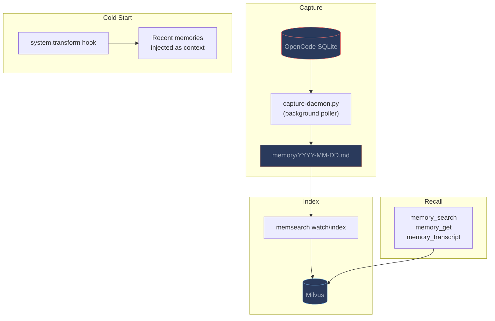

# OpenCode Plugin

**Semantic memory for [OpenCode](https://github.com/nicepkg/opencode).** A TypeScript plugin that captures conversations via a background SQLite daemon and provides three-layer memory recall.

---

## Quick Start

### Prerequisites

- OpenCode with plugin support
- Python 3.10+
- memsearch installed: `uv tool install "memsearch[onnx]"`

### Installation

```bash
# Automated install
bash memsearch/plugins/opencode/install.sh
```

The installer:

1. Symlinks the plugin to `~/.config/opencode/plugins/memsearch.ts`
2. Symlinks the memory-recall skill to `~/.agents/skills/memory-recall`
3. Installs npm dependencies
4. Shows next steps

### Manual Installation

1. Add to your `opencode.json`:

    ```json
    {
      "plugin": ["memsearch-opencode"]
    }
    ```

2. Install the npm package:

    ```bash
    npm install --save-dev @opencode-ai/plugin
    ```

---

## What Happens Automatically

| Event | What memsearch does |
|-------|-------------------|
| **Session starts** | Recent memories injected via `system.transform` hook |
| **Conversation continues** | Capture daemon polls SQLite for new turns, summarizes, saves to `.md` |
| **LLM needs history** | Calls `memory_search`, `memory_get`, or `memory_transcript` tools |

---

## Architecture



### Capture Daemon

Unlike Claude Code and Codex (which use hook-based capture), OpenCode uses a **background Python daemon** (`capture-daemon.py`) that:

1. Polls OpenCode's SQLite database for completed conversation turns
2. Detects new turns by tracking `last_msg_time` (persisted to prevent duplicate captures on restart)
3. Summarizes each turn using `opencode run` with an isolated session
4. Writes summaries to `.memsearch/memory/YYYY-MM-DD.md`

The daemon runs continuously with a configurable poll interval (default: 10s) and manages itself via a PID file (`.memsearch/.capture.pid`).

---

## Tools

The plugin registers three tools:

| Tool | Parameters | What it does |
|------|-----------|-------------|
| `memory_search` | `query`, `top_k` | Semantic search over indexed memories |
| `memory_get` | `chunk_hash` | Expand a chunk to full markdown section |
| `memory_transcript` | `session_id` | Read original conversation from OpenCode SQLite DB |

### Three-Layer Progressive Recall

| Layer | Tool | What it returns |
|-------|------|----------------|
| **L1: Search** | `memory_search` | Top-K relevant chunk snippets |
| **L2: Expand** | `memory_get` | Full markdown section around a chunk |
| **L3: Transcript** | `memory_transcript` | Original conversation from OpenCode SQLite |

---

## Cold-Start Context

On session start, the `experimental.chat.system.transform` hook reads recent daily memory files and injects them into the system prompt. This gives the LLM awareness of recent sessions so it can decide when to invoke memory tools.

---

## Memory Files

```
your-project/.memsearch/memory/
├── 2026-03-25.md
└── 2026-03-26.md
```

Example:

```markdown
# 2026-03-26

## Session 14:30

### 14:30
<!-- session:ses_abc123 source:opencode-sqlite -->
- User asked about authentication flow
- Assistant explained OAuth2 in auth.ts
- Assistant modified token refresh logic in refresh.ts
```

---

## Configuration

The plugin defaults to ONNX embedding (no API key). Configuration uses the standard memsearch config system:

```bash
memsearch config set embedding.provider onnx
memsearch config set milvus.uri http://localhost:19530  # optional: remote Milvus
```

---

## Differences from Other Plugins

| Aspect | OpenCode | Claude Code | OpenClaw |
|--------|----------|-------------|----------|
| **Capture** | SQLite daemon (polling) | Stop hook (event-driven) | llm_output hook (event-driven) |
| **Summarizer** | `opencode run` | `claude -p --model haiku` | OpenClaw agent |
| **L3 source** | OpenCode SQLite DB | Claude Code JSONL | OpenClaw JSONL |
| **Skill context** | No fork support | `context: fork` | Tool-based |
| **Install** | npm + opencode.json | Plugin marketplace | `openclaw plugins install` |

---

## Plugin Files

```
plugins/opencode/
├── package.json                    # npm package with peer deps
├── index.ts                        # Main plugin: tools, hooks, daemon management
├── install.sh                      # Installation script
├── skills/
│   └── memory-recall/
│       └── SKILL.md                # Memory recall skill
└── scripts/
    ├── derive-collection.sh        # Per-project collection name
    ├── capture-daemon.py           # Background SQLite poller
    └── parse-transcript.py         # SQLite session reader
```
