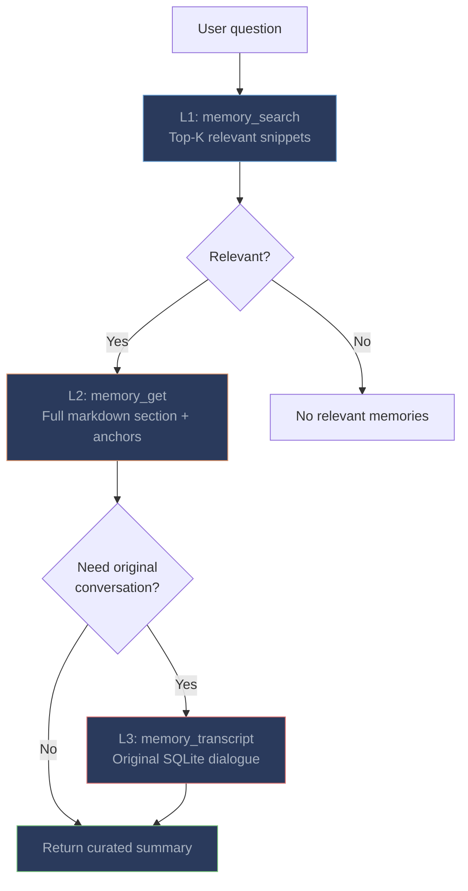

# Memory Tools

The plugin registers three tools via OpenCode's `tool()` API. All tools are available to the LLM during conversation and can be invoked autonomously when the LLM judges historical context would help.

---

## Tool Reference

| Tool | Parameters | What it does |
|------|-----------|-------------|
| `memory_search` | `query` (string), `top_k` (number, optional) | Semantic search over indexed memories via `memsearch search --json-output`. Returns top-K relevant chunks with scores, dates, and content snippets. Powered by Milvus hybrid search (BM25 + dense vectors + RRF reranking). |
| `memory_get` | `chunk_hash` (string) | Expand a chunk to full markdown section via `memsearch expand`. Shows the complete section with surrounding context, session anchors, and source file metadata. |
| `memory_transcript` | `session_id` (string), `limit` (number, optional) | Read original conversation from OpenCode's SQLite database via `parse-transcript.py`. Returns formatted dialogue with `[Human]` and `[Assistant]` labels, including tool call details. |

---

## Three-Layer Progressive Recall



| Layer | Tool | What it returns | When to use |
|-------|------|----------------|-------------|
| **L1: Search** | `memory_search` | Top-K chunk snippets with relevance scores | Starting point -- find potentially relevant memories |
| **L2: Expand** | `memory_get` | Full markdown section with session anchors | When a snippet looks relevant but needs more context |
| **L3: Transcript** | `memory_transcript` | Original conversation from OpenCode SQLite | When you need the exact exchange -- what was tried, what failed |

### Real-World Example

**User:** "We fixed a database migration issue last week. What was the solution?"

**L1 -- memory_search:** LLM calls `memory_search("database migration fix")`:
```json
[
  {
    "chunk_hash": "a1b2c3...",
    "score": 0.88,
    "content": "- User reported Alembic migration failing on user_preferences table\n- OpenCode found a missing nullable=True on the email column...",
    "source": ".memsearch/memory/2026-03-22.md"
  }
]
```

**L2 -- memory_get:** LLM calls `memory_get("a1b2c3...")`:
```markdown
### 15:45
<!-- session:ses_xyz789 source:opencode-sqlite -->
- User reported Alembic migration failing on user_preferences table
- OpenCode found a missing nullable=True on the email column
- Fixed by adding server_default="" to the column definition
- Tested with alembic upgrade head — migration succeeds
- Also added a rollback test to prevent regression
```

**LLM response:** "Last week we fixed an Alembic migration failure on the user_preferences table. The issue was a missing `nullable=True` on the email column. The fix was adding `server_default=""` to the column definition. We also added a rollback test."

---

## Using `opencode run` for Non-Interactive Memory Queries

You can query memories outside of a conversation session using `opencode run`:

```bash
# Search memories from the command line
opencode run "Use the memory_search tool to find what we did about caching"

# Get detailed context about a specific memory
opencode run "Use memory_get to expand chunk a1b2c3..."
```

This is useful for scripting, CI/CD pipelines, or quick lookups without starting a full interactive session.

---

## Comparison with Other OpenCode Memory Plugins

| Feature | memsearch | opencode-mem | No plugin |
|---------|-----------|-------------|-----------|
| **Number of tools** | 3 (search, get, transcript) | 1-2 (search, save) | 0 |
| **Search backend** | Milvus hybrid (dense + BM25 + RRF) | SQLite + USearch (dense only) | N/A |
| **Capture method** | Background daemon (automatic) | Hook-based or manual | N/A |
| **Storage** | Plain `.md` files (human-readable) | SQLite (opaque) | N/A |
| **Progressive disclosure** | Three-layer (search → expand → transcript) | Single-layer | N/A |
| **Cross-platform** | Yes -- Claude Code, OpenClaw, Codex | OpenCode only | N/A |
| **Keyword search** | BM25 catches exact terms | Dense-only may miss specific terms | N/A |
| **Embedding model** | Pluggable (ONNX default, no API key) | Typically fixed | N/A |

### Why Hybrid Search Matters

Pure dense vector search finds semantically similar content but can miss results containing specific identifiers, error codes, or technical terms. memsearch's hybrid search fuses dense cosine similarity with BM25 keyword matching via [Reciprocal Rank Fusion (RRF)](../../architecture.md#hybrid-search):

- **"Fix the CORS error in auth.ts"** -- BM25 boosts results mentioning "CORS" and "auth.ts" exactly
- **"What did we do about security headers?"** -- Dense search finds semantically related content about CORS, CSP, etc.
- **Combined** -- RRF merges both rankings, so both exact matches and semantic matches surface

---

## Tips

**Ensure the daemon is running.** If new conversations aren't being captured, check the daemon status:
```bash
cat .memsearch/.capture.pid && kill -0 $(cat .memsearch/.capture.pid) 2>/dev/null && echo "running" || echo "not running"
```

**Let the LLM decide.** The cold-start context injection and tool descriptions give the LLM enough information to invoke memory tools autonomously. You don't need to explicitly ask it to search memory.

**Check project matching.** The daemon matches sessions by project directory. If memories are missing, verify that OpenCode is using the expected `directory` field in its SQLite sessions.
