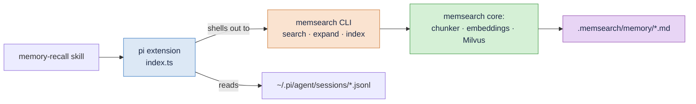

# How It Works

The plugin is a single pi extension that registers three tools and subscribes to
three lifecycle events. Everything runs locally: no MCP server, no sidecar
process, no background daemon.



---

## Lifecycle

| pi event | What the plugin does |
|----------|----------------------|
| `session_start` | Ensure the ONNX default config, index the journal in the background, reset per-session state |
| `before_agent_start` | Append recent journal entries and a `[memsearch] Memory available.` hint to the system prompt |
| `agent_settled` | Extract the settled turn, summarize it, append it to today's journal, reindex |

### Why `agent_settled` and not `agent_end`

pi may auto-retry, auto-compact, or drain queued follow-up messages **after**
`agent_end` fires. Capturing there would record the same exchange more than
once. `agent_settled` fires only when pi will not continue on its own, which is
exactly the boundary a memory entry should correspond to.

The plugin additionally skips capture when the session leaf has not moved, so an
`agent_settled` triggered by an aborted run does not re-append the previous turn.

---

## Capture pipeline

```
buildContextEntries()      resolve the active branch, with compaction applied
        │
        ▼
extractLastTurn()          take the last user message and everything after it
        │                  (toolResult messages and thinking blocks dropped)
        ▼
summarizeTurn()            third-person bullet notes
        │
        ▼
append to YYYY-MM-DD.md    with a session/turn/transcript anchor
        │
        ▼
memsearch index            background, non-blocking
```

Captures are serialized through a queue. Summarization takes tens of seconds --
long enough for the next turn to settle while the previous entry is still being
written -- so without serialization the journal could interleave.

### Summarization fallbacks

1. **A memsearch-managed provider**, used only when
   `plugins.pi.summarize.provider` names one. The setting is resolved once per
   session, so the default costs nothing.
2. **pi itself in print mode**, which is the default and corresponds to
   `provider = "native"` in the other plugins.
3. **The raw turn text**, truncated to its tail.

The prompt is `prompts/summarize.txt`, shared across every plugin via
`scripts/sync-prompts.sh`, with `{{AGENT_NAME}}` resolved to `Pi`.

---

## Memory files

Journals live in `<project>/.memsearch/memory/YYYY-MM-DD.md`:

```markdown
# 2026-07-25

## Session 17:32

### 17:32
<!-- session:019f98… turn:3950049d transcript:/Users/you/.pi/agent/sessions/…jsonl -->
- User asked what a B+ tree is.
- Pi explained that it is a balanced multi-way search tree…
```

The `## Session` heading is written lazily, on the first capture of a session,
so a session that produces no memory leaves no empty stub. Per-session state is
reset on `session_start`, because `/new`, `/resume`, and `/fork` all start a
fresh session inside the same process.

Markdown is the source of truth. Milvus is a derived index and can be rebuilt
from the files at any time with `memsearch index`.

---

## Transcript resolution

pi stores sessions as JSONL under
`~/.pi/agent/sessions/--<escaped-path>--/<timestamp>_<uuid>.jsonl`. Entries form
a **tree** through `id` / `parentId`, so a single file can contain several
branches once `/fork` or `/clone` has been used.

Reading the file in line order would interleave abandoned branches with the live
conversation. `transcript.py` instead walks `parentId` upward from a target
entry -- or from the last entry, which is the live leaf -- and reverses the
result, yielding exactly one root-to-leaf path.

This is why capture records the leaf id as `turn:` in the anchor: it pins the
precise tree position that drill-down should target.

---

## Indexing

The index is refreshed at session start and after every capture. There is no
file watcher, matching the OpenCode and OpenClaw plugins. (The Claude Code
plugin starts one only under Milvus Server; under Milvus Lite -- the default --
it too falls back to one-time indexing, because a file lock prevents concurrent
access.)

The practical consequence is narrow: markdown edited by hand **during** a
session is not picked up until the next session start, or until you run
`memsearch index` yourself.

---

## Failure handling

Capture and injection failures are swallowed so they can never break a session.
That makes misconfiguration invisible, so the plugin provides an escape hatch:

```bash
MEMSEARCH_DEBUG=/tmp/memsearch.log pi
```

Every swallowed failure is appended there with the stage that produced it
(`summarize/memsearch`, `summarize/pi`, or `capture`).
