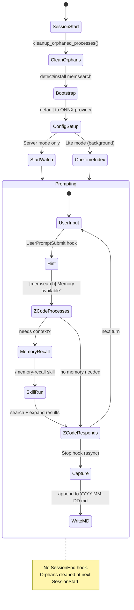
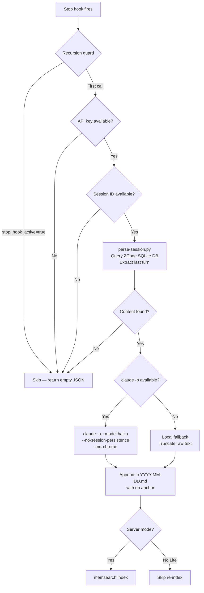

# How It Works

## What Happens Automatically

| Event | What memsearch does |
|-------|-------------------|
| **Session starts** | Clean up orphaned processes, start watch (Server) or one-time index (Lite), write session heading, inject recent memories, check for updates |
| **Each prompt** | Memory-recall skill hint displayed |
| **Each turn ends** | Conversation summarized via `claude -p` (async) and saved to daily `.md` |

---

## Hook Architecture

The ZCode plugin uses 3 shell hooks (ZCode does not have a `SessionEnd` hook):

| Hook | Type | Async | Timeout | What It Does |
|------|------|-------|---------|-------------|
| **SessionStart** | command | no | 10s | Cleanup orphans, bootstrap memsearch, start watch/index, write session heading, inject memories, display status |
| **UserPromptSubmit** | command | no | 15s | Return hint "[memsearch] Memory available" |
| **Stop** | command | **yes** | 120s | Summarize the last turn via `claude -p`, reading the conversation from the ZCode SQLite session DB |

### Hook Lifecycle



---

## Environment Variables

ZCode injects several environment variables when firing hooks. The plugin uses these to locate the session and project:

| Variable | Purpose | Default |
|----------|---------|---------|
| `CLAUDE_SESSION_ID` | Current session ID (ZCode injects this as a template variable) | -- |
| `ZCODE_PROJECT_DIR` / `CLAUDE_PROJECT_DIR` | Project working directory | `$(pwd)` |
| `ZCODE_DB_PATH` | Path to the ZCode session SQLite database | `~/.zcode/cli/db/db.sqlite` |
| `CLAUDE_PLUGIN_ROOT` | Plugin install directory (resolves `${CLAUDE_PLUGIN_ROOT}` in hooks.json) | -- |

---

## SessionStart -- Bootstrap and Inject

The SessionStart hook handles several concerns:

1. **Orphan cleanup** -- since ZCode has no `SessionEnd` hook, orphaned `memsearch watch` and `memsearch index` processes from previous sessions are cleaned up here. Also sweeps orphaned `milvus_lite` processes.

2. **Bootstrap** -- if `memsearch` is not found in PATH, the hook auto-installs `uv` and warms up the `uvx` cache with `memsearch[onnx]`.

3. **Config setup** -- defaults to `onnx` provider if no config file exists (no API key needed).

4. **Watch vs. one-time index** -- detects the Milvus backend:
    - **Server mode** (`http://` or `tcp://` URI): starts `memsearch watch` as a persistent background process via `setsid`
    - **Lite mode** (local `.db` file): runs a one-time `memsearch index` in a background subshell (watch would fail due to Milvus Lite's file lock)

5. **Cold-start injection** -- injects memory file count and date range, with a hint to use `/memory-recall`.

6. **Update check** -- queries PyPI (2s timeout) and shows update banner if newer version exists.

### Milvus Lite Lock Handling

Milvus Lite uses a file-level lock that prevents concurrent access. This means `memsearch watch` (which runs continuously) would block `memsearch search` (which runs on-demand). The plugin handles this by:

- **Not starting watch in Lite mode** -- the SessionStart hook detects the URI format and skips `start_watch()` for non-HTTP/TCP URIs
- **Skipping re-index in Stop hook for Lite mode** -- the Stop hook only runs `memsearch index` when using a Server backend
- **One-time index at session start** -- a single background index run at SessionStart ensures existing memories are searchable
- **Dimension mismatch auto-recovery** -- if indexing fails with "dimension mismatch" (e.g., after switching embedding providers), the hook auto-resets and re-indexes

For real-time indexing without lock issues, use [Milvus Server or Zilliz Cloud](../../getting-started.md#milvus-backends).

---

## Stop Hook -- Capture

The Stop hook is the core capture mechanism. It runs **asynchronously** after each ZCode response, returning `{}` immediately so the user can continue working.



### SQLite Session Parsing

Unlike Claude Code (JSONL transcripts) or Codex (rollout files), ZCode stores conversation history in a SQLite database at `~/.zcode/cli/db/db.sqlite`. The Stop hook reads this database directly via `parse-session.py`:

- Queries the `message` table (filtered by session ID) joined with the `part` table
- Groups messages into turns (user prompt → assistant response)
- Renders text parts as `[User]` / `[Assistant]` blocks
- Includes `[Tool call]` entries for tool invocations
- Omits reasoning blocks (internal thinking) to keep summaries focused

The session ID is injected via the `CLAUDE_SESSION_ID` environment variable at hook invocation time.

### claude -p Isolation

The Stop hook calls `claude -p` for LLM summarization. To prevent **hook recursion** (the summarization call triggering another Stop hook), it sets the `CLAUDECODE=` environment variable and `MEMSEARCH_IN_STOP_WORKER=1`:

```bash
MEMSEARCH_NO_WATCH=1 MEMSEARCH_IN_STOP_WORKER=1 CLAUDECODE= \
  timeout 110 claude -p \
    --strict-mcp-config \
    --tools "" \
    --model "$SUMMARIZE_MODEL" \
    --no-session-persistence \
    --no-chrome
```

Set `plugins.zcode.summarize.model` to override only this native capture model. Empty or unset keeps the default (`haiku`). To use a memsearch-managed API provider instead, define `[llm.providers.<name>]` and set `plugins.zcode.summarize.provider` to that name. Empty or `native` preserves the current behavior, and this setting does not fall back to `llm.model`.

### Local Fallback

If `claude -p` is unavailable or returns empty output, the hook falls back to raw text truncation:

```bash
# Fallback: use raw conversation text (truncated to 8000 chars)
SUMMARY="$CONTENT"
```

This ensures memory capture works even when the summarization model is unavailable.

---

## hooks.json Format

ZCode uses a `hooks.json` file within the plugin directory to define hook scripts. The hooks use `${CLAUDE_PLUGIN_ROOT}` for path resolution:

```json
{
  "hooks": {
    "SessionStart": [
      {
        "matcher": "startup|resume|clear|compact",
        "hooks": [
          {
            "type": "command",
            "command": "bash ${CLAUDE_PLUGIN_ROOT}/hooks/session-start.sh",
            "timeout": 10
          }
        ]
      }
    ],
    "UserPromptSubmit": [
      {
        "hooks": [
          {
            "type": "command",
            "command": "bash ${CLAUDE_PLUGIN_ROOT}/hooks/user-prompt-submit.sh",
            "timeout": 15
          }
        ]
      }
    ],
    "Stop": [
      {
        "hooks": [
          {
            "type": "command",
            "command": "bash ${CLAUDE_PLUGIN_ROOT}/hooks/stop.sh",
            "async": true,
            "timeout": 120
          }
        ]
      }
    ]
  }
}
```

---

## Memory Files

```
your-project/.memsearch/memory/
├── 2026-03-24.md
├── 2026-03-25.md
└── 2026-03-26.md
```

### Example Memory File

```markdown
# 2026-03-25

## Session 10:30

### 10:30
<!-- session:abc123 db:/home/user/.zcode/cli/db/db.sqlite -->
- User asked about database migration strategy for the new preferences feature
- ZCode implemented Alembic migration for new user_preferences table with 4 columns
- Added rollback script and tested migration on staging database
- Created index on user_id column for query performance

### 11:15
<!-- session:abc123 db:/home/user/.zcode/cli/db/db.sqlite -->
- User asked to add validation for the preferences API endpoint
- ZCode added pydantic models for request/response validation
- Implemented custom validators for preference value types
- Added unit tests covering edge cases (empty values, invalid types)
```

The `db:` anchor stores the path to the ZCode session database, enabling the memory-recall skill to drill back into the original conversation turns.

---

## Differences from Claude Code and Codex Plugins

| Aspect | ZCode Plugin | Claude Code Plugin | Codex Plugin |
|--------|-------------|-------------------|-------------|
| **SessionEnd hook** | Not available -- orphans cleaned at next SessionStart | Available -- clean shutdown | Not available -- orphans cleaned at next SessionStart |
| **Session storage** | SQLite database (`db.sqlite`) | JSONL transcript files | Rollout JSONL files |
| **Summarizer** | `claude -p --model haiku` | `claude -p --model haiku` | `codex exec` |
| **Recursion prevention** | `CLAUDECODE=` + `MEMSEARCH_IN_STOP_WORKER=1` | `stop_hook_active` flag + `CLAUDECODE=` | `features.hooks=false` on child `codex exec` |
| **Skill context** | Main context (no `context: fork`) | Forked subagent (`context: fork`) | Main context (no `context: fork`) |
| **Session ID source** | `CLAUDE_SESSION_ID` env var | `transcript_path` in payload | `session_id` in payload |
| **hooks.json** | Plugin manifest (`${CLAUDE_PLUGIN_ROOT}`) | Part of plugin manifest | `~/.codex/hooks.json` (installer-managed) |

---

## Plugin Files

```
plugins/zcode/
├── .claude-plugin/
│   └── plugin.json                  # Plugin manifest
├── hooks/
│   ├── common.sh                    # Shared setup: JSON helpers, process management, orphan cleanup
│   ├── hooks.json                   # Hook declarations (SessionStart, UserPromptSubmit, Stop)
│   ├── session-start.sh             # SessionStart: bootstrap, watch/index, cold-start injection
│   ├── stop.sh                      # Stop: async capture via claude -p, local fallback
│   └── user-prompt-submit.sh        # UserPromptSubmit: memory availability hint
├── prompts/
│   └── summarize.txt                # Summarization prompt template
├── scripts/
│   ├── derive-collection.sh         # Per-project collection name
│   ├── maintenance-runner.py        # Advanced maintenance (PROJECT.md, USER.md, skill distillation)
│   └── parse-session.py             # ZCode SQLite session parser for L3 drill-down
└── skills/
    ├── memory-config/
    │   └── SKILL.md                 # Memory configuration skill
    ├── memory-recall/
    │   └── SKILL.md                 # Memory recall skill (/memory-recall)
    └── memory-to-skill/
        └── SKILL.md                 # Skill distillation skill
```

| File | Purpose |
|------|---------|
| `common.sh` | Shared library sourced by all hooks. Includes JSON helpers (`_json_val`), memsearch detection, watch/index singleton management, and `cleanup_orphaned_processes()` for ZCode's missing SessionEnd. Resolves `ZCODE_SESSION_ID` from `CLAUDE_SESSION_ID`, `ZCODE_DB_PATH` (default `~/.zcode/cli/db/db.sqlite`), and `PROJECT_DIR` from `ZCODE_PROJECT_DIR`/`CLAUDE_PROJECT_DIR`. |
| `session-start.sh` | Bootstrap memsearch, start watch (Server) or one-time index (Lite), write session heading, inject cold-start context, check for updates. |
| `stop.sh` | Async capture: parse the last turn from the ZCode SQLite DB via `parse-session.py`, summarize via `claude -p` with recursion prevention, fall back to raw text if `claude -p` fails. |
| `user-prompt-submit.sh` | Return lightweight hint about memory availability for prompts longer than 10 characters. |
| `parse-session.py` | Queries the ZCode SQLite session database. Groups messages into turns, renders text and tool-call parts, omits reasoning blocks. |
| `hooks.json` | Declares the three hooks with `${CLAUDE_PLUGIN_ROOT}` path resolution and the Stop hook's `async: true` flag. |
