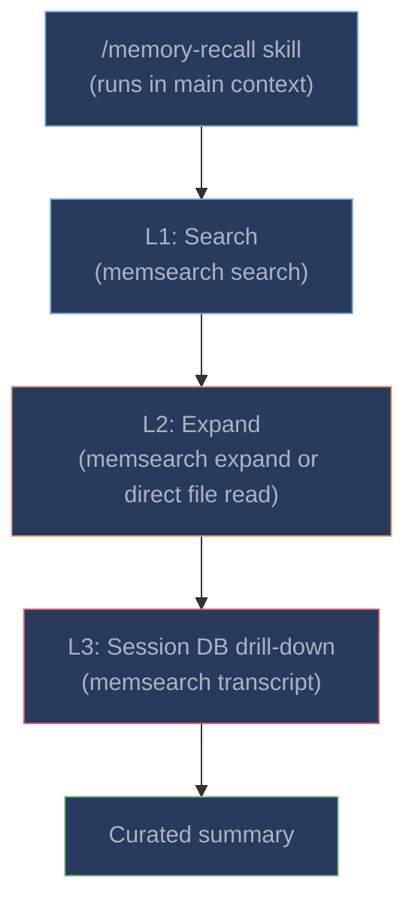

# Memory Recall

The `/memory-recall` skill provides semantic search over past sessions. ZCode can invoke it automatically when it judges historical context would help, or you can trigger it manually.

---

## Invoking the Skill

- **Automatically**: ZCode decides when past context would help, based on the `UserPromptSubmit` hint and skill description
- **Manually**: `/memory-recall <your query>`

### Manual Example

```
/memory-recall database migration fix from last week
```

ZCode will search past memories, expand relevant results, and return a curated summary.

---

## Three-Layer Progressive Disclosure



| Layer | Command | What it returns | When to use |
|-------|---------|----------------|-------------|
| **L1: Search** | `memsearch search "<query>" --top-k 5 --json-output` | Top-K relevant chunk snippets with scores | Always -- the starting point |
| **L2: Expand** | `memsearch expand <chunk_hash>` (or direct `cat` fallback) | Full markdown section with session/db anchors | When a snippet needs more context |
| **L3: Session DB** | `memsearch transcript <db_path>` or direct SQLite query | Original ZCode conversation turns from the session database | When you need the exact exchange and the memory entry includes a `db:` anchor |

### L2 Fallback: Direct File Read

The skill includes a **direct file read fallback** for L2:

```
If memsearch expand fails, read the source file directly.
Search results include `source` (file path) and `start_line`/`end_line`.
Use `cat <source_file>` or read the relevant line range.
```

This ensures L2 works even if `memsearch expand` hits a lock or permission error by reading the markdown files directly rather than querying Milvus.

### L3: SQLite Session Drill-Down

ZCode stores conversations in a SQLite database, not JSONL files. The memory anchor format is:

```html
<!-- session:abc123 db:/home/user/.zcode/cli/db/db.sqlite -->
```

The `parse-session.py` script can extract specific turns from this database:

```bash
python3 /path/to/plugins/zcode/scripts/parse-session.py \
  --session abc123 \
  --db /home/user/.zcode/cli/db/db.sqlite
```

If `memsearch transcript` doesn't recognize the `db:` anchor format, the skill falls back to calling `parse-session.py` directly or reading the SQLite database manually.

---

## Real-World Example

**User:** "What approach did we take for the caching layer?"

**L1 -- Search:** Skill runs `memsearch search "caching layer approach" --top-k 5 --json-output`:
```
Score 0.82: "ZCode implemented Redis caching middleware with 5min TTL..."
Score 0.71: "Added cache invalidation via pub/sub channel..."
```

**L2 -- Expand:** Skill reads the full section:
```markdown
### 14:30
<!-- session:abc123 db:/home/user/.zcode/cli/db/db.sqlite -->
- User asked about caching strategy for API responses
- ZCode implemented Redis L1 cache with 5min TTL using ioredis
- Added in-process LRU as L2 (1000 entries) for hot path
- Configured cache invalidation via Redis pub/sub on writes
- Decided against Memcached due to lack of pub/sub support
```

**L3 (optional):** If the summary isn't enough and the memory entry includes a `db:` anchor, the skill runs `parse-session.py` to get the original conversation turns from the ZCode session database.

**Result returned to user:** "We implemented a two-layer caching strategy: Redis L1 (5min TTL) + in-process LRU L2 (1000 entries). Cache invalidation uses Redis pub/sub on writes. We chose Redis over Memcached specifically for pub/sub support."

---

## Comparison with Claude Code's Memory Recall

The key architectural difference is in **skill execution context**:

| Aspect | ZCode | Claude Code |
|--------|-------|-------------|
| **Skill context** | Main context -- results visible in conversation | Forked subagent (`context: fork`) -- isolated |
| **Intermediate results** | Visible to user (search output, expand output) | Hidden -- only curated summary reaches main context |
| **Context cost** | Search/expand results consume main context tokens | Zero -- subagent has its own context window |
| **Autonomy** | Skill steps visible and interruptible | Fully autonomous inside subagent |
| **L2 fallback** | Direct file read (bypasses Milvus lock issues) | Always uses `memsearch expand` |
| **L3 format** | SQLite session database (`db:` anchor) | JSONL transcript (`transcript:` anchor) |
| **Skill prefix** | `/memory-recall` | `/memory-recall` |

### Why No Fork Context?

ZCode does not support `context: fork` for skills. This means the `/memory-recall` skill runs in the **main conversation context** -- all intermediate search results, chunk expansions, and session drill-down steps are visible to the user and consume main context tokens.

In practice, this works well for targeted queries but is less efficient for broad searches (where many intermediate results would clutter the context). For the best experience with large memory histories, consider using [Milvus Server](../../getting-started.md#milvus-backends) for faster search responses.

---

## Tips for Better Recall

**Use specific queries.** "Redis caching" will return better results than "the thing we did". The hybrid search combines semantic similarity with keyword matching, so including specific terms helps.

**Derive collection manually.** If you need to debug collection issues:
```bash
bash /path/to/plugins/zcode/scripts/derive-collection.sh
```

**Rebuild the index.** If search quality degrades after changing embedding providers:
```bash
memsearch index .memsearch/memory/ --force --collection <collection_name>
```
